# SkyraQR — Business Requirements Document (BRD)

**Document Identifier:** SKYRA-DOC-BRD-001  
**Version:** 2.2.0  
**Status:** Approved for Implementation (Architecture Locked)  
**Owner:** Skyra Product Management & Strategy Group  
**Release Phasing:** MVP (Stage 1) $\rightarrow$ Phase 2 (Automation & Scale) $\rightarrow$ Phase 3 (Agency & Intelligence) $\rightarrow$ Enterprise (Stage 4/5)  

---

## Executive Summary

**SkyraQR** is an enterprise-grade B2B Software-as-a-Service (SaaS) platform engineered to modernize the creation, intelligent routing, design management, analytics, and lifecycle governance of dynamic and static QR codes. 

While legacy QR platforms (e.g., QRFY, Beaconstac, QR Code Generator) have historically capitalized on post-pandemic contactless adoption, publicly observed competitor capabilities reveal acute friction points: deceptive trial-to-annual billing lock-ins (often charging $300–$450/year after an initial trial), rigid 1:1 destination routing, siloed agency account management, and a complete absence of localized pricing and regional payment mechanisms (such as India's UPI). *Note: Competitor internal architecture, backend implementations, and proprietary algorithms are not publicly known.*

SkyraQR resolves these market challenges by delivering:
1. **Target Sub-30ms Edge Dynamic Redirection:** High-performance short-link resolution with multi-region edge caching. Target p99 end-to-end edge redirection latency is $<30\text{ms}$ under defined benchmark conditions, excluding client/network latency outside SkyraQR control.
2. **Context-Aware Smart Routing:** Deterministic traffic splitting based on user device OS, geographic location, scheduled time windows, and privacy-preserving statistical A/B tests.
3. **No-Code Micro-Landing Pages:** High-converting, mobile-responsive interactive landing pages (digital menus, vCard Plus, product showcases, event registration, and customer feedback) hosted natively with custom domain and white-label support.
4. **Transparent, Fair & Localized Monetization:** A sustainable pricing architecture featuring localized billing (native INR/UPI support alongside USD/Stripe), explicit renewal notifications, and an authoritative policy prohibiting third-party advertising inside customer QR destinations.
5. **Tripartite Dashboard Domain Architecture:** Complete separation between the **Customer Dashboard** (daily QR operations), **Workspace Administration** (team RBAC, domains, API keys, MCP credentials), and the **SkyraQR Platform Owner Dashboard** (global SaaS infrastructure, revenue, abuse quarantine, and platform audit logs).
6. **First-Class Model Context Protocol (MCP) Server with Admin-Managed Credentials:** Native integration enabling AI agents (such as the Jarvis AI Agent) to securely query analytics, manage campaigns, and inspect link health through an authorized domain service layer—with zero direct database access. **Admin-Managed MCP Credentials** constitute the primary authentication model, governed by strict delegated authority boundaries, independent role permissions, and complete credential lifecycle states.
7. **Privacy-by-Design Architecture:** Real-time scan telemetry built on a privacy-by-design and compliance-aligned architecture (addressing principles in GDPR, CCPA, and India's DPDP Act 2023), utilizing cryptographic one-way daily-keyed hashing to measure unique scans without persisting raw client IP addresses.
8. **Enterprise Observability & Traceable Audit Governance:** Dual-tier logging architecture comprising an authoritative, immutable PostgreSQL audit ledger (`audit_logs`) capturing every business mutation alongside centralized structured JSON logging (ELK stack) with distributed request tracing (`request_id`, `trace_id`).

---

## Table of Contents

- [1. Product Overview & Codename Policy](#1-product-overview--codename-policy)
  - [1.1 Product Codename & Branding Policy](#11-product-codename--branding-policy)
  - [1.2 Product Vision & Mission](#12-product-vision--mission)
  - [1.3 Problem Statement](#13-problem-statement)
  - [1.4 Market Opportunity](#14-market-opportunity)
  - [1.5 Value Proposition & Competitive Differentiation](#15-value-proposition--competitive-differentiation)
- [2. Business Problems by Industry Vertical](#2-business-problems-by-industry-vertical)
- [3. Target Personas & User Classes](#3-target-personas--user-classes)
- [4. Product Scope & Phased Roadmap](#4-product-scope--phased-roadmap)
- [5. Authentication, Identity & Session Architecture](#5-authentication-identity--session-architecture)
  - [5.1 Multi-Channel Authentication Overview](#51-multi-channel-authentication-overview)
  - [5.2 Admin-Managed MCP Credential Model (Primary)](#52-admin-managed-mcp-credential-model-primary)
  - [5.3 Delegated MCP Access & Authority Boundaries](#53-delegated-mcp-access--authority-boundaries)
- [6. Tripartite Dashboard & RBAC Architecture](#6-tripartite-dashboard--rbac-architecture)
  - [6.1 Customer Dashboard](#61-customer-dashboard)
  - [6.2 Workspace Administration & MCP Access Management](#62-workspace-administration--mcp-access-management)
  - [6.3 Platform Owner Dashboard](#63-platform-owner-dashboard)
- [7. Core Feature Specifications & Frontend Role](#7-core-feature-specifications--frontend-role)
- [8. Advanced & Differentiating Features](#8-advanced--differentiating-features)
  - [8.1 Model Context Protocol (MCP) & Jarvis AI Integration](#81-model-context-protocol-mcp--jarvis-ai-integration)
  - [8.2 MCP Role Model & Permission Taxonomy](#82-mcp-role-model--permission-taxonomy)
  - [8.3 MCP Credential Lifecycle Governance](#83-mcp-credential-lifecycle-governance)
  - [8.4 Context-Aware Smart Routing & A/B Testing](#84-context-aware-smart-routing--ab-testing)
  - [8.5 QR Health Monitoring & Dead-Link Defense](#85-qr-health-monitoring--dead-link-defense)
  - [8.6 White-Label Agency Dashboards & Client Portals](#86-white-label-agency-dashboards--client-portals)
- [9. QR Type Strategy & Comprehensive Generation Lifecycle](#9-qr-type-strategy--comprehensive-generation-lifecycle)
- [10. Dynamic QR Business Logic & Lifecycle](#10-dynamic-qr-business-logic--lifecycle)
- [11. End-to-End User Journeys](#11-end-to-end-user-journeys)
- [12. Detailed Functional Requirements (BR-FR-001 to BR-FR-029)](#12-detailed-functional-requirements)
- [13. Traceability Matrix](#13-traceability-matrix)
- [14. Non-Functional Requirements (BR-NFR-001 to BR-NFR-015)](#14-non-functional-requirements)
- [15. Subscription, Entitlement Engine & Monetization Strategy](#15-subscription-entitlement-engine--monetization-strategy)
  - [15.1 Before-Subscription and After-Subscription Experience](#151-before-subscription-and-after-subscription-experience)
  - [15.2 Subscription Tier Architecture](#152-subscription-tier-architecture)
  - [15.3 Authoritative Entitlement Policy Model (BLOCK, SOFT_OVERAGE, READ_ONLY)](#153-authoritative-entitlement-policy-model)
  - [15.4 Advertising & Monetization Boundaries](#154-advertising--monetization-boundaries)
- [16. Privacy, Security Logging & Audit Retention Policy](#16-privacy-security-logging--audit-retention-policy)
- [17. Observability & Centralized ELK Requirements](#17-observability--centralized-elk-requirements)
- [18. Assumptions, Dependencies & Risks](#18-assumptions-dependencies--risks)
- [19. Glossary](#19-glossary)
- [20. Revision & Version History](#20-revision--version-history)

---

## 1. Product Overview & Codename Policy

### 1.1 Product Codename & Branding Policy

To maintain architectural rigor while brand positioning is finalized, the following naming policy is authoritatively enforced:
- **Internal Project Codename:** **SkyraQR** (used consistently throughout engineering and technical documentation).
- **Parent Company:** **Skyra Tech**.
- **Future Commercial Product Name:** **TBD** (to be selected by product leadership prior to commercial launch).

> [!IMPORTANT]
> **Zero Architectural Lock-in:** The platform architecture, API endpoints, database entities, and frontend assets are designed so that the eventual commercial product name can replace the "SkyraQR" codename via configuration and environment variables without requiring structural or architectural code changes.

### 1.2 Product Vision & Mission

- **Vision:** To serve as the global infrastructure standard connecting physical surfaces to intelligent digital experiences through secure, ultra-fast, and brand-first QR technology.
- **Mission:** Empower SMBs, creative agencies, global consumer brands, and AI agents with an affordable, enterprise-grade QR lifecycle platform that combines precision design, contextual smart routing, actionable real-time analytics, and seamless multi-tenant team collaboration.

### 1.3 Problem Statement

Physical-to-digital interactions mediated by QR codes represent an indispensable channel for modern commerce, marketing, and operational workflows. However, businesses deploying QR codes today encounter acute operational vulnerabilities:
- **Print Permanence vs. Digital Mutability:** Traditional static QR codes hardcode URLs into print runs. If the destination link changes, breaks, or expires, physical collateral (signage, packaging, menus, billboards) is immediately invalidated, resulting in expensive reprints.
- **Predatory SaaS Economics:** Leading market incumbents (such as QRFY and competitors) frequently lure users with deceptive $0.99 or free trial periods, only to enforce automated renewals exceeding $300–$450/year without transparent monthly options, causing widespread customer disputes.
- **Rudimentary Dynamic Routing:** Most tools only offer simple 1:1 URL redirects. Marketers cannot redirect an iOS user to the Apple App Store, an Android user to Google Play, and a desktop user to a web landing page from a single printed code.
- **AI Agent Integration Gap:** Modern enterprises increasingly deploy autonomous AI agents (such as Jarvis) for business intelligence, campaign management, and customer operations. Legacy QR platforms lack standard protocols (such as MCP) to enable AI agents to safely read analytics or provision campaigns without fragile web scraping.
- **Data & Compliance Deficits:** Legacy analytics engines either log unhashed raw IP addresses (violating modern privacy standards) or provide superficial total-scan counters devoid of conversion attribution or city-level geographic fidelity.

### 1.4 Market Opportunity

The global QR code generation and dynamic management market is expanding at a Compound Annual Growth Rate (CAGR) of 16.8%, driven by omnichannel retail, smart packaging, restaurant operational digitization, and contactless authentication. Furthermore, high-velocity digital economies like India, Southeast Asia, and Latin America have established QR-based digital interactions as daily cultural norms (e.g., UPI payments, ONDC retail discovery, smart tickets). 

Yet, virtually zero incumbent Western SaaS providers cater natively to these geographies with localized pricing (INR, UPI), regional edge POPs, or localized customer support. SkyraQR captures this whitespace while concurrently disrupting the North American and European mid-market.

### 1.5 Value Proposition & Competitive Differentiation

| Vector | Observed Public Competitor Capabilities (e.g., QRFY, Bitly) | SkyraQR Proposed Platform Capabilities | Competitor Internal Status |
| :--- | :--- | :--- | :--- |
| **Pricing & Transparency** | Trial-to-annual lock-ins ($300–$450/yr), limited monthly cancellation options. | Transparent monthly & annual tiers; explicit renewal notifications; graceful soft-limits upon downgrade. | Competitor billing logic is proprietary and internal. |
| **Regional Payments** | Credit card/USD/EUR centric; lacks native Indian UPI or regional payment methods. | Native Stripe (USD/EUR) + Razorpay (INR) dual engine; UPI AutoPay, Netbanking, GST invoices. | Competitor payment partnerships are external. |
| **Edge Redirection Speed** | Centralized redirection exhibiting noticeable mobile white-screen pauses. | Target p99 end-to-end edge redirection latency is $<30\text{ms}$ under defined benchmark conditions, excluding network latency outside SkyraQR control. | Competitor edge infrastructure is proprietary and not publicly disclosed. |
| **Smart Routing Engine** | Single static target URL per dynamic code. | Context-Aware Smart Engine: Device OS, Geolocation (Country/City), Time/Dayparting, and deterministic A/B testing. | Basic redirect rules observed in select enterprise tiers. |
| **AI Agent Integration** | Zero standardized agentic support; requires custom scraping. | Native **Model Context Protocol (MCP)** server with Admin-Managed credentials, delegated governance, and domain service execution. | No known competitor MCP server exists. |
| **Platform Governance** | Single-tier account view; agency client accounts share unified logins. | Tripartite Dashboard Architecture: Customer Dashboard, Workspace Admin, and isolated Platform Owner Admin. | Competitor internal admin tooling is not public. |
| **QR Health Monitoring** | Broken destination links throw unbranded 404 errors indefinitely. | Automated dead-link crawler (404/500 detection) and pre-screen integration with Google Safe Browsing. | Competitor health checking not publicly documented. |
| **Monetization Ethics** | Occasional ads or brand watermarks injected on lower tiers. | **Zero third-party ads** in customer QRs, destinations, or paid landing pages. Clean B2B SaaS monetization. | Competitor advertising policies vary by tier. |

---

## 2. Business Problems by Industry Vertical

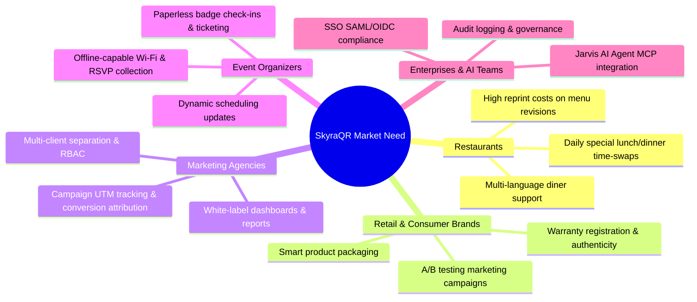

### 2.1 Restaurants & Hospitality
- **The Challenge:** Seasonal food pricing, daily specials (lunch vs. dinner menus), and supply-chain stockouts require frequent menu updates. Physical reprints cost restaurants hundreds of dollars monthly and generate paper waste.
- **SkyraQR Solution:** Built-in Digital Menu Builder supporting multiple categories, allergen tags, currency switchers, multi-language localization, and time-based scheduling (switching from Breakfast to Dinner automatically).

### 2.2 Retail & Packaged Goods (CPG / FMCG)
- **The Challenge:** QR codes printed on physical packaging, carton boxes, or hangtags have lifetimes measured in months or years. If a product recall occurs, a regulatory label changes, or an unboxing video link breaks, millions of packages are affected.
- **SkyraQR Solution:** Dynamic QR codes with immutable short codes that allow instant destination URL rewrites, GS1 2D barcode alignment, serial batch identification, and warranty registration micro-landing pages.

### 2.3 Product & Brand Marketing Professionals
- **The Challenge:** Marketers cannot accurately attribute offline scans to downstream digital conversions (e.g., newsletter signups, app downloads, e-commerce purchases).
- **SkyraQR Solution:** Built-in UTM parameter generators, custom tracking pixels, automated A/B destination split-testing, and dynamic campaign attribution dashboards.

### 2.4 Marketing & Advertising Agencies
- **The Challenge:** Agencies manage dozens of separate client accounts. Storing them under one login creates data privacy hazards and prevents clients from reviewing analytics without seeing other clients' assets.
- **SkyraQR Solution:** Multi-tenant Workspaces with isolated assets, billing, and custom domains; custom client-facing white-label portals featuring the agency's logo, colors, and domain (e.g., `qr.agencyname.com`).

### 2.5 Event Organizers & Venues
- **The Challenge:** Conference schedules, speaker halls, and badge access credentials change dynamically up to the last hour. Paper programs cannot adapt.
- **SkyraQR Solution:** Dynamic Event QR codes linking to responsive schedule micro-pages, downloadable `.ics` calendar files, one-tap Wi-Fi network joining, and live RSVP check-in counters.

### 2.6 Small Businesses & Freelance Professionals
- **The Challenge:** Traditional business cards are thrown away within one week. Solo entrepreneurs lack the budget or technical skill to build a custom website.
- **SkyraQR Solution:** Digital vCard Plus micro-page that allows contacts to download a verified `.vcf` file into their phone's native address book with a single tap, alongside social links, WhatsApp click-to-chat, and payment links.

### 2.7 Enterprise Organizations & AI Operations
- **The Challenge:** Lack of centralized security, uncontrolled creation of rogue QR codes by rogue teams, vulnerability to phishing/malware links, lack of enterprise Single Sign-On (SSO), and inability for enterprise AI agents (e.g., Jarvis) to automate QR workflows safely.
- **SkyraQR Solution:** Okta/Azure AD SAML 2.0 and OIDC Single Sign-On, strict Role-Based Access Control, centralized audit trail logging, automated malware destination inspection, 99.95% uptime SLAs, and an enterprise **Model Context Protocol (MCP)** server with delegated admin-managed credentials.

---

## 3. Target Personas & User Classes

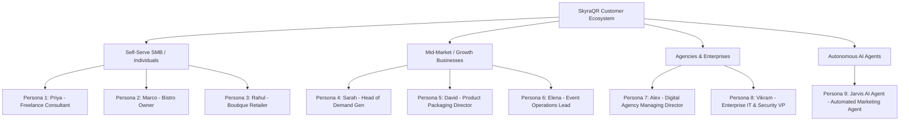

### Persona 1: Priya Sharma — Independent Creative & Consultant
- **Role:** Freelance Brand Designer & Marketing Consultant (Solo proprietor)
- **Goals:** Showcase portfolio, distribute contact information seamlessly at networking events, capture inbound leads.
- **Pain Points:** High card reprint costs; standard paper cards cannot reflect portfolio changes; cannot afford $40/mo enterprise tools.
- **Required Features:** vCard Plus QR, Social Links QR, custom logo embedding, SVG vector export, basic scan counts.
- **Target Tier:** **Free** to **Starter Tier** ($9 / ₹499/mo).

### Persona 2: Marco Rossi — Owner & General Manager
- **Role:** Independent Restaurant & Craft Bar Owner (2 locations, 24 employees)
- **Goals:** Eliminate paper menu printing costs, update culinary specials dynamically, provide contactless Wi-Fi access.
- **Pain Points:** High reprint costs when wine vintages change; menus load slowly on poor cellular networks.
- **Required Features:** Interactive Digital Menu builder, allergen filters, scheduled dayparting (Breakfast/Lunch/Dinner), Wi-Fi QR, table-tent design templates.
- **Target Tier:** **Starter** to **Business Tier** ($29 / ₹1,499/mo).

### Persona 3: Rahul Gupta — Direct-to-Consumer (D2C) Retail Founder
- **Role:** Founder of an artisanal apparel brand (15 employees, 50k monthly shipments)
- **Goals:** Drive repeat purchases from packaging unboxing inserts, gather customer feedback, authenticate product batches.
- **Pain Points:** Inability to track which retail box inserts result in repeat store purchases; inability to run seasonal discounts on pre-printed packaging.
- **Required Features:** Dynamic URL QR, Coupon QR, Feedback QR, UTM campaign tracking, A/B destination testing.
- **Target Tier:** **Business Tier** ($29 / ₹1,499/mo).

### Persona 4: Sarah Jenkins — Performance Marketing Director
- **Role:** Growth & Demand Generation Lead at a mid-market SaaS (250 employees)
- **Goals:** Bridge physical conference banners, print magazine ads, and transit billboards directly into the digital sales pipeline with end-to-end attribution.
- **Pain Points:** Physical campaigns act as data black holes; cannot determine offline ROAS; high risk of pre-printed links leading to 404s.
- **Required Features:** Smart OS routing (iOS App Store vs. Google Play), UTM parameter passing, webhook notifications on scan milestones, dead-link monitoring, CSV bulk export.
- **Target Tier:** **Business Tier** ($29 / ₹1,499/mo).

### Persona 5: David Vance — Director of Packaging & Brand Identity
- **Role:** CPG Brand Director (Global beverage company, 10M units/year)
- **Goals:** Implement compliant, high-density GS1 2D barcodes and dynamic QR codes on aluminum cans and glass bottles.
- **Pain Points:** Errors in printing cause packaging recalls; QR designs must strictly match brand guidelines without failing barcode scannability.
- **Required Features:** Precise QR scannability validation score, vector downloads (EPS, PDF, SVG), high error correction (Level H 30%), custom branded corner eyes, API batch generation.
- **Target Tier:** **Enterprise Tier** (Custom / $299+/mo).

### Persona 6: Elena Rostova — VP of Global Event Operations
- **Role:** Chief Event Producer for international tech summits (5,000+ attendees)
- **Goals:** Provide dynamic schedules, live venue maps, digital speaker bios, and sponsor engagement tracking across badges and exhibition booths.
- **Pain Points:** Schedule changes occur hours before keynote sessions; attendees complain of unreadable codes in dim lighting.
- **Required Features:** Event QR, PDF QR with offline progressive caching, fast-loading micro-pages, scheduled redirect changes, high-throughput bulk badge generation.
- **Target Tier:** **Business** or **Agency Tier** ($79 / ₹3,999/mo).

### Persona 7: Alex Mercer — Agency Managing Director
- **Role:** Founder of a 30-person digital marketing agency (45 active client retainers)
- **Goals:** Provide clients with branded QR campaign management under the agency's domain without clients knowing third-party software is utilized.
- **Pain Points:** Staff mixing up client links; clients requesting ad-hoc scan reports; clients complaining about third-party branding on redirect intermediate screens.
- **Required Features:** Multi-tenant Workspaces, white-label client portal (`qr.agency.com`), custom client CNAME short-domains, white-label PDF analytics reports, granular member roles (Viewer, Editor).
- **Target Tier:** **Agency Tier** ($79 / ₹3,999/mo).

### Persona 8: Vikram Singhania — Enterprise Chief Information Security Officer (CISO)
- **Role:** VP of IT Infrastructure & Information Security (10,000+ employees across 12 countries)
- **Goals:** Ensure all employee-generated QR codes comply with strict corporate cybersecurity policies and data privacy regulations.
- **Pain Points:** Employees generating QR codes on unvetted free tools that redirect through unsecured domains; lack of Single Sign-On; no audit trail.
- **Required Features:** SAML 2.0 / Okta SSO, SCIM provisioning, automated malicious destination URL blocking, role-based governance, immutable audit logging, 99.95% uptime SLA, dedicated IP/VPC options.
- **Target Tier:** **Enterprise Tier** (Annual contract).

### Persona 9: Jarvis AI Agent — Autonomous Marketing Operations Assistant
- **Role:** Automated AI Agent integrated with marketing stacks, CRM, and BI tools
- **Goals:** Autonomously retrieve QR scan telemetry, inspect link health, create promotional QRs for new campaigns, and summarize ROI for human marketing directors.
- **Pain Points:** Traditional web scraping is fragile and violates security boundaries; lacks programmatic, structured access with tool-level authorization.
- **Required Features:** Model Context Protocol (MCP) server support, scoped tool access (`read:analytics`, `write:qrs`), human-in-the-loop confirmation for high-risk actions, rate limiting, and structured JSON tool returns.
- **Target Tier:** Included across **Business**, **Agency**, and **Enterprise Tiers**.

---

## 4. Product Scope & Phased Roadmap

```mermaid
gantt
    title SkyraQR Phased Implementation Roadmap
    dateFormat  X
    axisFormat  Stage %s
    section MVP (Stage 1)
    User Auth, JWT, Refresh Rotation & Sessions :active, 0, 3
    Core Dynamic & Static QR Engines          :active, 0, 3
    Design Studio & Scannability Scoring       :active, 1, 3
    Core Micro-Pages (Menu, vCard, PDF)        :active, 1, 4
    Durable Redis Telemetry & Rollup Pipeline  :active, 1, 4
    Stripe & Razorpay Dual Billing Engine      :active, 2, 4
    section Phase 2 (Automation & Scale)
    Smart Routing Engine (OS, Geo, Time)       :3, 6
    CSV Bulk Generation & Export Engine        :4, 6
    Custom Domain CNAME & Auto-SSL Engine      :4, 7
    Public REST API v1 & Webhooks              :5, 7
    Customer & Workspace Admin Separation      :5, 7
    section Phase 3 (Agency & Intelligence)
    Model Context Protocol (MCP) Server        :6, 9
    Admin-Managed MCP Credentials & Delegation :7, 9
    Jarvis AI Agent Tool Integration           :7, 9
    White-Label Agency Client Portals          :7, 10
    A/B Traffic Splitting & Conversion Engine  :8, 10
    Automated Dead-Link Health Crawler         :8, 10
    SkyraQR Platform Owner Dashboard           :8, 11
    section Enterprise (Stage 4/5)
    Enterprise SAML 2.0 SSO & SCIM             :10, 13
    ClickHouse Analytical Database Migration   :11, 14
    GS1 2D Digital Link Barcode Engine         :12, 14
```

---

## 5. Authentication, Identity & Session Architecture

### 5.1 Multi-Channel Authentication Overview

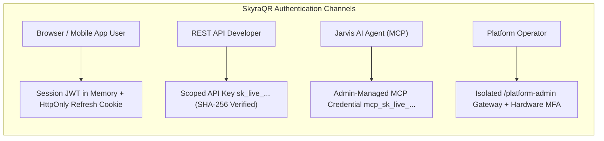

SkyraQR enforces strict authentication boundaries across all four access channels:
1. **Browser/Customer Authentication:** Passwords hashed with **Argon2id** ($m=65536 \text{ KiB}, t=3, p=4$). Short-lived JWT access tokens (15-min TTL) in application memory; rotating refresh tokens (7-day TTL) in `HttpOnly`, `Secure`, `SameSite=Strict` cookies (`__Host-skyra_rt`). Token replay detection immediately revokes the session family in Redis.
2. **REST API Client Authentication:** Programmatic access via high-entropy API keys (`sk_live_...`). **API keys are explicitly NOT JWTs.** The API Gateway computes `SHA-256(API_KEY)` and queries `api_keys`.
3. **MCP / Jarvis AI Agent Authentication:** Authenticated **exclusively** via **Admin-Managed MCP Credentials** (`mcp_sk_live_...`). OAuth 2.0 / OIDC is not supported as a primary authentication mechanism and is documented strictly as a future enterprise federation option.
4. **Platform Administration Authentication:** Accessible only via `/platform-admin/login`, requiring mandatory hardware (WebAuthn/FIDO2) or TOTP MFA.

### 5.2 Admin-Managed MCP Credential Model (Primary)

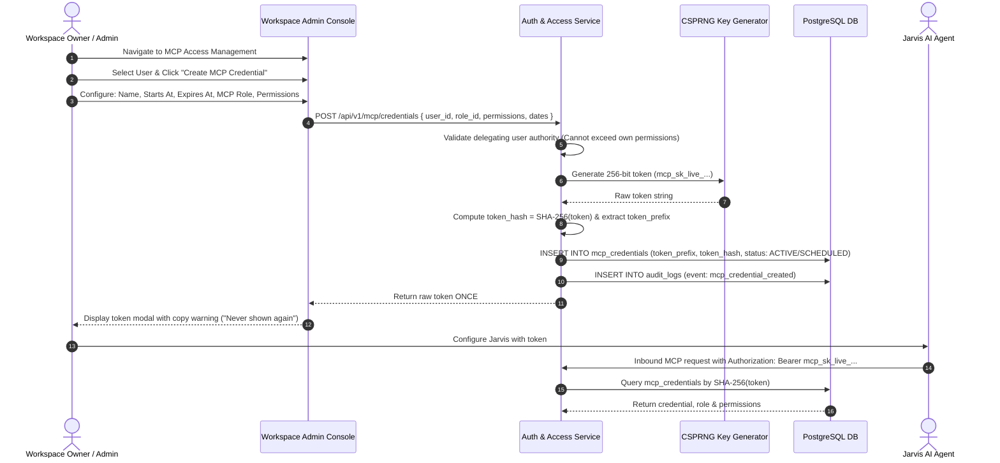

- **One-Time Secret Display:** The raw MCP token is displayed to the administrator exactly once upon creation. It is never stored in plaintext, never logged, and is mathematically unrecoverable from the database.
- **Database Storage:** The database stores strictly `token_prefix` (e.g., `mcp_sk_live_9a`) and `token_hash` (SHA-256).

### 5.3 Delegated MCP Access & Authority Boundaries

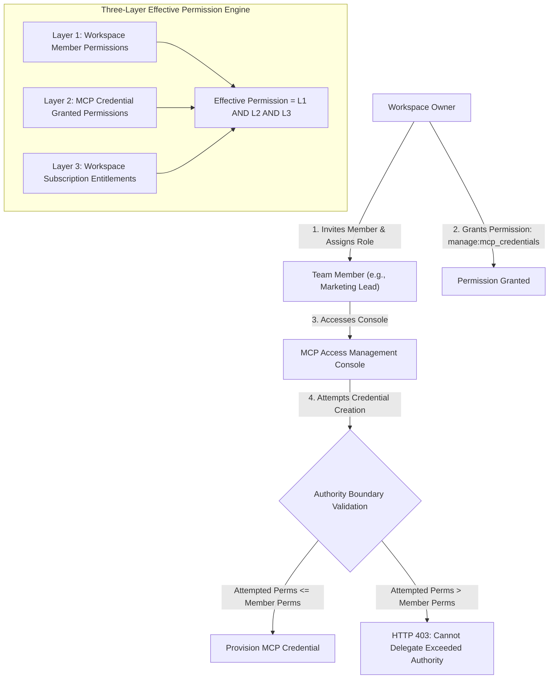

#### Authoritative Business Rules for Delegated Administration:
1. A Workspace Owner or authorized Workspace Admin can delegate MCP credential management to another workspace user.
2. The delegated user can create, inspect, suspend, rotate, and revoke MCP credentials **strictly within the workspaces they are authorized to manage**.
3. **The Principle of Delegated Authority Limits:** A delegated user **CANNOT** grant permissions greater than their own effective workspace permissions.
4. A delegated user **CANNOT** grant themselves higher workspace privileges or create credentials with roles they do not possess.
5. A delegated user **CANNOT** bypass active subscription entitlements or quota meters.
6. **Effective Permission Computation:**
   $$\text{Effective MCP Permission} = \text{Workspace Permission} \land \text{MCP Credential Permission} \land \text{Subscription Entitlement}$$
   *If ANY layer denies access, the tool invocation is immediately rejected.*

---

## 6. Tripartite Dashboard & RBAC Architecture

```mermaid
graph TD
    App[SkyraQR Application Ecosystem]
    App --> D1[Customer Dashboard]
    App --> D2[Workspace Administration]
    App --> D3[Platform Owner Dashboard]

    subgraph D1_Content[Customer Dashboard: Normal Business Users]
        D1 --> C1[Overview & Quick Stats]
        D1 --> C2[QR Codes & Creation Studio]
        D1 --> C3[Analytics & Heatmaps]
        D1 --> C4[Campaigns & Landing Pages]
        D1 --> C5[Personal Settings]
    end

    subgraph D2_Content[Workspace Administration: Owner & Admin]
        D2 --> W1[Team Members & RBAC Roles]
        D2 --> W2[MCP Access Management & Credentials]
        D2 --> W3[Custom Branded Domains & SSL]
        D2 --> W4[API Keys & Outbound Webhooks]
        D2 --> W5[Subscription, Invoicing & Quotas]
        D2 --> W6[Workspace Security & Audit Logs]
    end

    subgraph D3_Content[Platform Owner Dashboard: Skyra Operations Only]
        D3 --> P1[Global ARR, MRR & Revenue]
        D3 --> P2[Total Workspaces & Users]
        D3 --> P3[Abuse Detection & Quarantined QRs]
        D3 --> P4[Infrastructure, DB & Queue Health]
        D3 --> P5[Plan, Entitlement & Feature Flags]
        D3 --> P6[Platform Audit Logs & Support Ops]
    end
```

### 6.1 Customer Dashboard
Designed for everyday marketers, restaurant managers, and content creators:
- Overview, QR Codes Catalog, Create QR Studio, Analytics & Heatmaps, Campaigns, Landing Pages, Personal Settings.

### 6.2 Workspace Administration & MCP Access Management
Dedicated governance console for members holding `OWNER` or `ADMIN` roles (or delegated `manage:mcp_credentials` permission):
- Team Members & RBAC (`OWNER`, `ADMIN`, `EDITOR`, `VIEWER`, `CLIENT_GUEST`).
- **MCP Access Management:** Create, configure, rotate, suspend, and revoke credentials; inspect real-time agent invocation logs and rate limits.
- Custom Domains & SSL, Scoped API Keys, Outbound Webhooks, Subscription Billing & Quota Meters, Workspace Audit Logs.

### 6.3 Platform Owner Dashboard
Isolated administrative system for Skyra operations staff (`/platform-admin`):
- Roles: `PLATFORM_OWNER`, `PLATFORM_ADMIN`, `PLATFORM_SUPPORT`, `PLATFORM_ANALYST`.
- Global ARR/MRR telemetry, abuse quarantine, infrastructure health (Postgres pool, Redis memory, stream depth), plan & entitlement configuration, and platform audit logs.

---

## 7. Core Feature Specifications & Frontend Role

### 7.1 Frontend Application Responsibilities
The user interface is powered by **Next.js 14+ (App Router)** with **TypeScript**, **React**, **Tailwind CSS**, and **shadcn/ui**.
- **Role:** Presentation, client state, and user interaction.
- **Strict Boundary:** Next.js is **never** the authoritative business backend. All business rules, entitlement enforcement, dynamic routing, and data mutations are executed exclusively in the NestJS shared domain services.

### 7.2 Dynamic & Static QR Engines
- **Dynamic QR Engine:** Encodes a unique 6-character Base62 short URL (e.g., `skyra.link/x7k9p2`). Short codes resolve to edge redirect workers where smart routing, health verification, and scan telemetry collection occur prior to issuing an HTTP 302/307 redirect.
- **Static QR Engine:** Encodes data directly into the QR barcode matrix (e.g., raw text, direct Wi-Fi credentials). Zero database lookups or redirections; permanent and immutable once printed.
- **Scannability Assurance Engine:** Evaluates background-to-foreground contrast ratio (WCAG AA standard) and module density in real time. Automatically alerts users if color selections or embedded logos risk unreadability.

### 7.3 Customization & Design Studio
- **Matrix Patterns:** 12 module styles (Square, Rounded, Dots, Diamond, Leaf, Connected Lines, Fluid Beads, etc.).
- **Eye Corner Shapes:** Independent outer border and inner pupil customizers.
- **Coloration Engine:** Solid hex colors, linear gradients, and radial gradients.
- **Branded Logo Integration:** Center logo upload with automatic background cutout, clamped to $\le 22\%$ of matrix area.
- **Frame & CTA System:** 20+ preset decorative frames featuring customizable Call-to-Action text banners.
- **Error Correction Levels (ECC):** Level L (7%), Level M (15%), Level Q (25%), Level H (30%).

---

## 8. Advanced & Differentiating Features

### 8.1 Model Context Protocol (MCP) & Jarvis AI Integration

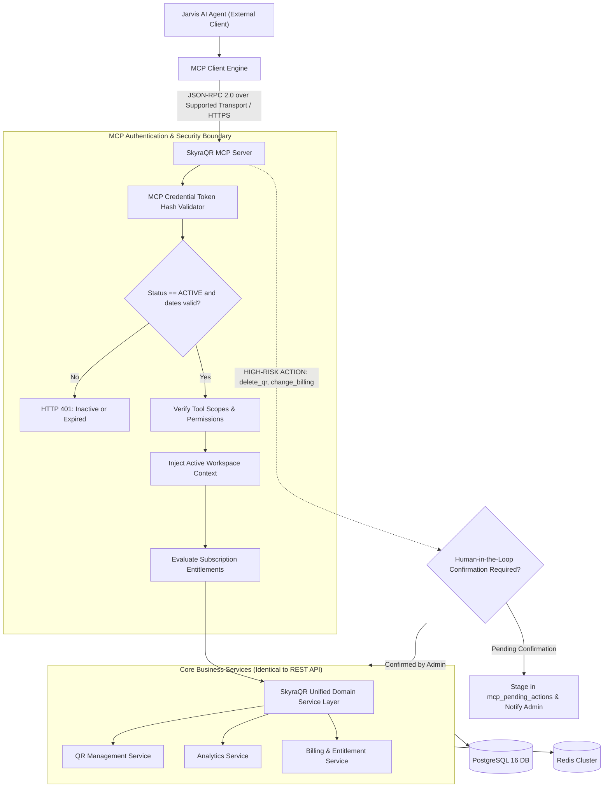

- **Architecture Principle:** The MCP Server connects **exclusively** to SkyraQR's unified Domain Service Layer. **The MCP Server is strictly prohibited from executing direct database queries against PostgreSQL.**
- **High-Risk Human Confirmation:** Destructive operations (`delete_qr`, `change_billing`, `manage:security`) stage in `mcp_pending_actions` until explicitly approved by a human Workspace Admin.
- **Transport Specification:** Native MCP server implemented using the officially supported transport mechanisms of the selected production MCP SDK/version (with secure authenticated HTTPS communication).

### 8.2 MCP Role Model & Permission Taxonomy

SkyraQR establishes four standard MCP roles, comprised of granular, independently assignable permissions:

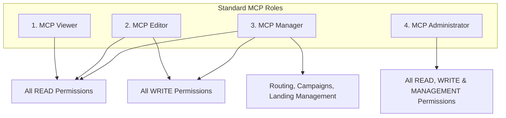

| Permission Category | Granular Permission Key | Classification | Description |
| :--- | :--- | :--- | :--- |
| **READ** | `read:workspace` | Standard | Inspect workspace metadata, plan tier, and settings |
| **READ** | `read:qrs` | Standard | List and fetch QR destinations, designs, and status |
| **READ** | `read:analytics` | Standard | Retrieve aggregate scan counts, timeseries, and geo metrics |
| **READ** | `read:usage` | Standard | Inspect quota meters and limit consumption |
| **READ** | `read:health` | Standard | Query dead-link status and destination ping results |
| **READ** | `read:campaigns` | Standard | List marketing campaigns and associated QR codes |
| **READ** | `read:landing_pages` | Standard | Fetch micro-landing page schemas, menus, and vCards |
| **READ** | `read:domains` | Standard | Inspect custom CNAME hostnames and SSL certificate status |
| **READ** | `read:team` | Standard | List workspace team members and assigned roles |
| **READ** | `read:audit` | Standard | Inspect workspace audit logs and history |
| **WRITE** | `create:qrs` | Standard | Provision new Dynamic or Static QR codes |
| **WRITE** | `update:qrs` | Standard | Modify destination URLs, tags, folders, or designs |
| **WRITE** | `delete:qrs` | **HIGH-RISK** | Soft-delete a QR code (Requires human confirmation) |
| **WRITE** | `create:campaigns` | Standard | Create new marketing campaign containers |
| **WRITE** | `update:campaigns` | Standard | Update campaign metadata and associated QR lists |
| **WRITE** | `delete:campaigns` | **HIGH-RISK** | Delete marketing campaign (Requires human confirmation) |
| **WRITE** | `create:landing_pages`| Standard | Publish new digital menu, vCard, or product page |
| **WRITE** | `update:landing_pages`| Standard | Update micro-page content, menu items, or styling |
| **WRITE** | `delete:landing_pages`| **HIGH-RISK** | Delete micro-landing page (Requires human confirmation) |
| **MANAGEMENT** | `manage:routing` | Standard | Create and update smart routing and A/B split rules |
| **MANAGEMENT** | `manage:domains` | Standard | Connect custom domains and trigger DNS verification |
| **MANAGEMENT** | `manage:api_keys` | **HIGH-RISK** | Create, rotate, and revoke REST API keys |
| **MANAGEMENT** | `manage:mcp_credentials`| **HIGH-RISK** | Provision, suspend, rotate, or revoke MCP credentials |
| **MANAGEMENT** | `manage:team` | **HIGH-RISK** | Invite, modify, or remove workspace members |
| **MANAGEMENT** | `manage:billing` | **HIGH-RISK** | Upgrade, downgrade, or cancel subscription plans |
| **MANAGEMENT** | `manage:security`| **HIGH-RISK** | Modify workspace MFA, IP allowlists, or security policies |

### 8.3 MCP Credential Lifecycle Governance

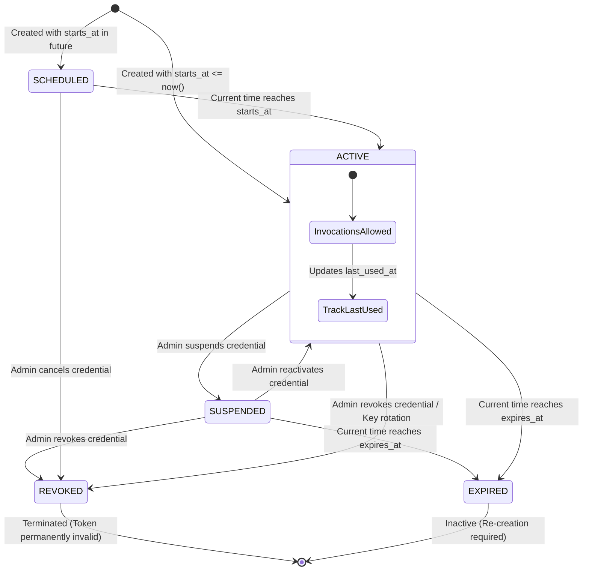

#### Authoritative Credential Lifecycle Rules:
1. **SCHEDULED:** Token does not work before `starts_at`. Inbound tool calls return `HTTP 401 Unauthorized` (`CREDENTIAL_NOT_YET_ACTIVE`).
2. **ACTIVE:** Token functions normally between `starts_at` and `expires_at`. Every successful invocation updates `last_used_at`.
3. **SUSPENDED:** Administrator temporarily halts token execution. Tool calls return `HTTP 401 Unauthorized` (`CREDENTIAL_SUSPENDED`). Can be reactivated to `ACTIVE`.
4. **EXPIRED:** Token stops working automatically once `now() >= expires_at`. Returns `HTTP 401 Unauthorized` (`CREDENTIAL_EXPIRED`).
5. **REVOKED:** Token is permanently and irreversibly invalidated. Returns `HTTP 401 Unauthorized` (`CREDENTIAL_REVOKED`).
6. **Controlled Rotation:** Administrator issues a rotation request. A new token is generated and displayed once; the old credential status transitions to `REVOKED`.

### 8.4 Context-Aware Smart Routing & A/B Testing
- **Deterministic A/B Traffic Splitting:**
  $$\text{bucket} = \text{hash}(\text{visitor\_key} \parallel \text{qr\_id}) \pmod{100}$$
  Where `visitor_key` is derived from the privacy-safe daily keyed scan identity.
  *Limitations:* Cross-device persistence is not guaranteed. Cross-day persistence is not guaranteed if the daily salt changes. An optional first-party cookie (`__skyra_ab_{qr_id}`) may be enabled for browser-level stickiness subject to privacy rules.
- **Device OS Routing:** Inspects `User-Agent` headers at edge nodes to route iOS, Android, and Desktop users to distinct store links.
- **Time-Based Dayparting:** Evaluates scanner local timezone to switch destinations automatically.

### 8.5 QR Health Monitoring & Dead-Link Defense
- Asynchronous crawler inspects destination URLs every 12 hours via `HTTP HEAD`.
- Persistent failures across 3 retries update status to `FAILING`, alert the Owner, and redirect traffic to a safe fallback page.

### 8.6 White-Label Agency Dashboards & Client Portals
- Agencies can host SkyraQR under their custom domain (`app.agency.com`) with custom branding.
- The `CLIENT_GUEST` role allows agency clients to review live analytics without editing permissions.

---

## 9. QR Type Strategy & Comprehensive Generation Lifecycle

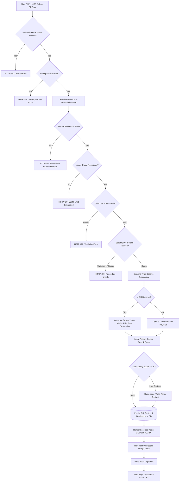

### The 16 Supported QR Types

| # | QR Type | Modality | Purpose & Primary User | Required Fields | Optional Fields | Target Behavior | Minimum Tier |
| :-: | :--- | :--- | :--- | :--- | :--- | :--- | :--- |
| **1** | **Dynamic URL** | Dynamic | Marketing campaigns, billboards, print ads | `target_url` | `utm_source`, `utm_medium`, `utm_campaign` | Resolves short link -> Smart routing -> 302 redirect | Free (2 active) |
| **2** | **Static URL** | Static | Permanent raw links, hardware labels | `raw_url` | None | Hardcoded into matrix; direct browser load | Free (Unlimited)|
| **3** | **vCard Plus** | Dynamic | Digital business cards for professionals | `first_name`, `email`, `phone` | `photo`, `company`, `title`, `socials`, `bio` | Loads responsive micro-page with 1-tap `.vcf` download | Starter |
| **4** | **Static vCard** | Static | Offline contact exchange | `first_name`, `phone` | `last_name`, `email`, `company` | Standard `BEGIN:VCARD` text payload in matrix | Free (Unlimited)|
| **5** | **Digital Menu** | Dynamic | Contactless restaurant & bar menus | Establishment `name`, $\ge 1$ Category, $\ge 1$ Item | Allergen tags, item photos, currency switcher | Loads fast responsive menu micro-page with dayparting | Starter |
| **6** | **PDF Showcase** | Dynamic | Catalogs, brochures, technical manuals | Uploaded PDF file ($\le 50\text{MB}$) | File title, cover image, download toggle | Loads embedded mobile PDF viewer micro-page | Starter |
| **7** | **Wi-Fi Access** | Static | Instant guest network connection | `ssid`, `auth_type` (WPA/WPA2/WEP) | `password`, `is_hidden` | Standard `WIFI:S:...;P:...;;` string; 1-tap connect | Free (Unlimited)|
| **8** | **Link-in-Bio** | Dynamic | Social media aggregators for creators | Title, $\ge 1$ Social/Web link | Profile avatar, bio, brand theme | Loads responsive social link aggregator micro-page | Free (Watermarked)|
| **9** | **WhatsApp Direct**| Dynamic/Static| Customer support & instant inquiries | `phone_number` | Pre-filled default message | Opens WhatsApp chat (`wa.me/{phone}?text=...`) | Free |
| **10**| **Product Page** | Dynamic | Packaging unboxing, D2C storytelling | Product `title`, Description, Photo | Buy button URL, SKU, specs, video embed | Loads high-converting product showcase micro-page | Business |
| **11**| **Coupon / Promo**| Dynamic | Retail discounts & seasonal promotions | Promo `title`, `discount_code` | Expiry countdown, barcode, terms, store URL | Loads coupon redeem micro-page with copy-code button | Business |
| **12**| **Event RSVP** | Dynamic | Conferences, weddings, webinars | Event `title`, `start_time`, Location | End time, map pin, `.ics` calendar download | Loads event details micro-page with 1-tap calendar add | Business |
| **13**| **Feedback Star** | Dynamic | Customer satisfaction surveys & reviews | Survey `title`, Rating prompt | Google Review link, feedback email destination | Loads 1–5 star rating micro-page; high scores route to Google | Business |
| **14**| **Smart App Link**| Dynamic | App developers & publishers | iOS App Store URL, Android Play URL | Web fallback URL, custom tracking campaign | Inspects OS at edge; redirects to correct app store | Business |
| **15**| **Audio / MP3** | Dynamic | Musicians, podcasters, museum audio tours | Uploaded Audio file ($\le 30\text{MB}$) | Track title, artist name, cover art, bio | Loads responsive audio player micro-page | Business |
| **16**| **GS1 Digital Link**| Dynamic | FMCG smart packaging, supply chain | GTIN (Global Trade Item Number) | Batch/Lot number, serial number, regulatory URL | GS1-conformant URI standard syntax (`/01/{gtin}/...`) | Enterprise |

---

## 10. Dynamic QR Business Logic & Lifecycle

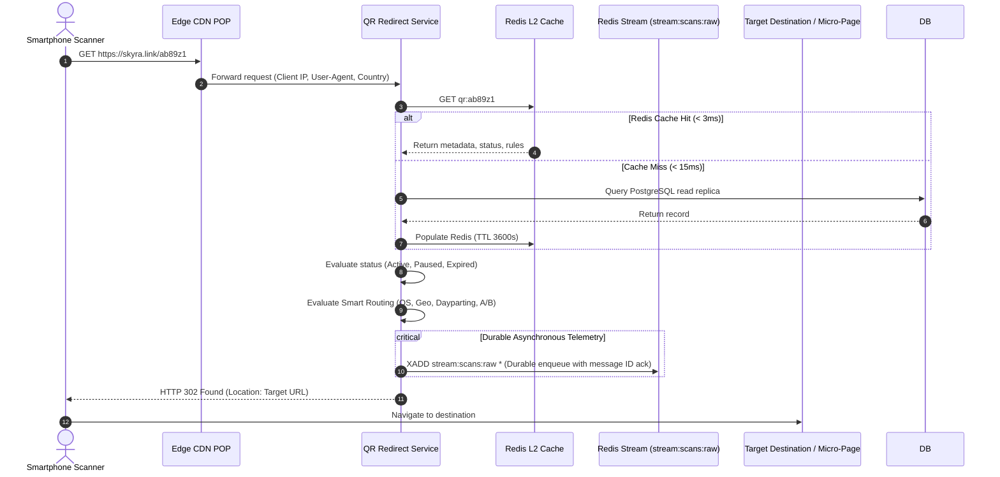

---

## 11. End-to-End User Journeys

### Journey 1: New User Self-Serve Onboarding to Production QR
1. User registers with email/password; system hashes password with Argon2id; provisions User and default Workspace.
2. User verifies email; logs in and receives short-lived JWT + `HttpOnly` refresh cookie.
3. Lands on **Customer Dashboard**; explores templates with clear status badges (**AVAILABLE**, **LIMITED**, **REQUIRES UPGRADE**).
4. Creates Dynamic URL QR within Free tier limits; styles design and downloads vector SVG.

### Journey 2: Workspace Admin Connects Custom Branded Domain
1. Workspace Owner navigates to **Workspace Administration** $\rightarrow$ **Domains**.
2. Submits custom domain: `go.mybrand.com`; system outputs DNS CNAME target: `edge.skyra.link`.
3. Admin updates DNS registrar; clicks **Verify DNS**.
4. System confirms DNS propagation, provisions Let's Encrypt SSL certificate via ACME; marks domain **ACTIVE**.

### Journey 3: Delegated MCP Credential Issuance & Jarvis AI Execution
1. Workspace Owner navigates to **Workspace Administration** $\rightarrow$ **Team Members**; invites Priya as `Workspace Admin` and grants `manage:mcp_credentials`.
2. Priya navigates to **MCP Access Management**; creates an MCP credential for the Jarvis marketing agent with role `MCP Manager` and 90-day expiry.
3. System validates that Priya's attempted permissions do not exceed her own effective privileges; mints `mcp_sk_live_...` and displays it **once**.
4. Jarvis connects to SkyraQR MCP Server endpoint; invokes `get_scan_metrics` and `update_destination`.
5. All operations are immutably logged in `audit_logs` and structured ELK streams with zero direct database exposure.

---

## 12. Detailed Functional Requirements

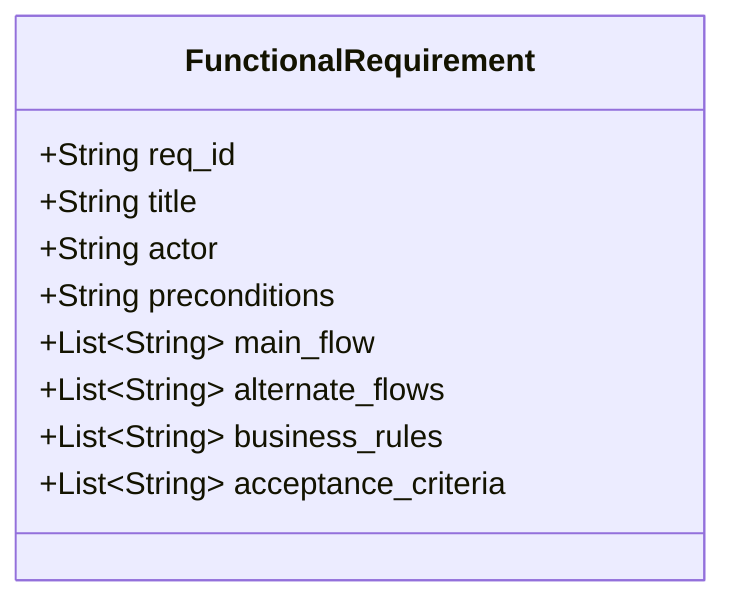

| ID | Requirement Name | Actor | Description & Business Rules |
| :--- | :--- | :--- | :--- |
| **BR-FR-001** | User Registration & Workspace Provisioning | Visitor | Provisions `users` record with Argon2id password hash and default `workspaces` container. Dispatches cryptographic verification email. |
| **BR-FR-002** | Sign-In & Refresh Token Rotation | User | Authenticates user; issues 15-min JWT access token and 7-day `HttpOnly` rotating refresh token cookie. Token replay immediately revokes session family. |
| **BR-FR-003** | Multi-Factor Authentication (TOTP) | User | RFC 6238 TOTP enrollment with encrypted secret and 8 single-use hashed recovery codes. Mandatory for Platform Administrators. |
| **BR-FR-004** | Password Reset & Token Invalidation | User | Cryptographic reset token (1-hour TTL); updating password automatically revokes all active Redis session keys for that user. |
| **BR-FR-005** | Customer Dashboard Experience | Member | Interface for everyday QR management, live canvas previews, campaigns, landing pages, and analytics. Badges indicate plan availability. |
| **BR-FR-006** | Workspace Administration & RBAC | Admin | Console for managing team members, RBAC roles (`OWNER`, `ADMIN`, `EDITOR`, `VIEWER`, `CLIENT_GUEST`), custom domains, API keys, and billing. |
| **BR-FR-007** | Platform Owner Administration | Platform Staff | Dedicated, isolated console (`/platform-admin`) for managing global ARR/MRR, system health, abuse quarantines, and plan configurations. |
| **BR-FR-008** | Dynamic QR Short Code Mapping | Editor+ | Generates collision-resistant 6-character Base62 short code linked to a destination URL. Verifies remaining dynamic QR quota before creation. |
| **BR-FR-009** | Design Studio & Scannability Scoring | Editor+ | Visual styling customizer for patterns, corner eyes, colors, and logos. Evaluates WCAG contrast ratio; clamps center logo to $\le 22\%$ matrix area. |
| **BR-FR-010** | Lossless Vector & Raster File Export | Member | Exports generated QR codes in SVG, PDF (CMYK print-ready), EPS, and high-res PNG (up to 4096px). |
| **BR-FR-011** | Context-Aware Device OS Routing | System | Edge redirect worker inspects `User-Agent` and routes iOS, Android, and Desktop users to distinct destination URLs. |
| **BR-FR-012** | Time-Based Dayparting | System | Edge redirect worker evaluates scanner local timezone to switch destinations automatically across scheduled time windows. |
| **BR-FR-013** | Deterministic A/B Traffic Splitting | Marketer | Splits traffic between two destination URLs using deterministic salted hash modulo math with optional first-party cookie stickiness. |
| **BR-FR-014** | Automated Dead-Link Crawler | System | Asynchronous crawler inspects destination URLs every 12 hours via `HTTP HEAD`; persistent failures trigger alerts and reroute traffic to fallback URLs. |
| **BR-FR-015** | MCP Server Interface for AI Agents | Jarvis Agent| Exposes standardized MCP server enabling AI agents to invoke read/write tools through the domain service layer. Zero direct database access. |
| **BR-FR-016** | Human Confirmation for High-Risk MCP Tools | Jarvis / Owner | High-risk MCP tools (`delete_workspace`, `delete_qr`, `change_billing`) stage in `PENDING_CONFIRMATION` until explicitly confirmed by a human Admin. |
| **BR-FR-017** | Privacy-First Telemetry Collection | System | Ingests real-time scan events using HMAC-SHA256 with a 24-hour rotating secret salt. Raw client IP addresses are discarded immediately from memory. |
| **BR-FR-018** | Real-Time Telemetry & Daily Rollups | Member / API | Interactive analytics charts backed by pre-aggregated `daily_scan_metrics` tables, loading in $< 50\text{ms}$ across 30-day query windows. |
| **BR-FR-019** | Custom Domains & Automated SSL | Admin | Supports custom CNAME subdomains (`qr.brand.com`) with automated Let's Encrypt SSL certificate provisioning via ACME protocol. |
| **BR-FR-020** | Bulk QR Generation via CSV | Admin | Programmatically provisions up to 5,000 QR codes from an uploaded CSV batch file via background worker queue. |
| **BR-FR-021** | Dual Billing Engine (Stripe + Razorpay) | Owner | Supports global credit cards/USD via Stripe Billing and native Indian payments (UPI AutoPay, Netbanking, GST invoices) via Razorpay. |
| **BR-FR-022** | Delegated Workspace Users | Owner / Admin | Allows owners and admins to invite users, assign workspace roles, and delegate administrative tasks within strict boundaries. |
| **BR-FR-023** | Delegated MCP Administration | Delegated Admin| Permits authorized users to access MCP Access Management; strictly prevents delegating permissions exceeding the user's own authority. |
| **BR-FR-024** | MCP Credential Creation & Token Hashing | Delegated Admin| Generates high-entropy `mcp_sk_live_...` credentials; displays token once; stores only `token_prefix` and SHA-256 `token_hash`. |
| **BR-FR-025** | MCP Credential Lifecycle Governance | Admin / System | Manages credential states: `SCHEDULED`, `ACTIVE`, `SUSPENDED`, `EXPIRED`, `REVOKED`. Enforces temporal and operational limits. |
| **BR-FR-026** | MCP Roles & Granular Permissions | Admin | Assigns standard roles (`MCP Viewer`, `MCP Editor`, `MCP Manager`, `MCP Administrator`) or granular custom permissions. |
| **BR-FR-027** | PostgreSQL Business & Security Audit Logging| System | Authoritative immutable ledger in `audit_logs` capturing actor, action, resource, before/after state, and request metadata. |
| **BR-FR-028** | Centralized ELK Observability & Tracing | System | Emits structured JSON events to Logstash/Elasticsearch with correlated `request_id` and `trace_id` across all application services. |
| **BR-FR-029** | Automated Sensitive Secret Redaction | System | Sanitizes all logs and audit events to prevent leaking raw tokens, password hashes, payment data, or authorization secrets. |

---

## 13. Traceability Matrix

| Requirement ID | Primary Architecture Component | API Endpoint Group | Database Entity | Verification Method |
| :--- | :--- | :--- | :--- | :--- |
| **BR-FR-001** | `AuthService` | `/api/v1/auth/register` | `users`, `workspaces` | Unit & E2E Test |
| **BR-FR-002** | `AuthService`, Redis Cluster | `/api/v1/auth/login`, `/refresh` | `user_sessions`, `refresh_tokens` | E2E Security Test |
| **BR-FR-003** | `AuthService` (RFC 6238) | `/api/v1/auth/mfa/*` | `user_mfa_settings` | Security Unit Test |
| **BR-FR-004** | `AuthService`, Redis Cluster | `/api/v1/auth/password-reset` | `users`, `auth_audit_logs` | Integration Test |
| **BR-FR-005** | Next.js Frontend, `QRService` | `/api/v1/qrs`, `/api/v1/workspaces`| `qr_codes`, `qr_designs` | UI E2E Cypress Test |
| **BR-FR-006** | `WorkspaceService`, RBAC Guard | `/api/v1/workspaces/:id/members` | `workspace_members`, `roles` | RBAC Matrix Test |
| **BR-FR-007** | `PlatformAdminService` | `/platform-admin/api/v1/*` | `platform_users`, `platform_roles`| Security Isolation Test |
| **BR-FR-008** | `QRService` | `/api/v1/qrs` | `qr_codes`, `qr_destinations` | Functional Test |
| **BR-FR-009** | `DesignService` (Canvas/SVG) | `/api/v1/qrs/preview` | `qr_designs` | Visual Regression Test |
| **BR-FR-010** | `ExportService` (Vector Engine) | `/api/v1/qrs/:id/export` | `qr_codes`, `qr_designs` | PDF/SVG Verification |
| **BR-FR-011** | Edge Redirect Worker | `GET /:shortCode` | `redirect_rules` | Edge Latency Test |
| **BR-FR-012** | Edge Redirect Worker | `GET /:shortCode` | `redirect_rules` | Time-Window Test |
| **BR-FR-013** | Edge Redirect Worker | `GET /:shortCode` | `redirect_rules` | Statistical A/B Test |
| **BR-FR-014** | `HealthCrawlerService` | `/api/v1/qrs/:id/health` | `qr_health_checks` | Background Job Test |
| **BR-FR-015** | `MCPServer`, Domain Services | `/api/v1/mcp/*` (JSON-RPC) | `mcp_credentials`, `mcp_roles` | MCP Client E2E Test |
| **BR-FR-016** | `MCPServer`, `WorkspaceAdmin` | `/api/v1/mcp/pending-actions/*`| `mcp_pending_actions` | Human Approval Flow |
| **BR-FR-017** | Edge POP, Redis Stream | `stream:scans:raw` | `scan_events` (Partitioned) | Privacy Salt Verification |
| **BR-FR-018** | `AnalyticsService` | `/api/v1/analytics/*` | `daily_scan_metrics` | Benchmark Load Test |
| **BR-FR-019** | `DomainService`, ACME Engine | `/api/v1/domains/*` | `custom_domains` | SSL Verification Test |
| **BR-FR-020** | `BulkQRWorker` (BullMQ) | `/api/v1/qrs/bulk` | `qr_generation_jobs` | 5,000 CSV Ingest Test |
| **BR-FR-021** | `BillingService` (Stripe/Razorpay)| `/api/v1/billing/*` | `subscriptions`, `invoices` | Webhook Simulator Test |
| **BR-FR-022** | `WorkspaceService` | `/api/v1/workspaces/:id/invites`| `workspace_invitations` | Member Onboarding Test |
| **BR-FR-023** | `MCPService`, Delegated Guard | `/api/v1/mcp/credentials` | `mcp_credentials`, `roles` | Authority Boundary Test |
| **BR-FR-024** | `MCPService`, Crypto Engine | `/api/v1/mcp/credentials` | `mcp_credentials` | Hash Storage Test |
| **BR-FR-025** | `MCPService`, Cron Worker | `/api/v1/mcp/credentials/:id/*`| `mcp_credentials` | Lifecycle State Machine |
| **BR-FR-026** | `MCPService` | `/api/v1/mcp/roles`, `/perms` | `mcp_roles`, `mcp_perms` | Permission Bundle Test |
| **BR-FR-027** | `AuditService` | `/api/v1/audit-logs` | `audit_logs` | Immutability Verification |
| **BR-FR-028** | Logger, Logstash / Elasticsearch| Centralized ELK Ingest | Elasticsearch Index | ELK Tracing Test |
| **BR-FR-029** | Logging Sanitizer Interceptor | All Ingress / Egress | ELK / `audit_logs` | Secret Leakage Scanner |

---

## 14. Non-Functional Requirements (NFRs)

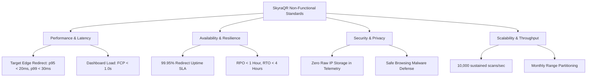

| ID | Category | Target Metric | Description & Architectural Enforcement |
| :--- | :--- | :--- | :--- |
| **BR-NFR-001** | **Redirect Latency** | $\text{p95} < 20\text{ms}, \text{p99} < 30\text{ms}$ | Target p99 end-to-end edge redirection latency under defined benchmark conditions, excluding network latency outside SkyraQR control. |
| **BR-NFR-002** | **Availability SLA** | $99.95\%$ Uptime | Applies to edge redirect infrastructure ($< 4.38\text{ hours}$ downtime/year). Multi-region edge deployment. |
| **BR-NFR-003** | **Ingestion Throughput**| $10,000 \text{ scans/sec}$ | Decoupled durable ingestion via Redis Streams (`stream:scans:raw`); zero blocking database writes during redirect. |
| **BR-NFR-004** | **Analytics Freshness** | $\le 5\text{ seconds}$ | Time from physical scan execution to appearance in real-time telemetry dashboard counters. |
| **BR-NFR-005** | **Privacy Architecture**| Privacy-by-Design Aligned | Raw IP addresses are not persisted in QR scan telemetry; limited IP data may be retained in security/audit logs per documented policies. |
| **BR-NFR-006** | **Security Standards** | OWASP Top 10 Aligned | Strict CSP, HSTS, rate-limiting on auth routes (5 req/15 min), parameterized queries, CORS lockdown. |
| **BR-NFR-007** | **Malware Defense** | Google Safe Browsing API | Pre-screens dynamic destination URLs at creation; automated 12-hour re-check of active destinations. |
| **BR-NFR-008** | **Accessibility** | WCAG 2.1 Level AA | Customer dashboard and all public micro-landing pages comply with contrast and keyboard accessibility standards. |
| **BR-NFR-009** | **Mobile Performance** | Lighthouse Mobile $\ge 90$ | Public micro-landing pages achieve First Contentful Paint (FCP) $< 1.2\text{s}$ on 4G cellular connections. |
| **BR-NFR-010** | **Disaster Recovery** | $\text{RPO} < 1\text{ hr}, \text{RTO} < 4\text{ hrs}$ | Continuous PostgreSQL WAL archiving to S3/R2; daily cross-region automated database snapshots. |
| **BR-NFR-011** | **API Performance** | $\text{p95} < 100\text{ms}$ | Core management REST API endpoints respond under 100ms under standard load conditions. |
| **BR-NFR-012** | **Barcode Precision** | ISO/IEC 18004:2015 | Standard-compliant QR code generation ensuring compatibility across 100% of standard smartphone scanners. |
| **BR-NFR-013** | **Export Asset Quality**| Lossless Vector Output | SVG, EPS, and PDF vector files contain zero raster artifacting to permit billboard-scale printing. |
| **BR-NFR-014** | **Tenant Isolation** | Strict Multi-Tenancy | Every database query scoped directly via `workspace_id` or indirectly via parent relational foreign key hierarchy. |
| **BR-NFR-015** | **MCP Tool Latency** | $\text{p95} < 250\text{ms}$ | MCP tool invocations execute through domain services and return structured JSON in under 250ms. |

---

## 15. Subscription, Entitlement Engine & Monetization Strategy

### 15.1 Before-Subscription and After-Subscription Experience

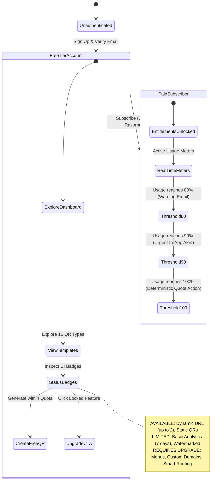

### 15.2 Subscription Tier Architecture

| Dimension | Free Tier | Starter Tier | Business Tier | Agency Tier | Enterprise Tier |
| :--- | :--- | :--- | :--- | :--- | :--- |
| **Price (USD)** | $0 / month | $9 / month ($90/yr) | $29 / month ($290/yr) | $79 / month ($790/yr) | Custom ($299+/mo) |
| **Price (INR)** | ₹0 / month | ₹499 / month (₹4,990/yr) | ₹1,499 / mo (₹14,990/yr) | ₹3,999 / mo (₹39,990/yr) | Custom (₹25,000+/mo) |
| **Database Precision** | `NUMERIC(12,2)` | `NUMERIC(12,2)` | `NUMERIC(12,2)` | `NUMERIC(12,2)` | `NUMERIC(12,2)` |
| **Active Dynamic QRs**| 2 active | 15 active | 100 active | 500 active | Unlimited |
| **Static QRs** | Unlimited | Unlimited | Unlimited | Unlimited | Unlimited |
| **Monthly Scans** | 500 / month | 25,000 / month | 250,000 / month | 1,500,000 / month | Unlimited / Custom |
| **Analytics Retention**| 7 days | 90 days | 365 days | 2 Years | 5 Years / Raw Export |
| **Micro-Landing Pages**| Watermarked | All templates, No watermark | Custom CSS & Badges | Custom CSS & White-Label | Custom Domain Isolated |
| **Custom Domains** | 0 | 0 | 1 Custom Domain | 5 Custom Domains | Unlimited Dedicated |
| **Team Member Seats** | 1 (Solo) | 2 Seats | 5 Seats | 15 Seats | Custom RBAC Seats |
| **Workspaces** | 1 | 1 | 3 Workspaces | 10 Client Workspaces | Unlimited Workspaces |
| **Bulk Generation** | Not available | Up to 100 QRs/batch | Up to 1,000 QRs/batch | Up to 5,000 QRs/batch | Programmatic API Stream |
| **Smart Routing** | Not available | OS Device Routing | OS, Geo & Dayparting | OS, Geo, Time, A/B Split | Custom Edge Rules Engine|
| **REST API & Webhooks**| Not available | Read-only API | Full API (60 req/min) | Full API (300 req/min) | Dedicated API Limits |
| **MCP Server Access** | Not available | Read-only tools | Read + Write tools | Full MCP + Jarvis Agent | Custom Agent Scopes |
| **Dead-Link Crawler** | Not available | Weekly check | 12-hour crawl | 6-hour crawl | Real-time health monitor|
| **White-Labeling** | SkyraQR branding | SkyraQR branding | Remove Skyra branding | Full Agency White-Label | Custom Portal & Dedicated IP|

### 15.3 Authoritative Entitlement Policy Model

SkyraQR enforces a unified, unambiguous three-tier entitlement policy model across the UI, REST API, and MCP Server:

| Quota / Feature Name | Relevant Plans | Limit Specification | Enforcement Layer | Behavior When Limit Reached |
| :--- | :--- | :--- | :--- | :--- |
| **Dynamic QR Creation** | All Tiers | Free: 2, Starter: 15, Business: 100, Agency: 500 | `QRService` | **BLOCK:** Feature denied. UI displays upgrade modal; REST API returns `HTTP 403 Forbidden` if tier does not permit, or `HTTP 429 Too Many Requests` when active quota exhausted. Existing dynamic QRs continue scanning. |
| **Monthly Scans** | All Tiers | Free: 500, Starter: 25k, Business: 250k, Agency: 1.5M | Redirect Worker | **SOFT_OVERAGE:** Scans are never blocked. In Free/Starter, admin alerts fire; in Business/Agency, overage billing applies per 10k additional scans. |
| **Team Member Seats** | All Tiers | Free: 1, Starter: 2, Business: 5, Agency: 15 | `TeamService` | **BLOCK:** Inviting additional members denied. REST API returns `HTTP 429 Too Many Requests`. Existing members retain full access. |
| **Custom Domains** | Business+ | Free: 0, Starter: 0, Business: 1, Agency: 5 | `DomainService` | **BLOCK:** Adding new domains denied (`HTTP 403` on Free/Starter, `HTTP 429` on Business/Agency). Existing custom domains continue routing normally. |
| **REST API Access** | Business+ | Free: 0, Starter: Read-only, Business/Agency: Full | API Gateway | **BLOCK:** In Free tier, requests return `HTTP 403 Forbidden` (feature not included). In Business/Agency, exceeding monthly request cap returns `HTTP 429 Too Many Requests`. |
| **MCP AI Server Tools** | Starter+ | Free: 0, Starter: Read, Business/Agency: Read+Write | MCP Guard | **BLOCK:** Excluded tools return `HTTP 403` (requires plan upgrade). Exceeding request rate limit returns `HTTP 429`. |
| **Workspace Downgrade** | All Tiers | Expired or canceled subscriptions | Entitlement Engine | **READ_ONLY:** Workspace enters read-only grace period. Existing QR codes continue redirecting; creating or editing QRs is blocked until subscription is renewed. |

### 15.4 Advertising & Monetization Boundaries

SkyraQR explicitly upholds a strict B2B SaaS monetization policy:
- **Zero Third-Party Advertising:** SkyraQR **never** injects third-party programmatic advertisements (e.g., Google AdSense, banners) into customer-generated QR codes, customer destination URLs, paid micro-landing pages, or agency white-label portals.
- **Primary Revenue Streams:** Subscription tiers, usage-based scan overages, custom domains, high-capacity bulk generation add-ons, agency white-label portals, and enterprise contracts.
- **Free Tier Policy:** Free tier micro-landing pages include a discreet "Powered by SkyraQR" footer link. Users upgrade to Starter or Business tiers to remove this watermark.

---

## 16. Privacy, Security Logging & Audit Retention Policy

To reconcile data protection with operational security auditing:

> **Core Policy Statement:**  
> *"Raw IP addresses are not persisted in QR scan telemetry; limited IP data may be retained in security/audit logs according to documented retention and access-control policies."*

| Log / Data Category | Table Name | IP Retention Detail | Primary Purpose | Retention Period | Access Controls |
| :--- | :--- | :--- | :--- | :--- | :--- |
| **QR Scan Telemetry** | `scan_events` | **Zero Raw IP.** Only 64-char HMAC-SHA256 salted hash stored. | Scan analytics and unique visitor counting. | 90 days (Starter), 365 days (Business), 2–5 yrs (Agency/Enterprise). | Workspace members with `read:analytics` permission. |
| **User Active Sessions** | `user_sessions` | Client IP address recorded at login. | Session management, remote logout, stolen session detection. | Purged immediately upon session termination or after 7 days inactivity. | Authenticated user and Workspace Admin. |
| **Authentication Audit**| `auth_audit_logs` | Client IP address recorded on auth events. | Brute-force investigation, account lockout, audit trail. | 90 days rolling retention; auto-purged via cron. | Workspace Admins and Platform Security staff. |
| **Business Audit Logs** | `audit_logs` | Client IP address recorded on mutations. | Authoritative historical ledger of all configuration and resource changes. | 1 year (Business), 5 years (Agency/Enterprise, SOC2 aligned). | Workspace Admins and Platform Security staff. |
| **MCP Invocation Logs** | `mcp_invocation_logs`| Origin IP address of MCP client/agent. | AI agent audit trail and rate-limit verification. | 180 days rolling retention. | Workspace Admins and Platform Security staff. |
| **Platform Operator Logs**| `platform_audit_logs`| Operator IP address recorded on mutations. | Administrative accountability and compliance. | 7 years statutory compliance retention. | Platform Owner and designated Security Auditors only. |

---

## 17. Observability & Centralized ELK Requirements

SkyraQR enforces a unified observability standard:
1. **Centralized Structured JSON Logging:** Every component (Next.js frontend, NestJS backend, Fastify edge redirect, background workers, MCP server) emits machine-readable structured JSON events to Logstash / Elasticsearch.
2. **Distributed Request Tracing:** Every HTTP and MCP request receives or generates a unique `request_id` (UUIDv7) and `trace_id` (W3C trace context format). These IDs propagate through controllers, domain services, background queues, and outbound requests.
3. **Automated Secret Redaction:** Logging interceptors automatically scrub Authorization headers, password fields, API keys, MCP tokens, and credit card values before serializing logs.

---

## 18. Assumptions, Dependencies & Risks

### 18.1 Key Assumptions
- Smartphone native camera apps will continue maintaining built-in QR barcode scanning without requiring third-party scanning apps.
- Dynamic QR code redirection provides sufficient utility to sustain recurring monthly SaaS subscriptions for businesses.
- Stripe and Razorpay maintain operational API availability in primary target jurisdictions.

### 18.2 System Dependencies
- Cloudflare Enterprise Anycast DNS & Edge Network.
- MaxMind GeoIP2 in-memory binary database.
- Google Safe Browsing API v4 for real-time link reputation checks.
- Stripe Billing & Razorpay Subscriptions payment gateways.

### 18.3 Risk Assessment & Mitigation

| Risk Description | Severity | Probability | Architectural Mitigation |
| :--- | :--- | :--- | :--- |
| **Phishing / Malware Abuse:** Bad actors use short links to disguise malicious websites. | High | Medium | Pre-save screening via Google Safe Browsing; automated 12-hr health crawl; 1-click quarantine in Platform Owner Dashboard. |
| **Shared Domain Blacklisting:** If `skyra.link` is flagged by spam filters, customer codes are impacted. | High | Low | Isolate free-tier and paid-tier domains; encourage Business/Agency users to connect custom CNAME domains. |
| **Edge Redirection Outage:** Redirect cluster downtime causes physical menus and packaging to fail globally. | Critical | Very Low | Stateless edge worker architecture with multi-region failover, in-memory caching, and automated static fallback pages. |

---

## 19. Glossary

- **Admin-Managed MCP Credentials:** High-entropy tokens (`mcp_sk_live_...`) generated and governed by workspace administrators with explicit permissions, expiration dates, and lifecycle states.
- **Argon2id:** A hybrid memory-hard password hashing algorithm providing maximum resistance against GPU/ASIC brute-force cracking.
- **Base62:** An alphanumeric encoding scheme utilizing `0-9`, `a-z`, and `A-Z`, optimal for collision-resistant compact URL shorteners.
- **Dayparting:** The practice of dividing a day into discrete time windows to serve contextually relevant content (e.g., breakfast vs. dinner menus).
- **Delegated Administration:** The security model allowing workspace owners to grant specific sub-administrators permission to manage MCP credentials without granting global platform privileges.
- **DPDP Act 2023:** Digital Personal Data Protection Act of India, governing the processing of digital personal data.
- **Dynamic QR Code:** A QR code encoding an intermediate short URL whose ultimate destination can be modified dynamically without altering the printed barcode.
- **Model Context Protocol (MCP):** An open standard protocol enabling AI agents (e.g., Jarvis) to securely discover and invoke external tools and data sources.
- **Reed-Solomon ECC:** Mathematical error correction embedded within QR codes enabling scannability even if portions are obscured or damaged.
- **Static QR Code:** A QR barcode that hardcodes data directly into the matrix modules; permanent, immutable, and non-trackable.
- **UUIDv7:** A time-ordered 128-bit universally unique identifier (RFC 9562) providing sequential B-tree indexing clustering and collision-free generation.
- **vCard Plus:** A dynamic micro-landing page displaying professional contact details with 1-tap download into native iOS/Android address books.

---

## 20. Revision & Version History

| Version | Date | Description | Author |
| :--- | :--- | :--- | :--- |
| **v1.0.0** | 2026-08-15 | Initial baseline BRD release | Skyra Product Strategy |
| **v2.0.0** | 2026-08-25 | Expansion to 16 QR types, dual billing, and MCP architecture | Skyra Product Strategy |
| **v2.1.0** | 2026-09-01 | Architecture reconciliation and strict NFR metrics | Skyra Solution Architecture |
| **v2.2.0** | 2026-09-02 | Final pre-implementation architecture consistency correction: Codename policy, Next.js frontend boundary, Admin-Managed MCP primary auth, and NUMERIC(12,2) precision | Skyra Solution Architecture Group |
