# SkyraQR — System & Project Architecture Document

**Document Identifier:** SKYRA-DOC-ARC-001  
**Version:** 2.2.0  
**Status:** Approved for Implementation (Architecture Locked)  
**Owner:** Skyra Engineering & Solution Architecture Group  
**Target Delivery:** MVP (Stage 1) $\rightarrow$ Phase 2 (Automation & Scale) $\rightarrow$ Phase 3 (Agency & Intelligence) $\rightarrow$ Enterprise (Stage 4/5)  

---

## Executive Summary

This document establishes the comprehensive technical system architecture for **SkyraQR**, an enterprise-grade, multi-tenant B2B SaaS platform for dynamic QR code generation, intelligent contextual routing, micro-landing page serving, privacy-first scan telemetry, and autonomous AI-agent operations.

The architecture is founded upon five core engineering principles:
1. **The Shared Domain Services Principle:** Whether an operation is initiated by a human user on the Web Dashboard, a developer via the **REST API (`/api/v1`)**, or the **Jarvis AI Agent via the Model Context Protocol (MCP) Server**, all requests converge through an identical, authorized business service layer. **The MCP server is strictly prohibited from direct database access.**
2. **Two-Layer Authorization (Identity + Entitlement):** Every request must satisfy both Identity/RBAC authorization (`"Is this actor permitted to perform this action?"`) and Database-Driven Subscription Entitlements (`"Does this workspace's active subscription plan permit this feature and quota?"`).
3. **Strict Presentation vs. Business Boundary:** The frontend is built on **Next.js 14+ (App Router)** and acts strictly as a presentation and routing tier. The **NestJS backend** remains the sole authoritative application API and domain service boundary.
4. **Pragmatic Modular Monolith Topology:** SkyraQR avoids the anti-pattern of premature microservice fragmentation. The platform is structured as a high-performance Modular Monolith with decoupled edge redirection and durable event-driven analytics workers, maintaining a clear migration trajectory toward a dedicated analytical database (ClickHouse) based on documented workload thresholds.
5. **Authoritative Dual-Tier Observability & Audit:** Business mutations are immutably preserved in PostgreSQL (`audit_logs`), while runtime metrics and application diagnostics stream in structured JSON format to a centralized **ELK Stack (Elasticsearch, Logstash, Kibana)** with end-to-end request and trace correlation.

---

## Table of Contents

- [1. Architecture Goals, Engineering Principles & Codename Policy](#1-architecture-goals-engineering-principles--codename-policy)
  - [1.1 Product Codename & Branding Policy](#11-product-codename--branding-policy)
  - [1.2 Architecture Goals & Core Tenets](#12-architecture-goals--core-tenets)
- [2. Recommended Technology Stack Selection](#2-recommended-technology-stack-selection)
- [3. High-Level System Topology & Application Boundaries](#3-high-level-system-topology--application-boundaries)
  - [3.1 Global Production Topology](#31-global-production-topology)
  - [3.2 Primary Frontend Architecture (Next.js 14+ App Router)](#32-primary-frontend-architecture-nextjs-14-app-router)
  - [3.3 Next.js ↔ NestJS Boundary & Security Rules](#33-nextjs--nestjs-boundary--security-rules)
  - [3.4 Canonical Request Execution Paths (REST Flow vs. MCP Flow)](#34-canonical-request-execution-paths-rest-flow-vs-mcp-flow)
  - [3.5 The Shared Domain Services Principle (REST + MCP)](#35-the-shared-domain-services-principle-rest--mcp)
  - [3.6 Database & Storage Authority Model](#36-database--storage-authority-model)
  - [3.7 Synchronous vs. Durable Asynchronous Workloads](#37-synchronous-vs-durable-asynchronous-workloads)
- [4. Dynamic QR Redirect Architecture](#4-dynamic-qr-redirect-architecture)
  - [4.1 Edge POP Resolution Flow & Latency Budget](#41-edge-pop-resolution-flow--latency-budget)
  - [4.2 Multi-Tier Caching Architecture (L1, L2, L3)](#42-multi-tier-caching-architecture-l1-l2-l3)
  - [4.3 Smart Routing & Deterministic A/B Testing Execution](#43-smart-routing--deterministic-ab-testing-execution)
  - [4.4 Malicious URL Protection & Dead-Link Defense](#44-malicious-url-protection--dead-link-defense)
- [5. Scan Telemetry & Analytics Pipeline](#5-scan-telemetry--analytics-pipeline)
  - [5.1 Privacy-Preserving Salted IP Hashing](#51-privacy-preserving-salted-ip-hashing)
  - [5.2 Durable Redis Stream Telemetry Pipeline & Reliability](#52-durable-redis-stream-telemetry-pipeline--reliability)
  - [5.3 Omnichannel Analytics Consumption (Dashboard, REST, MCP)](#53-omnichannel-analytics-consumption)
- [6. Authentication, Session & Multi-Tenant RBAC Architecture](#6-authentication-session--multi-tenant-rbac-architecture)
  - [6.1 Authentication Modality Specifications](#61-authentication-modality-specifications)
  - [6.2 Refresh Token Rotation & Session Revocation](#62-refresh-token-rotation--session-revocation)
  - [6.3 Tripartite Dashboard & Privilege Boundaries](#63-tripartite-dashboard--privilege-boundaries)
  - [6.4 Multi-Tenant Workspace Scoping Model](#64-multi-tenant-workspace-scoping-model)
- [7. Model Context Protocol (MCP) Server Architecture](#7-model-context-protocol-mcp-server-architecture)
  - [7.1 Primary Authentication: Admin-Managed MCP Credentials](#71-primary-authentication-admin-managed-mcp-credentials)
  - [7.2 Delegated MCP User Access & Authority Limits](#72-delegated-mcp-user-access--authority-limits)
  - [7.3 MCP Role Model & Permission Taxonomy](#73-mcp-role-model--permission-taxonomy)
  - [7.4 MCP Credential Lifecycle State Machine](#74-mcp-credential-lifecycle-state-machine)
  - [7.5 MCP Authorization Sequence & High-Risk Human Confirmation](#75-mcp-authorization-sequence--high-risk-human-confirmation)
- [8. Complete REST API & Developer Platform Architecture](#8-complete-rest-api--developer-platform-architecture)
  - [8.1 API Specification & Conventions](#81-api-specification--conventions)
  - [8.2 Complete REST API Resource Inventory](#82-complete-rest-api-resource-inventory)
- [9. Database-Driven Subscription & Entitlement Engine](#9-database-driven-subscription--entitlement-engine)
- [10. PostgreSQL Audit Logging Architecture & Event Catalog](#10-postgresql-audit-logging-architecture--event-catalog)
  - [10.1 Authoritative Audit Ledger Design](#101-authoritative-audit-ledger-design)
  - [10.2 Audit Event Catalog](#102-audit-event-catalog)
- [11. Centralized ELK Observability & Request Tracing Architecture](#11-centralized-elk-observability--request-tracing-architecture)
  - [11.1 Logging Pipeline Architecture](#111-logging-pipeline-architecture)
  - [11.2 Canonical ELK Structured JSON Event Schema](#112-canonical-elk-structured-json-event-schema)
  - [11.3 Automated Secret Redaction & Logging Guardrails](#113-automated-secret-redaction--logging-guardrails)
  - [11.4 End-to-End Request Tracing Sequences](#114-end-to-end-request-tracing-sequences)
- [12. Security, Privacy & Logging Retention Architecture](#12-security-privacy--logging-retention-architecture)
- [13. Phased Scalability Strategy & Analytical Migration](#13-phased-scalability-strategy--analytical-migration)
- [14. Development Implementation Dependency Graph](#14-development-implementation-dependency-graph)
- [15. Disaster Recovery, High Availability & Runbooks](#15-disaster-recovery-high-availability--runbooks)
- [16. Revision & Version History](#16-revision--version-history)

---

## 1. Architecture Goals, Engineering Principles & Codename Policy

### 1.1 Product Codename & Branding Policy

To maintain architectural rigor while brand positioning is finalized, the following naming policy is authoritatively enforced:
- **Internal Project Codename:** **SkyraQR** (used consistently throughout engineering and technical documentation).
- **Parent Company:** **Skyra Tech**.
- **Future Commercial Product Name:** **TBD** (to be selected by product leadership prior to commercial launch).

> [!IMPORTANT]
> **Zero Architectural Lock-in:** The platform architecture, API endpoints, database entities, and frontend assets are designed so that the eventual commercial product name can replace the "SkyraQR" codename via configuration and environment variables without requiring structural or architectural code changes.

### 1.2 Architecture Goals & Core Tenets

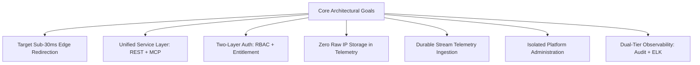

1. **Target Sub-30ms Edge Redirection Latency:** Target p99 end-to-end edge redirection latency is $<30\text{ms}$ under defined benchmark conditions (warm edge cache, healthy origin network), excluding client/network latency outside SkyraQR control.
2. **The Unified Domain Services Principle:** REST APIs and MCP Servers share the exact same underlying service layer. Business logic is never duplicated, and AI agents have zero direct database access.
3. **Two-Layer Authorization (Identity + Entitlement):** Authorization requires both User Role permission and active Subscription Entitlement verification.
4. **Strict Frontend/Backend Boundary:** Next.js is strictly a presentation and routing frontend. NestJS Shared Domain Services are the sole authoritative backend.
5. **Privacy-by-Design Architecture:** Built to align with GDPR, CCPA, and India's DPDP Act 2023 principles. Raw IP addresses are never persisted in scan telemetry; limited IP data is retained only in security/audit logs under documented policies.
6. **Durable Telemetry Pipeline:** Scan events are durably pushed to Redis Streams with consumer group acknowledgments (`XACK`), designed to prevent scan-event loss during expected traffic spikes.
7. **Strict Privilege Boundaries:** Customer Workspaces and Platform Administration are logically and physically separated. Customer API keys or MCP agents cannot access platform management APIs.
8. **Dual-Tier Audit & Observability:** Business integrity is secured via an immutable PostgreSQL `audit_logs` table, while operational health is managed via structured JSON logging into an ELK stack with distributed tracing.

---

## 2. Recommended Technology Stack Selection

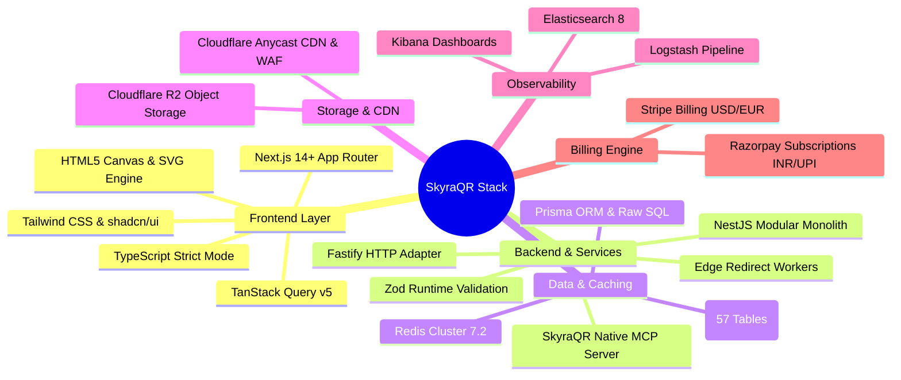

| Component | Selected Technology | Architectural Justification | Alternatives Considered & Rejected |
| :--- | :--- | :--- | :--- |
| **Frontend Framework** | **Next.js 14+ (App Router)** | React Server Components for fast micro-landing pages; rich client state for QR Studio. | Pure SPA (React Vite): Rejected due to poor SEO and slower FCP on landing pages. |
| **Backend Framework** | **NestJS 10+ (Fastify Adapter)** | Enterprise TypeScript modularity, dependency injection, OpenAPI 3.0 generation, $2\times$ faster than Express. | Python/FastAPI: Rejected to preserve full-stack TypeScript code sharing. |
| **MCP Server** | **Native MCP Server (Production SDK)** | Implemented using officially supported transport mechanisms of selected production MCP SDK/version over HTTPS. | Custom Webhooks: Rejected due to lack of standard agentic tool schema. |
| **Primary Database** | **PostgreSQL 16+ (57 Tables)** | ACID compliance, UUIDv7 indexing, declarative monthly range partitioning for scan logs. | MongoDB: Rejected due to weak relational integrity and financial transaction risks. |
| **In-Memory Cache & Bus**| **Redis Cluster 7.2** | Sub-millisecond short-code cache, rate limiting, and durable streaming queues. | RabbitMQ / Kafka: Overkill for MVP; added in Stage 4/5. |
| **Object Storage** | **Cloudflare R2** | S3-compatible, edge distribution, and **zero egress bandwidth fees** for PDFs and menus. | AWS S3: Higher egress costs on high-traffic PDF downloads. |
| **Centralized Logging** | **Elasticsearch + Logstash + Kibana (ELK)**| High-throughput distributed structured JSON log aggregation and real-time dashboarding. | Datadog/Splunk: Prohibitive SaaS costs at high volume. |
| **Dual Billing Gateways**| **Stripe + Razorpay** | Native support for global credit cards (Stripe) + Indian UPI AutoPay and Netbanking (Razorpay). | Stripe-only: Fails in Indian market due to low credit card penetration. |

---

## 3. High-Level System Topology & Application Boundaries

### 3.1 Global Production Topology

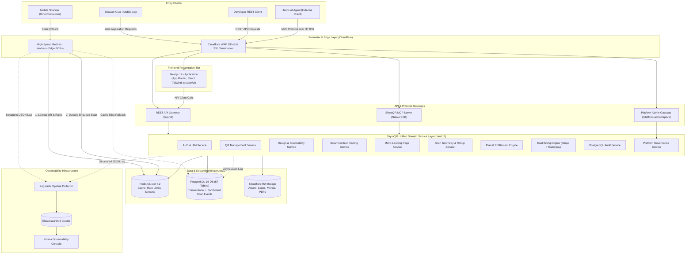

### 3.2 Primary Frontend Architecture (Next.js 14+ App Router)

**Next.js 14+ with App Router** is the official frontend application framework for SkyraQR. It is configured with:
- **Language & Types:** TypeScript in strict mode.
- **Component & Styling Architecture:** React 18+, Tailwind CSS, and shadcn/ui.
- **Client State & Caching:** TanStack Query v5 for API state caching, query invalidation, and optimistic updates.
- **Iconography & Visuals:** Lucide React, HTML5 Canvas, and SVG generation previewers.

#### Frontend Functional Responsibilities
The Next.js application is responsible for:
- Marketing and public web pages (landing pages, pricing tables, documentation guides).
- Authentication UI (login, register, forgot-password, TOTP MFA challenge).
- Customer Dashboard UI (metric summaries, recent QRs, scan heatmaps).
- Workspace Administration UI (team invitations, RBAC roles, domain settings).
- QR Creation & Design Studio UI (live matrix previews, scannability score indicators, styling accordions).
- Analytics visualization (geographical charts, device breakdowns, timeseries graphs).
- Campaign management UI and folder organization.
- Micro-landing page builders (Digital Menu, vCard Plus, Product Showcase, Event RSVP).
- Billing & Invoices UI (plan comparison, Stripe/Razorpay modals, receipt downloads).
- Developer Settings UI (API key generation, webhook registration).
- MCP Access Management UI (credential creation, lifecycle controls, pending action approvals).
- Platform Administration UI (operator metrics, quarantine toggles).
- Frontend routing, client state management, and UI composition.

> [!CAUTION]
> **CRITICAL ARCHITECTURAL RULE — NEXT.JS MUST NOT BECOME THE BUSINESS BACKEND:**  
> All business rules, entitlement evaluations, dynamic routing decisions, and data access logic must reside exclusively in the **NestJS Shared Domain Services**.  
> The following logic must **NEVER** be duplicated inside Next.js:
> - Authorization and RBAC permission checks
> - Subscription entitlement and quota checks
> - Billing calculations and webhook processing
> - QR short-code collision-handling and generation logic
> - Dynamic routing rule evaluation
> - MCP credential authentication and delegation validation
> - Multi-tenant isolation rules
> - Business audit logging and security policies

### 3.3 Next.js ↔ NestJS Boundary & Security Rules

$$\text{Browser} \longrightarrow \text{Next.js} \longrightarrow \text{NestJS API} \longrightarrow \text{Shared Domain Services} \longrightarrow \text{Repository} \longrightarrow \text{PostgreSQL / Redis}$$

1. **The NestJS backend remains the authoritative application API.** Next.js communicates with NestJS via:
   - Server-side requests (Next.js Server Components fetching initial data via internal API client).
   - Browser-side requests (TanStack Query client calls to `/api/v1/*`).
   - Authenticated API clients passing user session tokens.
2. **Strict Direct Data Access Prohibition:** The frontend (both client-side and server-side Next.js code) must **NEVER** directly connect to:
   - PostgreSQL 16 database
   - Redis Cluster
   - Elasticsearch cluster
   - Internal background workers (BullMQ)
   - MCP internal tables or databases
   - Payment provider secret keys (Stripe secret key, Razorpay secret key)
   - Infrastructure credentials
3. **Server Actions Policy:** If Next.js Server Actions are utilized, they must act strictly as presentation/API adapters and **delegate the actual business operation to the NestJS API via HTTP client**. Server Actions must not query database tables directly.
4. **Environment Secret Protection:** Secret environment variables (database connection strings, JWT private signing keys, payment provider secrets, encryption keys) must remain strictly server-side in the NestJS environment and must never be prefixed with `NEXT_PUBLIC_` or bundled into client code.

### 3.4 Canonical Request Execution Paths (REST Flow vs. MCP Flow)

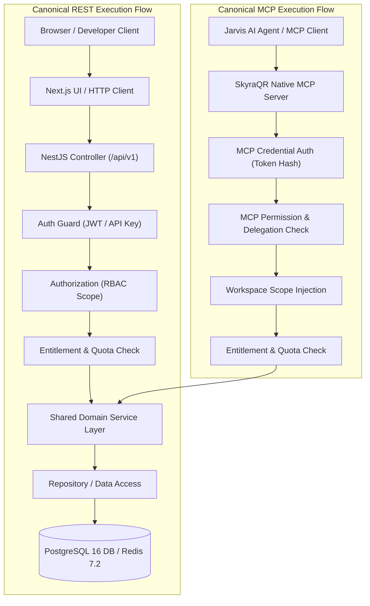

Both paths **MUST converge on the same Shared Domain Service layer**. Business logic, quota consumption, and validation rules are executed once and shared universally.

### 3.5 The Shared Domain Services Principle (REST + MCP)

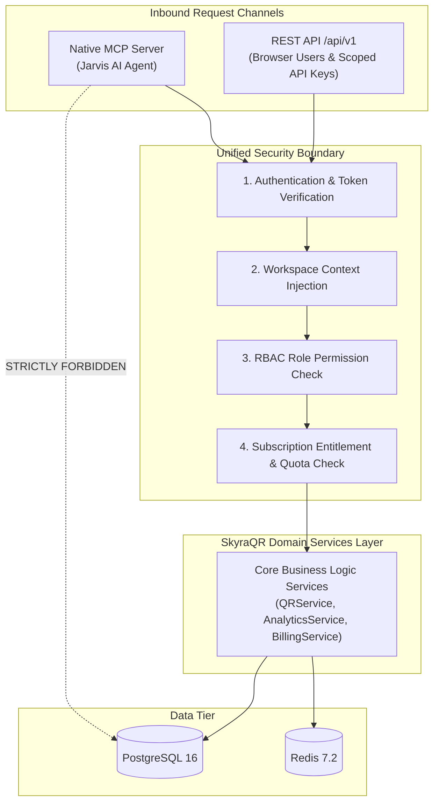

Both the REST API and the SkyraQR MCP Server invoke the **identical domain service classes**. This guarantees:
- Identical business validation and error codes across both human and AI interactions.
- Equal enforcement of subscription plan entitlements and rate limits.
- Zero possibility of an AI agent bypassing tenant scoping or RBAC permissions.
- **Zero direct database queries by the MCP server.**

### 3.6 Database & Storage Authority Model

SkyraQR enforces strict data store responsibilities to prevent split-brain states:
1. **PostgreSQL 16 Multi-AZ:** The **sole authoritative transactional database** for all business data, identities, workspaces, subscriptions, invoices, QR configurations, and authoritative `audit_logs`.
2. **Redis Cluster 7.2:** Fast in-memory cache for short-code routing rules, active session store, token replay detection, and durable streaming queues (`stream:scans:raw`). **Redis is explicitly NOT an authoritative source for transactional business data.**
3. **Elasticsearch 8:** Centralized log search and operational telemetry storage. **Elasticsearch is strictly observability infrastructure, NOT an authoritative business database.**
4. **ClickHouse:** Documented as the future dedicated analytical database migration target when scan volumes reach architectural scale thresholds.

### 3.7 Synchronous vs. Durable Asynchronous Workloads

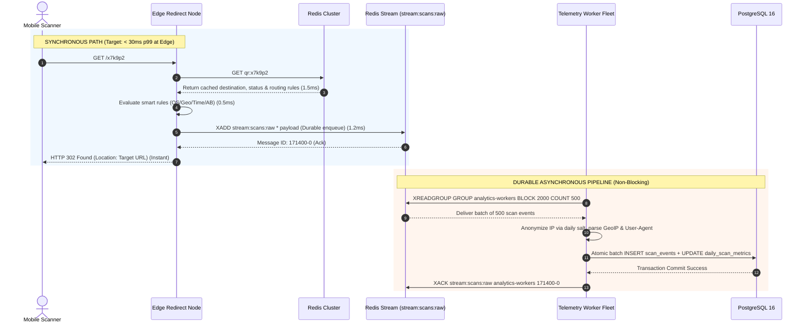

---

## 4. Dynamic QR Redirect Architecture

### 4.1 Edge POP Resolution Flow & Latency Budget

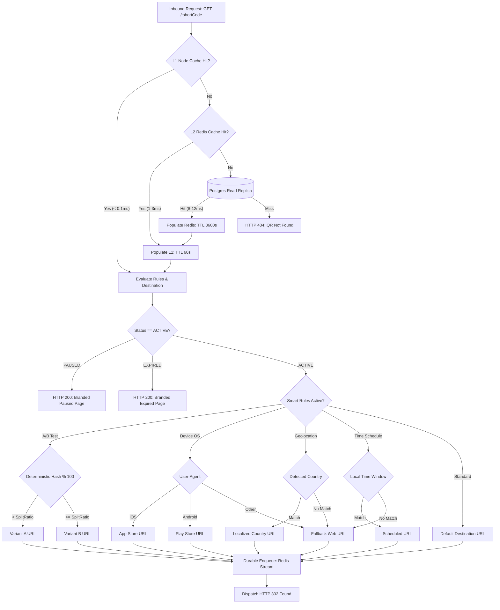

#### Measured Engineering Targets at Edge POP (Benchmark Conditions)

| Stage | Operation | Target Latency | Architectural Benchmark Assumptions |
| :--- | :--- | :---: | :--- |
| **1. Ingress Handshake** | Anycast DNS + TLS 1.3 Handshake | $< 12\text{ms}$ | Cloudflare Global Anycast POPs (warm session resumption). |
| **2. Short Code Lookup**| In-memory L1 / Redis L2 Cache | $< 3\text{ms}$ | Redis cluster in-memory key lookup (`GET qr:{code}`). |
| **3. Rule Evaluation** | Context-Aware Smart Engine | $< 1\text{ms}$ | In-memory evaluation of pre-cached JSON rule tree. |
| **4. Telemetry Push** | Durable Redis Stream Enqueue | $< 2\text{ms}$ | `XADD stream:scans:raw` non-blocking call. |
| **5. Egress Response** | Dispatch `HTTP 302 Found` | $< 2\text{ms}$ | Immediate response with `Location` header. |
| **Total Pipeline** | **Edge Processing Latency** | **$< 20\text{ms}$** | Total edge processing before network egress. |
| **End-to-End Metric**| **Target p99 Edge Latency** | **$< 30\text{ms}$** | Target p99 end-to-end edge redirection latency under defined benchmark conditions, excluding network latency outside SkyraQR control. |

### 4.2 Multi-Tier Caching Architecture (L1, L2, L3)
1. **L1 In-Memory Node Cache:** In-process LRU cache within Fastify worker instances (10,000 hot keys, 60s TTL, $< 0.1\text{ms}$).
2. **L2 Redis Cluster Cache:** Centralized in-memory cache holding active dynamic QR routing payloads (3,600s TTL, $1.5 - 3.0\text{ms}$).
3. **L3 Database Fallback:** PostgreSQL read replicas queried only on cold cache misses ($8 - 12\text{ms}$).
4. **Cache Invalidation:** Updates in dashboard trigger atomic Redis `DEL qr:{code}` and publish an invalidation event on Redis Pub/Sub, evicting L1 caches across all edge worker nodes within $< 50\text{ms}$.

### 4.3 Smart Routing & Deterministic A/B Testing Execution
- **Deterministic A/B Traffic Splitting:**
  $$\text{bucket} = \text{hash}(\text{visitor\_key} \parallel \text{qr\_id}) \pmod{100}$$
  Where `visitor_key` is derived from the privacy-safe daily keyed scan identity. If $\text{bucket} < \text{SplitRatio}$, Variant A is served; otherwise Variant B.
  *Documented Limitations:* Cross-device persistence is NOT guaranteed. Cross-day persistence is NOT guaranteed if the daily salt changes. An optional first-party cookie (`__skyra_ab_{qr_id}`) may be used for stronger browser-level stickiness, subject to user consent and privacy settings.
- **Device OS Routing:** Evaluates `User-Agent` headers in $< 0.5\text{ms}$ to route iOS, Android, and Desktop users to distinct store links.
- **Time-Based Dayparting:** Converts UTC timestamp to the scanner's local timezone (via MaxMind GeoIP) to match against time windows (e.g., Breakfast vs. Lunch vs. Dinner).

### 4.4 Malicious URL Protection & Dead-Link Defense
- **Pre-Screening API:** Destination URLs checked in real time against the **Google Safe Browsing API v4** and **Cloudflare Radar Malicious Domain Feed** prior to persisting.
- **Automated Dead-Link Crawler:** Asynchronous crawler executes `HTTP HEAD` every 12 hours against all active destinations. If a target returns 4xx, 5xx, or SSL connection failures across 3 retries, status is updated to `FAILING`, alerting the Owner and redirecting scans to a safe fallback URL.

---

## 5. Scan Telemetry & Analytics Pipeline

### 5.1 Privacy-Preserving Salted IP Hashing

SkyraQR enforces a privacy-by-design and compliance-aligned architecture:
1. A cryptographically random 256-bit salt $S_d$ is generated daily at 00:00:00 UTC and stored in Redis with a 48-hour TTL.
2. Upon receiving a scan, the edge worker computes:
   $$\text{visitor\_hash} = \text{HMAC-SHA256}\left(\text{Client IP} \parallel \text{User-Agent}, S_d\right)$$
3. **The raw Client IP address is immediately purged from memory.** It is never written to disk, database tables, or Redis logs in the scan telemetry pipeline.
4. Because the salt rotates daily, cross-day user profiling is prevented, while unique daily visitors are accurately calculated within any given 24-hour period.

### 5.2 Durable Redis Stream Telemetry Pipeline & Reliability
- The edge redirect worker appends raw events to `stream:scans:raw` using `XADD`.
- An autoscaling worker fleet (`analytics-worker`) reads the stream using consumer groups:
  ```bash
  XREADGROUP GROUP analytics-processors consumer-1 BLOCK 2000 COUNT 500 STREAMS stream:scans:raw >
  ```
- **Durability & Retry Semantics:**
  1. Events are durably stored in Redis append-only file (AOF) storage before redirect acknowledgment.
  2. Workers process events in micro-batches (up to 500 events or 1,000ms window).
  3. Bulk inserts into partitioned `scan_events` and atomic counter increments in `daily_scan_metrics` execute in an ACID transaction.
  4. Messages are acknowledged via `XACK`, advancing the consumer group offset.
  5. If a worker crashes before `XACK`, unacknowledged messages are reclaimed by remaining workers via `XPENDING` and `XCLAIM`.
  6. Persistent message parsing failures after 5 retries move to a dead-letter stream `stream:scans:dead_letter` for operator inspection.

### 5.3 Omnichannel Analytics Consumption (Dashboard, REST, MCP)

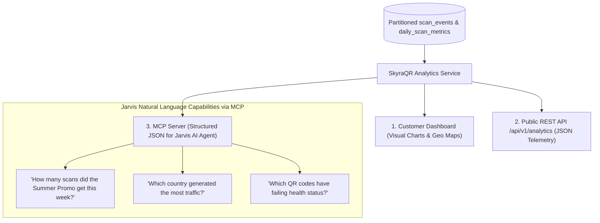

---

## 6. Authentication, Session & Multi-Tenant RBAC Architecture

### 6.1 Authentication Modality Specifications

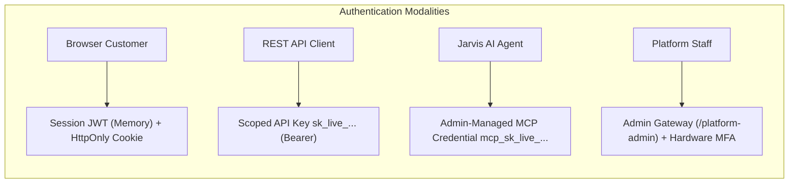

SkyraQR explicitly distinguishes four authentication mechanisms:

1. **Browser/Customer Authentication:**
   - **Password Security:** Passwords hashed using **Argon2id** ($m=65536 \text{ KiB}, t=3, p=4$).
   - **Access Token:** Short-lived JWT (15 min TTL), signed via asymmetric RS256/EdDSA. Stored strictly in application memory. **Never stored in localStorage or IndexedDB.**
   - **Refresh Token:** Cryptographically secure 256-bit token stored in an `HttpOnly`, `Secure`, `SameSite=Strict` cookie (`__Host-skyra_rt`).
   - **Authority Location:** NestJS `AuthService` is the sole authority for authentication. Next.js consumes the authenticated context for rendering but does not issue or validate tokens independently.
2. **REST API Client Authentication:**
   - Programmatic consumers authenticate using scoped API keys (`sk_live_...`).
   - **API keys are NOT JWTs.** They are high-entropy random strings whose SHA-256 hash is verified against database records in `api_keys`.
   - Transmitted via `Authorization: Bearer <API_KEY>` or `X-API-Key: <API_KEY>`, where the value is explicitly parsed as an API key.
3. **MCP / Jarvis AI Agent Authentication:**
   - Authenticated **exclusively** via **Admin-Managed MCP Credentials** (`mcp_sk_live_...`). OAuth 2.0 / OIDC is reserved as a future enterprise federation option.
   - Verified via SHA-256 hash lookup in `mcp_credentials` and checked against `mcp_roles` and `mcp_credential_permissions`.
   - **MCP clients pass through the domain service layer and never access PostgreSQL directly.**
4. **Platform Administration Authentication:**
   - Accessible only via `/platform-admin/login`.
   - Physically and logically segregated authentication gateway requiring mandatory hardware or TOTP MFA.

### 6.2 Refresh Token Rotation & Session Revocation
- **Automatic Rotation:** Every refresh invocation invalidates the utilized refresh token and issues a new pair.
- **Reuse Detection:** If an invalidated refresh token is presented, the system detects a token replay attack, immediately revokes all sessions in that user's session family in Redis, and forces re-authentication across all devices.
- **Session Revocation:**
  - *Logout Current Device:* Revokes specific refresh token in Redis.
  - *Logout All Devices:* Purges all Redis keys for `user_sessions:{userId}:*`.
  - *Password Modification:* Automatically invalidates all active sessions.

### 6.3 Tripartite Dashboard & Privilege Boundaries

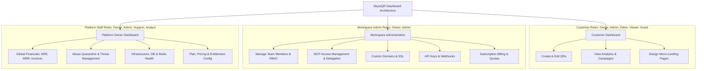

### 6.4 Multi-Tenant Workspace Scoping Model
- **Application-Level Enforcement:** A NestJS Request Interceptor extracts `workspace_id` from the verified JWT, API-key, or MCP credential and injects it into all query predicates.
- **Direct Tenant Scoping:** Root resources (`qr_codes`, `campaigns`, `custom_domains`, `api_keys`, `webhooks`, `mcp_credentials`, `usage_meters`) carry a direct `workspace_id UUID REFERENCES workspaces(id)`.
- **Indirect Relational Scoping:** Nested sub-entities (`menu_items`, `qr_designs`, `redirect_rules`, `landing_page_sections`) derive workspace scope through their parent foreign key hierarchy.
- **Database-Level Isolation:** PostgreSQL Row-Level Security (RLS) is an optional deployment mode for regulated enterprise private clouds, while application-level parameterization serves standard multi-tenant clusters.

---

## 7. Model Context Protocol (MCP) Server Architecture

### 7.1 Primary Authentication: Admin-Managed MCP Credentials

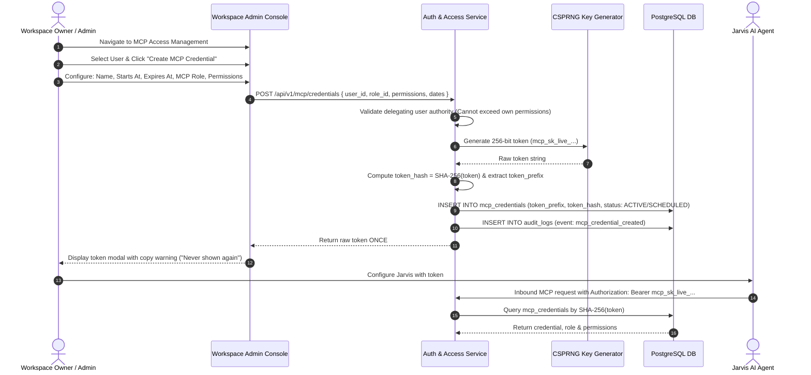

- **Admin-Managed Credentials as Sole Primary:** All MCP integrations use explicit workspace credentials created and managed in the Workspace Administration console.
- **Zero Plaintext Storage:** The database stores strictly `token_prefix` (VARCHAR(14)) and `token_hash` (VARCHAR(64), SHA-256). The raw secret is displayed exactly once.
- **Transport Specification:** Native MCP server implemented using the officially supported transport mechanisms of the selected production MCP SDK/version (with secure authenticated HTTPS communication).

### 7.2 Delegated MCP User Access & Authority Limits

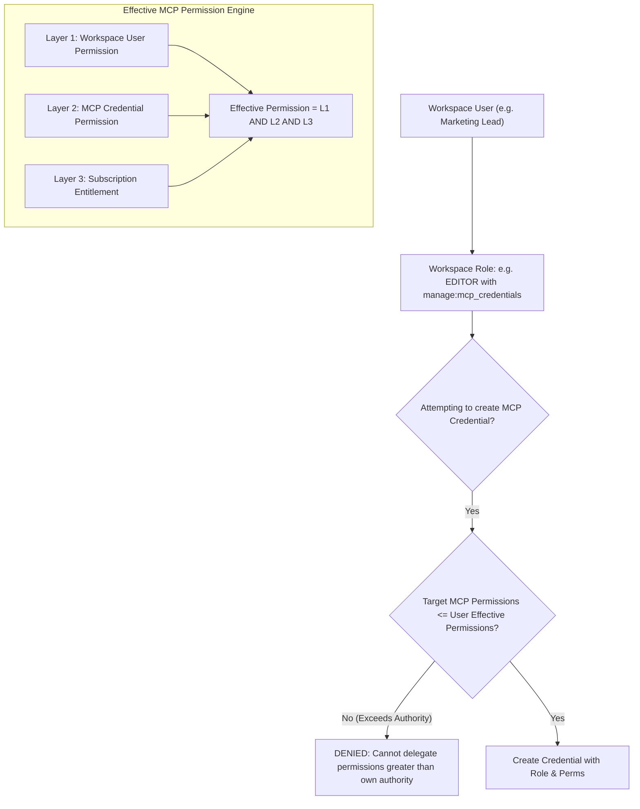

#### The Principle of Delegated Authority Limits
- A delegated user **CANNOT** grant permissions greater than their own effective permissions.
- Example: If a user possesses `MCP Manager` permissions, attempting to issue an `MCP Administrator` credential is **strictly rejected**.
- Formula:
  $$\text{Effective MCP Permission} = \text{Workspace User Permission} \land \text{MCP Credential Permission} \land \text{Subscription Entitlement}$$

### 7.3 MCP Role Model & Permission Taxonomy

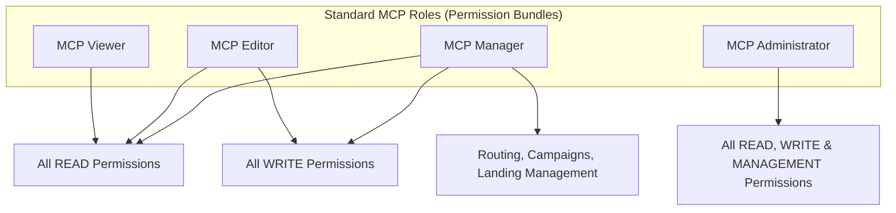

| Permission Category | Permission Key | Classification | Description |
| :--- | :--- | :--- | :--- |
| **READ** | `read:workspace` | Standard | Inspect workspace metadata and plan limits |
| **READ** | `read:qrs` | Standard | List and inspect QR destinations and designs |
| **READ** | `read:analytics` | Standard | Retrieve aggregate scan counts, timeseries, geo |
| **READ** | `read:usage` | Standard | Query real-time quota meters |
| **READ** | `read:health` | Standard | Check destination dead-link status |
| **READ** | `read:campaigns` | Standard | List marketing campaigns and attached QRs |
| **READ** | `read:landing_pages` | Standard | Fetch micro-landing page schemas and menus |
| **READ** | `read:domains` | Standard | Inspect custom domains and SSL certificate status |
| **READ** | `read:team` | Standard | List team members and assigned roles |
| **READ** | `read:audit` | Standard | Read workspace audit log history |
| **WRITE** | `create:qrs` | Standard | Create new dynamic or static QR codes |
| **WRITE** | `update:qrs` | Standard | Update target destination URL or design |
| **WRITE** | `delete:qrs` | **HIGH-RISK** | Soft-delete a QR code (Human confirmation required) |
| **WRITE** | `create:campaigns` | Standard | Create new marketing campaign containers |
| **WRITE** | `update:campaigns` | Standard | Update campaign metadata and QR associations |
| **WRITE** | `delete:campaigns` | **HIGH-RISK** | Delete marketing campaign (Human confirmation required) |
| **WRITE** | `create:landing_pages`| Standard | Publish new digital menu or vCard micro-page |
| **WRITE** | `update:landing_pages`| Standard | Update landing page sections or menu items |
| **WRITE** | `delete:landing_pages`| **HIGH-RISK** | Delete landing page (Human confirmation required) |
| **MANAGEMENT** | `manage:routing` | Standard | Configure device OS, geo, time, and A/B rules |
| **MANAGEMENT** | `manage:domains` | Standard | Connect custom domains and trigger DNS checks |
| **MANAGEMENT** | `manage:api_keys` | **HIGH-RISK** | Create, rotate, and revoke REST API keys |
| **MANAGEMENT** | `manage:mcp_credentials`| **HIGH-RISK**| Create, suspend, rotate, or revoke MCP credentials |
| **MANAGEMENT** | `manage:team` | **HIGH-RISK** | Invite or remove workspace team members |
| **MANAGEMENT** | `manage:billing` | **HIGH-RISK** | Modify subscription tier or payment methods |
| **MANAGEMENT** | `manage:security`| **HIGH-RISK** | Modify workspace MFA or security policies |

### 7.4 MCP Credential Lifecycle State Machine

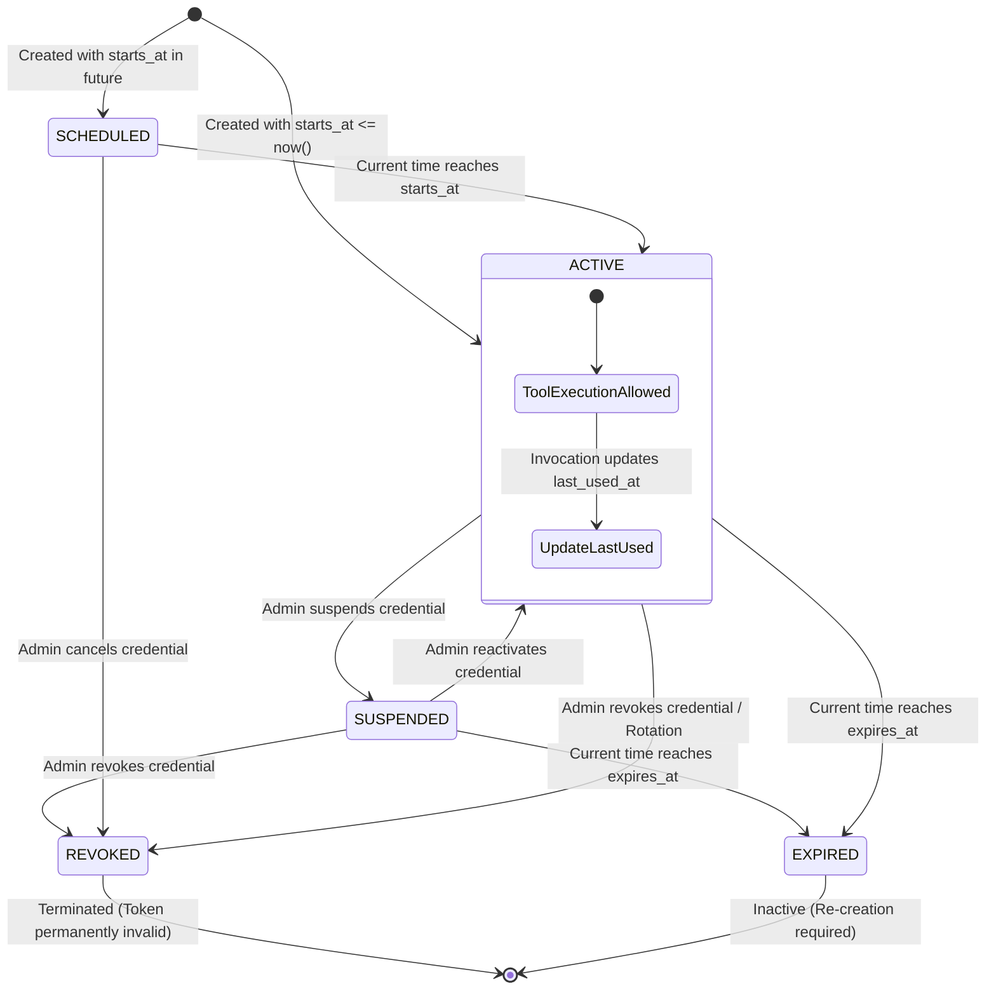

### 7.5 MCP Authorization Sequence & High-Risk Human Confirmation

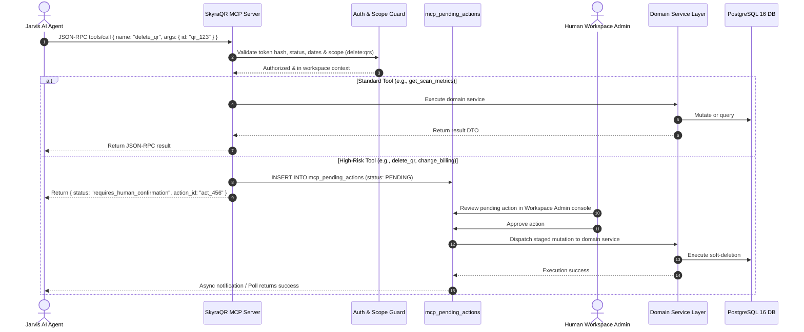

---

## 8. Complete REST API & Developer Platform Architecture

### 8.1 API Specification & Conventions
- **Base URL:** `https://api.skyra.link/api/v1`
- **Format:** HTTPS, TLS 1.3 Strict, JSON request and response payloads.
- **Authentication:** `Authorization: Bearer <API_KEY>` (Scoped API Key) or Session JWT.
- **Developer Endpoints:**
  - Interactive Documentation: `GET /api/v1/docs` (Swagger / Scalar UI)
  - OpenAPI 3.0 Schema: `GET /api/v1/openapi.json`
  - MCP Server Manifest: `GET /api/v1/mcp/manifest.json`

### 8.2 Complete REST API Resource Inventory

| Resource Group | Method | Endpoint Route | Required Scope | Workspace Scope | Request Purpose | Response Purpose | Status Codes | Rate Limit |
| :--- | :--- | :--- | :--- | :--- | :--- | :--- | :--- | :--- |
| **Auth** | `POST` | `/api/v1/auth/register` | Public | None | Register user & default workspace | Returns user record & verification token | 201, 400, 422 | 5 req/15m |
| **Auth** | `POST` | `/api/v1/auth/login` | Public | None | Authenticate credentials | Returns access JWT + Set-Cookie refresh token | 200, 401, 429 | 5 req/15m |
| **Auth** | `POST` | `/api/v1/auth/refresh` | Public | None | Rotate refresh token | Returns new access JWT + rotated refresh cookie | 200, 401 | 30 req/m |
| **Auth** | `POST` | `/api/v1/auth/logout` | Session | Current | Terminate current session | Invalidates refresh token in Redis | 200, 401 | 30 req/m |
| **Auth** | `POST` | `/api/v1/auth/password-reset` | Public | None | Request password reset email | Dispatches reset email with cryptographic token | 200, 429 | 5 req/15m |
| **Auth** | `POST` | `/api/v1/auth/mfa/verify` | Session | Current | Validate TOTP 6-digit code | Completes MFA login challenge | 200, 401, 429 | 5 req/15m |
| **Users** | `GET` | `/api/v1/users/me` | Session | Current | Fetch current user profile | Returns profile metadata and active memberships | 200, 401 | 60 req/m |
| **Users** | `PUT` | `/api/v1/users/me` | Session | Current | Update profile name/avatar | Returns updated profile | 200, 400, 422 | 30 req/m |
| **Users** | `GET` | `/api/v1/users/me/sessions` | Session | Current | List active user devices | Returns session array with IP and User-Agent | 200, 401 | 30 req/m |
| **Workspaces** | `GET` | `/api/v1/workspaces` | `read:workspaces` | All user | List accessible workspaces | Returns array of workspaces and roles | 200, 401 | 60 req/m |
| **Workspaces** | `POST` | `/api/v1/workspaces` | `write:workspaces`| Current | Create isolated workspace | Returns created workspace | 201, 400, 403 | 10 req/m |
| **Workspaces** | `GET` | `/api/v1/workspaces/:id/members`| `read:team` | Scoped | List workspace team members | Returns array of members and RBAC roles | 200, 401, 403 | 60 req/m |
| **Workspaces** | `POST` | `/api/v1/workspaces/:id/invites`| `manage:team` | Scoped | Invite team member via email | Dispatches invitation token email | 201, 400, 403, 429 | 20 req/m |
| **QR Types** | `GET` | `/api/v1/qr-types` | Public | None | List the 16 supported QR types | Returns type catalog, categories, min tiers | 200 | 120 req/m |
| **QR Codes** | `GET` | `/api/v1/qrs` | `read:qrs` | Scoped | List paginated QR codes | Returns QR list with filters, status, folders | 200, 401 | 120 req/m |
| **QR Codes** | `POST` | `/api/v1/qrs` | `create:qrs` | Scoped | Create Dynamic or Static QR | Returns created QR metadata & short URL | 201, 400, 403, 429 | 60 req/m |
| **QR Codes** | `GET` | `/api/v1/qrs/:id` | `read:qrs` | Scoped | Fetch QR details & design | Returns destination, design, status, counts | 200, 401, 404 | 120 req/m |
| **QR Codes** | `PUT` | `/api/v1/qrs/:id` | `update:qrs` | Scoped | Update QR target or design | Returns updated QR record | 200, 400, 403, 404 | 60 req/m |
| **QR Codes** | `DELETE`| `/api/v1/qrs/:id` | `delete:qrs` | Scoped | Soft delete QR code | Sets `deleted_at`, evicts Redis cache | 200, 401, 403, 404 | 30 req/m |
| **QR Codes** | `POST` | `/api/v1/qrs/:id/status` | `update:qrs` | Scoped | Activate or pause QR code | Updates status (`ACTIVE`/`PAUSED`) | 200, 400, 403 | 60 req/m |
| **QR Codes** | `GET` | `/api/v1/qrs/:id/export` | `read:qrs` | Scoped | Download rendered QR asset | Streams SVG, PDF (CMYK), EPS, or PNG | 200, 401, 404 | 60 req/m |
| **QR Codes** | `GET` | `/api/v1/qrs/:id/health` | `read:health` | Scoped | Inspect destination HTTP status | Returns last checked status & dead-link flag | 200, 401, 404 | 60 req/m |
| **Routing** | `GET` | `/api/v1/qrs/:id/rules` | `read:qrs` | Scoped | List smart routing rules | Returns active OS, Geo, Time, A/B rules | 200, 401, 404 | 60 req/m |
| **Routing** | `POST` | `/api/v1/qrs/:id/rules` | `manage:routing` | Scoped | Configure smart routing rule | Returns created rule; updates Redis cache | 201, 400, 403, 404 | 30 req/m |
| **Campaigns** | `GET` | `/api/v1/campaigns` | `read:campaigns`| Scoped | List marketing campaigns | Returns campaigns with associated QRs | 200, 401 | 60 req/m |
| **Campaigns** | `POST` | `/api/v1/campaigns` | `create:campaigns`| Scoped | Create marketing campaign | Returns created campaign | 201, 400, 403 | 30 req/m |
| **Analytics** | `GET` | `/api/v1/analytics/overview` | `read:analytics`| Scoped | Workspace aggregate scan metrics | Returns totals, uniques, top country, device | 200, 401 | 60 req/m |
| **Analytics** | `GET` | `/api/v1/analytics/qrs/:id` | `read:analytics`| Scoped | Detailed QR scan timeseries | Returns hourly distribution, geo & OS maps | 200, 401, 404 | 60 req/m |
| **Analytics** | `GET` | `/api/v1/analytics/export` | `read:analytics`| Scoped | Export CSV scan telemetry | Streams CSV rollup data | 200, 401, 403 | 10 req/m |
| **Landing** | `GET` | `/api/v1/landing-pages/:id`| `read:landing_pages`| Scoped | Fetch micro-page details | Returns menu/vCard JSON payload | 200, 401, 404 | 60 req/m |
| **Landing** | `POST` | `/api/v1/landing-pages` | `create:landing_pages`| Scoped | Publish/update micro-page | Returns published page metadata | 201, 400, 403, 422 | 30 req/m |
| **Domains** | `GET` | `/api/v1/domains` | `read:domains` | Scoped | List custom branded domains | Returns hostnames, CNAME targets, SSL status| 200, 401, 403 | 60 req/m |
| **Domains** | `POST` | `/api/v1/domains` | `manage:domains` | Scoped | Connect custom domain | Generates CNAME target; starts DNS polling | 201, 400, 403, 429 | 10 req/m |
| **Domains** | `GET` | `/api/v1/domains/:id/verify`| `manage:domains`| Scoped | Poll DNS verification & SSL | Checks CNAME propagation & ACME cert | 200, 400, 404 | 20 req/m |
| **Billing** | `GET` | `/api/v1/billing/subscription`| `manage:billing`| Scoped | Fetch active subscription | Returns plan, status, renewal date, limits | 200, 401, 403 | 30 req/m |
| **Billing** | `POST` | `/api/v1/billing/checkout` | `manage:billing`| Scoped | Initiate Stripe/Razorpay checkout | Returns checkout session URL | 200, 400, 403 | 10 req/m |
| **Billing** | `POST` | `/api/v1/billing/webhook` | Gateway Sig | Public | Ingest billing webhook events | Processes recurring payment & renewal | 200, 400 | No limit |
| **Billing** | `GET` | `/api/v1/billing/invoices` | `manage:billing`| Scoped | List historical invoices | Returns invoice records with PDF receipt links| 200, 401, 403 | 30 req/m |
| **Usage** | `GET` | `/api/v1/usage/meters` | `read:usage` | Scoped | Fetch real-time usage meters | Returns current values vs. plan quota limits | 200, 401 | 60 req/m |
| **Developer** | `GET` | `/api/v1/api-keys` | `manage:api_keys`| Scoped | List scoped API keys | Returns key prefixes, scopes, last used | 200, 401, 403 | 30 req/m |
| **Developer** | `POST` | `/api/v1/api-keys` | `manage:api_keys`| Scoped | Create scoped API key | Returns secret key string once (`sk_live_...`)| 201, 400, 403 | 10 req/m |
| **Developer** | `POST` | `/api/v1/webhooks` | `manage:api_keys`| Scoped | Register outbound webhook | Returns webhook ID & signing secret | 201, 400, 403 | 20 req/m |
| **MCP** | `GET` | `/api/v1/mcp/credentials` | `manage:mcp_credentials`| Scoped | List MCP credentials | Returns credential metadata, roles, status | 200, 401, 403 | 30 req/m |
| **MCP** | `POST` | `/api/v1/mcp/credentials` | `manage:mcp_credentials`| Scoped | Create MCP credential | Displays `mcp_sk_live_...` once | 201, 400, 403 | 10 req/m |
| **MCP** | `POST` | `/api/v1/mcp/credentials/:id/suspend`| `manage:mcp_credentials`| Scoped | Suspend credential | Halts execution; status = SUSPENDED | 200, 400, 403 | 30 req/m |
| **MCP** | `POST` | `/api/v1/mcp/credentials/:id/rotate` | `manage:mcp_credentials`| Scoped | Rotate credential | Generates new token, revokes old one | 200, 400, 403 | 10 req/m |
| **MCP** | `POST` | `/api/v1/mcp/credentials/:id/revoke` | `manage:mcp_credentials`| Scoped | Revoke credential | Permanently terminates token | 200, 400, 403 | 30 req/m |
| **MCP** | `GET` | `/api/v1/mcp/invocations` | `read:audit` | Scoped | Query MCP tool execution logs| Returns paged tool calls and durations | 200, 401, 403 | 60 req/m |
| **Audit** | `GET` | `/api/v1/audit-logs` | `read:audit` | Scoped | Query PostgreSQL audit ledger | Returns immutable historical business events | 200, 401, 403 | 60 req/m |
| **Platform** | `GET` | `/platform-admin/api/v1/metrics`| `platform:metrics`| Global | Fetch global ARR/MRR/Scans | Returns global platform health and telemetry | 200, 401, 403 | 60 req/m |
| **Platform** | `POST`| `/platform-admin/api/v1/quarantine`| `platform:abuse`| Global | Quarantine abusive QR code | Globally deactivates malicious short code | 200, 400, 403 | 30 req/m |
| **System** | `GET` | `/health/liveness` | Public | None | Container liveness check | Returns `{ status: "ok" }` | 200 | No limit |
| **System** | `GET` | `/health/readiness` | Public | None | DB & Redis connectivity check | Returns `{ db: "ok", redis: "ok" }` | 200, 503 | No limit |
| **System** | `GET` | `/version` | Public | None | Service version info | Returns Git commit and build version | 200 | No limit |

---

## 9. Database-Driven Subscription & Entitlement Engine

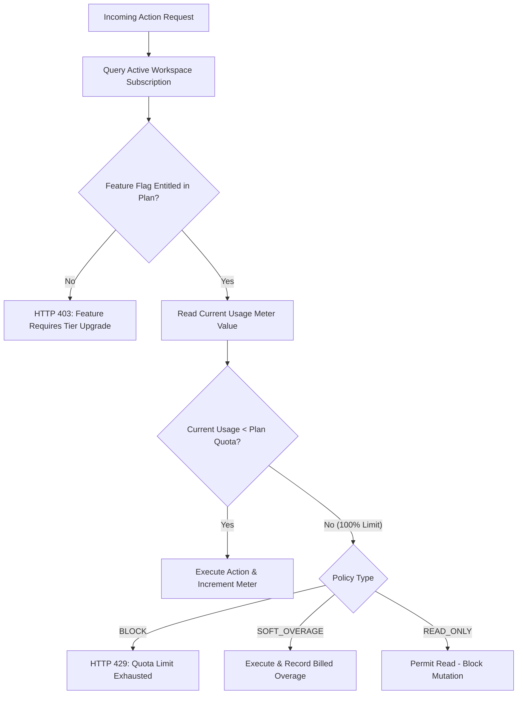

### Authoritative Policy Definitions:
- **BLOCK:** Feature or request denied. The API returns `HTTP 403 Forbidden` when access is not included in the plan tier, or `HTTP 429 Too Many Requests` when an included quota limit is exhausted.
- **SOFT_OVERAGE:** Operation continues uninterrupted. Usage is recorded in `usage_events`, and overage billing applies (e.g., additional scan blocks at `NUMERIC(12,2)`).
- **READ_ONLY:** Read operations remain fully accessible; write mutations are rejected (e.g., during subscription downgrade grace periods).

---

## 10. PostgreSQL Audit Logging Architecture & Event Catalog

### 10.1 Authoritative Audit Ledger Design

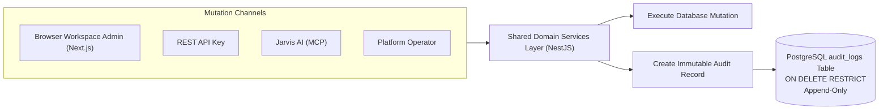

SkyraQR utilizes PostgreSQL `audit_logs` as the single source of business and security truth:
- **Immutability:** Zero `UPDATE` or `DELETE` permissions are granted on `audit_logs`.
- **Referential Protection:** Foreign keys to `workspaces` use `ON DELETE RESTRICT` to prevent accidental loss of historical records.
- **Redaction by Design:** Sensitive credentials, authorization tokens, passwords, and card data are automatically stripped prior to insertion.

### 10.2 Audit Event Catalog

| Event Category | Audit Event Type Key | Actor Types | Description |
| :--- | :--- | :--- | :--- |
| **Authentication** | `auth.login.success` | `USER` | User successfully authenticated credentials |
| **Authentication** | `auth.login.failed` | `USER` | Failed authentication attempt recorded |
| **Authentication** | `auth.logout` | `USER` | User session terminated |
| **Authentication** | `auth.mfa.success` | `USER` | TOTP MFA challenge successfully completed |
| **Authentication** | `auth.mfa.failed` | `USER` | Invalid TOTP code submitted |
| **Authentication** | `auth.password.reset`| `USER` | User password updated; all sessions revoked |
| **Workspace** | `workspace.created` | `USER`, `OPERATOR` | New workspace provisioned |
| **Workspace** | `workspace.updated` | `USER` | Workspace settings or branding modified |
| **Team / RBAC** | `member.invited` | `USER` | New member invited via email |
| **Team / RBAC** | `member.created` | `USER` | Member accepted invitation and joined workspace |
| **Team / RBAC** | `member.role_changed`| `USER` | Member RBAC role updated |
| **Team / RBAC** | `member.removed` | `USER` | Member removed from workspace |
| **QR Lifecycle** | `qr.created` | `USER`, `API_KEY`, `MCP_AGENT` | Dynamic or static QR code created |
| **QR Lifecycle** | `qr.updated` | `USER`, `API_KEY`, `MCP_AGENT` | Destination URL or design modified |
| **QR Lifecycle** | `qr.paused` | `USER`, `API_KEY`, `MCP_AGENT` | Dynamic QR deactivated |
| **QR Lifecycle** | `qr.activated` | `USER`, `API_KEY`, `MCP_AGENT` | Dynamic QR re-enabled |
| **QR Lifecycle** | `qr.deleted` | `USER`, `API_KEY`, `MCP_AGENT` | QR code soft-deleted |
| **Campaigns** | `campaign.created` | `USER`, `API_KEY`, `MCP_AGENT` | Marketing campaign container created |
| **Campaigns** | `campaign.updated` | `USER`, `API_KEY`, `MCP_AGENT` | Campaign parameters modified |
| **Campaigns** | `campaign.deleted` | `USER`, `API_KEY`, `MCP_AGENT` | Campaign soft-deleted |
| **Landing Pages** | `landing_page.created`| `USER`, `API_KEY`, `MCP_AGENT` | Micro-landing page published |
| **Landing Pages** | `landing_page.updated`| `USER`, `API_KEY`, `MCP_AGENT` | Menu or vCard content updated |
| **Landing Pages** | `landing_page.deleted`| `USER`, `API_KEY`, `MCP_AGENT` | Micro-landing page deleted |
| **Domains** | `domain.created` | `USER` | Custom CNAME domain registered |
| **Domains** | `domain.verified` | `SYSTEM` | DNS verification & SSL certificate issued |
| **Domains** | `domain.deleted` | `USER` | Custom domain disconnected |
| **Subscription** | `subscription.created`| `USER`, `SYSTEM` | Subscription plan purchased |
| **Subscription** | `subscription.updated`| `USER`, `SYSTEM` | Plan tier upgraded or downgraded |
| **Subscription** | `subscription.cancelled`| `USER`, `SYSTEM` | Subscription canceled at period end |
| **Billing** | `payment.succeeded` | `SYSTEM` | Recurring subscription payment processed |
| **Billing** | `payment.failed` | `SYSTEM` | Invoice payment failed; dunning started |
| **API Keys** | `api_key.created` | `USER` | Scoped REST API key generated |
| **API Keys** | `api_key.rotated` | `USER` | REST API key rotated |
| **API Keys** | `api_key.revoked` | `USER` | REST API key permanently invalidated |
| **MCP Credentials**| `mcp_credential.created` | `USER` | Admin-managed MCP credential generated |
| **MCP Credentials**| `mcp_credential.updated` | `USER` | MCP credential metadata or dates updated |
| **MCP Credentials**| `mcp_credential.suspended`| `USER` | MCP credential temporarily paused |
| **MCP Credentials**| `mcp_credential.reactivated`| `USER` | MCP credential re-enabled |
| **MCP Credentials**| `mcp_credential.rotated` | `USER` | MCP token re-issued; old token revoked |
| **MCP Credentials**| `mcp_credential.revoked` | `USER` | MCP token permanently invalidated |
| **Security** | `security.setting_changed`| `USER` | Workspace security policy altered |
| **Platform** | `platform.quarantine`| `OPERATOR` | Malicious QR quarantined globally |

---

## 11. Centralized ELK Observability & Request Tracing Architecture

### 11.1 Logging Pipeline Architecture

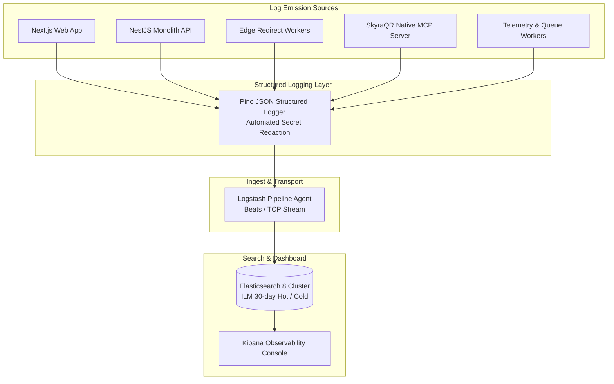

### 11.2 Canonical ELK Structured JSON Event Schema

Every service in the SkyraQR platform logs using a standardized JSON schema:

```json
{
  "timestamp": "2026-09-02T07:15:00.123Z",
  "level": "INFO",
  "service": "skyraqr-api",
  "environment": "production",
  "event": {
    "type": "qr.updated",
    "category": "business",
    "action": "update"
  },
  "request": {
    "id": "018f3a99-b123-7456-9abc-def012345678",
    "method": "PUT",
    "route": "/api/v1/qrs/018f3a99-b456-7890-abcd-ef0123456789"
  },
  "actor": {
    "type": "user",
    "user_id": "018f3a99-b789-7012-bcde-f0123456789a",
    "workspace_id": "018f3a99-babc-7345-cdef-0123456789ab",
    "role": "ADMIN"
  },
  "resource": {
    "type": "qr_code",
    "id": "018f3a99-b456-7890-abcd-ef0123456789"
  },
  "http": {
    "status_code": 200,
    "duration_ms": 22
  },
  "trace": {
    "trace_id": "4bf92f3577b34da6a3ce929d0e0e4736",
    "span_id": "00f067aa0ba902b7"
  }
}
```

### 11.3 Automated Secret Redaction & Logging Guardrails

Logging interceptors enforce strict algorithmic redaction. The following fields are **never** logged to stdout, files, or Elasticsearch:
- `password`, `password_hash`, `new_password`
- `access_token`, `refresh_token`, `jwt`
- `Authorization` header contents
- `token`, `secret`, `signing_secret`
- `mcp_sk_live_...`, `sk_live_...`
- Credit card numbers, CVV, Stripe customer payment method tokens

### 11.4 End-to-End Request Tracing Sequences

#### A. REST API Mutation Tracing Flow
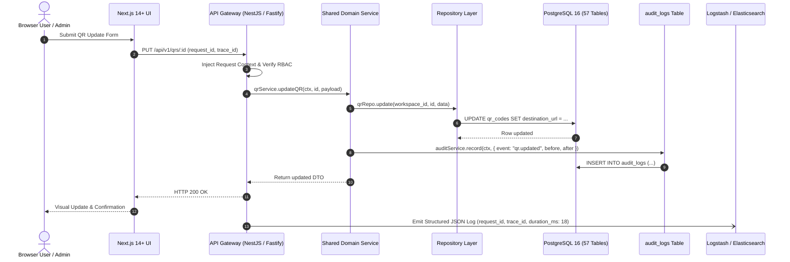

#### B. Jarvis AI Agent MCP Tracing Flow
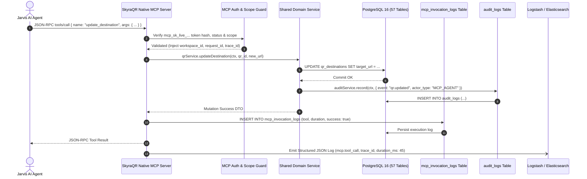

---

## 12. Security, Privacy & Logging Retention Architecture

```mermaid
graph TD
    Sec[SkyraQR Defense-in-Depth]
    Sec --> Perimeter[Perimeter: Cloudflare WAF, TLS 1.3, DDoS]
    Sec --> AuthSec[Identity: Argon2id, Rotating Refresh Tokens, MFA]
    Sec --> AppSec[Application: Parameterized SQL, Zod, CSP, CORS]
    Sec --> AbuseSec[Abuse Defense: Google Safe Browsing, Dead-Link Crawler]
    Sec --> DataSec[Privacy: Zero Raw IP Storage, Daily Salted HMAC-SHA256]
    Sec --> ObsSec[Observability: Immutable Audit Logs & Scrubbed ELK Stream]
```

### Privacy & Security Logging Retention Policy

> **Core Policy Statement:**  
> *"Raw IP addresses are not persisted in QR scan telemetry; limited IP data may be retained in security/audit logs according to documented retention and access-control policies."*

| Log Category | Database Entity | IP Retention Scope | Retention Period | Access Controls |
| :--- | :--- | :--- | :--- | :--- |
| **QR Scan Telemetry** | `scan_events` | **Zero Raw IP.** Only 64-char HMAC-SHA256 salted hash persisted. | 90 days (Starter), 365 days (Business), 2–5 yrs (Agency/Enterprise). | Workspace members with `read:analytics` permission. |
| **User Active Sessions**| `user_sessions` | Client IP address recorded at login. | Purged on logout or after 7 days inactivity. | Authenticated user and Workspace Admin. |
| **Authentication Audit**| `auth_audit_logs` | Client IP recorded on auth events. | 90 days rolling retention. | Workspace Admins and Platform Security staff. |
| **Business Audit Logs** | `audit_logs` | Client IP recorded on mutations. | 1 year (Business), 5 years (Agency/Enterprise, SOC2 aligned). | Workspace Admins and Platform Security staff. |
| **MCP Invocation Logs**| `mcp_invocation_logs`| Origin IP address of MCP agent. | 180 days rolling retention. | Workspace Admins and Platform Security staff. |
| **Platform Operator Logs**| `platform_audit_logs`| Operator IP recorded on mutations. | 7 years statutory compliance retention. | Platform Owner and designated Security Auditors. |

---

## 13. Phased Scalability Strategy & Analytical Migration

```mermaid
flowchart LR
    S1["Stage 1 (MVP)<br/>Modular Monolith<br/>PostgreSQL + Redis<br/>< 500k scans/mo"] --> S2["Stage 2 (Automation)<br/>Decoupled Redirect Edge<br/>Redis Streams Ingestion<br/>500k - 5M scans/mo"]
    S2 --> S3["Stage 3 (Scale)<br/>Postgres Read Replicas<br/>Monthly Partitioning<br/>5M - 25M scans/mo"]
    S3 --> S4["Stage 4 (ClickHouse)<br/>Dedicated Columnar DB<br/>Multi-Region Nodes<br/>25M - 150M scans/mo"]
    S4 --> S5["Stage 5 (Hyper-Scale)<br/>Anycast Edge Compute<br/>Apache Kafka Mesh<br/>150M+ scans/mo"]
```

### Authoritative Analytical Migration Policy
> **Migration Rule:**  
> *"ClickHouse evaluation begins around 10M scans/month based on workload characteristics, while mandatory migration is targeted around 25M scans/month or earlier if PostgreSQL analytics performance/SLOs require it."*

- **Stage 1 (MVP):** Modular Monolith + PostgreSQL 16 (57 Tables) + Redis Cluster. Monthly infrastructure cost $< \$150$.
- **Stage 2 (Decoupled Edge):** Redirect workers extracted into stateless autoscaling Fastify services; Redis Streams ingestion.
- **Stage 3 (Partitioned Scaling):** PostgreSQL read replicas for dashboard queries; automated monthly range partitioning on `scan_events` (`scan_events_YYYY_MM`).
- **Stage 4 (ClickHouse Migration):** Mandatory migration at 25M scans/month (evaluation at 10M). Telemetry streams to ClickHouse MergeTree tables, freeing PostgreSQL to focus purely on relational transactional metadata.
- **Stage 5 (Hyper-Scale):** Global Anycast edge compute (Cloudflare Workers) and Apache Kafka telemetry mesh.

---

## 14. Development Implementation Dependency Graph

```mermaid
flowchart TD
    P0[Phase 0: Engineering Foundation] --> P1[Phase 1: Database Foundation - 57 Tables]
    P1 --> P2[Phase 2: Authentication & Sessions]
    P2 --> P3[Phase 3: Workspace & RBAC]
    P3 --> P4[Phase 4: QR Engine]
    P4 --> P5[Phase 5: Dynamic Routing Engine]
    P5 --> P6[Phase 6: Analytics & Telemetry Pipeline]
    P6 --> P7[Phase 7: Customer Dashboard]
    P7 --> P8[Phase 8: Subscriptions & Billing]
    P8 --> P9[Phase 9: REST API Developer Platform]
    P9 --> P10[Phase 10: Native MCP Server & Delegated Credentials]
    P10 --> P11[Phase 11: ELK Observability & Audit Logging]
    P11 --> P12[Phase 12: Security Hardening]
    P12 --> P13[Phase 13: End-to-End Testing]
    P13 --> P14[Phase 14: Performance & Load Testing]
    P14 --> P15[Phase 15: Production Deployment]
```

---

## 15. Disaster Recovery, High Availability & Runbooks

- **Multi-AZ Failover:** Automated failover to standby PostgreSQL replica in secondary availability zone ($< 60\text{s}$ cutover).
- **RPO & RTO:** $\text{RPO} < 1\text{ hour}$ (Continuous WAL archiving to S3/R2); $\text{RTO} < 4\text{ hours}$ (Automated Terraform scripts).
- **Runbook — Abusive QR Blacklist Incident:**
  1. Platform Admin receives alert from Google Safe Browsing API webhook.
  2. Admin executes `POST /platform-admin/api/v1/quarantine` with target short code.
  3. System updates `qr_codes.status = 'BLOCKED'`, invalidates Redis cache, and sets destination to SkyraQR security warning page globally in $< 50\text{ms}$.

---

## 16. Revision & Version History

| Version | Date | Description | Author |
| :--- | :--- | :--- | :--- |
| **v1.0.0** | 2026-08-15 | Initial baseline Architecture release | Skyra Solution Architecture |
| **v2.0.0** | 2026-08-25 | Expansion to Modular Monolith, Redis Streams, and MCP Server | Skyra Solution Architecture |
| **v2.1.0** | 2026-09-01 | Architecture reconciliation and strict NFR metrics | Skyra Solution Architecture |
| **v2.2.0** | 2026-09-02 | Final pre-implementation architecture consistency correction: Codename policy, Next.js ↔ NestJS boundary & security rules, primary Admin-Managed MCP credentials, native MCP transport wording, 57 production tables, and NUMERIC(12,2) financial precision | Skyra Solution Architecture Group |
