# SkyraQR — Database Architecture & Data Model

**Document Identifier:** SKYRA-DOC-DB-001  
**Version:** 2.2.0  
**Status:** Approved for Implementation (Architecture Locked)  
**Owner:** Skyra Database Engineering & Architecture Group  
**Target Delivery:** MVP (Stage 1) $\rightarrow$ Phase 2 (Automation & Scale) $\rightarrow$ Phase 3 (Agency & Intelligence) $\rightarrow$ Enterprise (Stage 4/5)  

---

## Executive Summary

This document specifies the complete physical and logical database architecture for the **SkyraQR** platform. Engineered for **PostgreSQL 16+**, the data model supports sub-millisecond lookups for edge dynamic QR redirects, multi-tenant workspace isolation, database-driven subscription entitlements, autonomous AI agent interactions via the Model Context Protocol (MCP), and high-throughput scan telemetry collection.

The schema balances strict **Third Normal Form (3NF)** relational integrity for core business domains (identities, workspaces, RBAC, platform administration, subscriptions, and QR configurations) with **declarative monthly range partitioning** and **pre-aggregated rollup tables** for high-frequency scan events. This ensures that analytical growth (millions of scans per month) will never degrade core transactional performance.

The schema defines **exactly 57 production relational tables** organized across 12 logical groups. Every table in this specification is fully documented with exact PostgreSQL data types, nullability, default expressions, unique constraints, check constraints, foreign keys with referential actions, indexes, soft-delete rules, and data classification.

---

## Table of Contents

- [1. Database Design Principles & Standards](#1-database-design-principles--standards)
  - [1.1 Product Codename Policy & Data Store Authority](#11-product-codename-policy--data-store-authority)
  - [1.2 Central PostgreSQL Datatype Policy & Financial Precision](#12-central-postgresql-datatype-policy--financial-precision)
  - [1.3 Table & Column Naming Conventions](#13-table--column-naming-conventions)
  - [1.4 UUIDv7 Primary Key Architecture](#14-uuidv7-primary-key-architecture)
  - [1.5 Multi-Tenant Scoping Architecture (Direct vs. Indirect)](#15-multi-tenant-scoping-architecture-direct-vs-indirect)
  - [1.6 Soft Deletion & Partial Indexing Pattern](#16-soft-deletion--partial-indexing-pattern)
  - [1.7 Privacy-by-Design Telemetry vs. Security Logging](#17-privacy-by-design-telemetry-vs-security-logging)
- [2. Global Entity-Relationship (ER) Architecture](#2-global-entity-relationship-er-architecture)
  - [2.1 Global Relationship Overview ER](#21-global-relationship-overview-er)
  - [2.2 Identity, Authentication & RBAC ER](#22-identity-authentication--rbac-er)
  - [2.3 QR Subsystem & Dynamic Routing ER](#23-qr-subsystem--dynamic-routing-er)
  - [2.4 Micro-Landing Pages & Digital Content ER](#24-micro-landing-pages--digital-content-er)
  - [2.5 Marketing Campaigns & Attribution ER](#25-marketing-campaigns--attribution-er)
  - [2.6 Scan Telemetry & Daily Metrics ER](#26-scan-telemetry--daily-metrics-er)
  - [2.7 Subscriptions, Entitlements & Metering ER](#27-subscriptions-entitlements--metering-er)
  - [2.8 Developer Platform & Custom Domains ER](#28-developer-platform--custom-domains-er)
  - [2.9 Model Context Protocol (MCP) & AI Integration ER](#29-model-context-protocol-mcp--ai-integration-er)
  - [2.10 Security, Abuse & Audit Logging ER](#210-security-abuse--audit-logging-er)
- [3. Complete Table Specifications & DDL Schemas (57 Tables)](#3-complete-table-specifications--ddl-schemas-57-tables)
  - [Group 1: Identity, Authentication & Sessions (6 Tables)](#group-1-identity-authentication--sessions-6-tables)
  - [Group 2: Tenancy, Workspaces & Customer RBAC (6 Tables)](#group-2-tenancy-workspaces--customer-rbac-6-tables)
  - [Group 3: Platform Owner Administration & Operations (5 Tables)](#group-3-platform-owner-administration--operations-5-tables)
  - [Group 4: QR Code Core Management & Design (7 Tables)](#group-4-qr-code-core-management--design-7-tables)
  - [Group 5: Dynamic Routing & Health Defense (2 Tables)](#group-5-dynamic-routing--health-defense-2-tables)
  - [Group 6: No-Code Micro-Landing Pages & Content (6 Tables)](#group-6-no-code-micro-landing-pages--content-6-tables)
  - [Group 7: Campaigns & Attribution (2 Tables)](#group-7-campaigns--attribution-2-tables)
  - [Group 8: Scan Telemetry & Pre-Aggregated Rollups (2 Tables)](#group-8-scan-telemetry--pre-aggregated-rollups-2-tables)
  - [Group 9: Subscriptions, Entitlements & Metering (8 Tables)](#group-9-subscriptions-entitlements--metering-8-tables)
  - [Group 10: Developer Platform & Custom Domains (4 Tables)](#group-10-developer-platform--custom-domains-4-tables)
  - [Group 11: Model Context Protocol (MCP) & AI Integration (7 Tables)](#group-11-model-context-protocol-mcp--ai-integration-7-tables)
  - [Group 12: Security, Abuse & Audit Logging (2 Tables)](#group-12-security-abuse--audit-logging-2-tables)
- [4. Complete Global Foreign Key Registry](#4-complete-global-foreign-key-registry)
- [5. Indexing Strategy & Query Optimization](#5-indexing-strategy--query-optimization)
- [6. High-Throughput Analytics & Partitioning Architecture](#6-high-throughput-analytics--partitioning-architecture)
  - [6.1 Declarative Range Partitioning for `scan_events`](#61-declarative-range-partitioning-for-scan_events)
  - [6.2 Pre-Aggregated Rollup Pipeline (`daily_scan_metrics`)](#62-pre-aggregated-rollup-pipeline-daily_scan_metrics)
  - [6.3 ClickHouse Migration Threshold & Target DDL](#63-clickhouse-migration-threshold--target-ddl)
- [7. Data Retention, Privacy & GDPR Deletion Protocols](#7-data-retention-privacy--gdpr-deletion-protocols)
- [8. Revision & Version History](#8-revision--version-history)

---

## 1. Database Design Principles & Standards

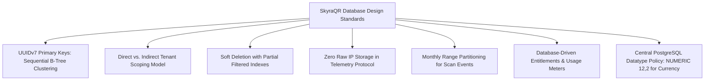

### 1.1 Product Codename Policy & Data Store Authority
- **Internal Project Codename:** **SkyraQR** (Parent Company: **Skyra Tech**; Commercial Product Name: **TBD**).
- **Transactional Authority:** **PostgreSQL 16+** is the **sole authoritative transactional database** for all business data, identities, workspaces, subscriptions, invoices, and authoritative `audit_logs`.
- **Cache & Telemetry Streams:** **Redis Cluster 7.2** is utilized strictly for caching, session state, token reuse detection, and durable telemetry streaming (`stream:scans:raw`). Redis is explicitly **not** the authoritative transactional store.
- **Observability Store:** **Elasticsearch 8** is utilized strictly for operational search and structured log telemetry, **not** as a transactional business database.

### 1.2 Central PostgreSQL Datatype Policy & Financial Precision
To ensure data integrity, optimal storage alignment, and prevention of floating-point inaccuracies:
1. **Primary Keys & UUIDs:** All identifiers use native PostgreSQL `UUID` (128-bit).
2. **Short Text & Slugs:** `VARCHAR(n)` with strict, enforced length boundaries.
3. **Unbounded Text:** `TEXT` for URLs, HTML descriptions, and JSON string representations.
4. **Email Addresses:** `CITEXT` (or lowercased `VARCHAR(255)`) for case-insensitive uniqueness.
5. **Timestamps:** Standardized on `TIMESTAMPTZ` (UTC storage, microsecond precision). `TIMESTAMP` without timezone is **prohibited**.
6. **Financial Currency & Prices:** Standardized on **`NUMERIC(12,2)`**. **`FLOAT`, `REAL`, and `DOUBLE PRECISION` are strictly prohibited for financial amounts, invoices, prices, payment records, and overages.**
7. **Integers & Counters:** `INTEGER` (32-bit) for UI limits, priorities, and display orders; `BIGINT` (64-bit) for scan counters and byte sizes.
8. **Structured Data:** `JSONB` with GIN indexing for flexible styling parameters and rule payloads.
9. **IP Addresses:** `INET` used **strictly and exclusively** in security/audit tables (`user_sessions`, `auth_audit_logs`, `platform_audit_logs`, `audit_logs`). **`INET` is strictly prohibited in `scan_events`.**

### 1.3 Table & Column Naming Conventions
- **Tables:** Lowercase, `snake_case`, plural nouns (e.g., `users`, `workspaces`, `qr_codes`, `mcp_credentials`, `audit_logs`).
- **Primary Keys:** Always named `id`.
- **Foreign Keys:** Always named `<singular_entity>_id` (e.g., `workspace_id`, `user_id`, `qr_id`, `role_id`).
- **Timestamps:** Suffixed with `_at` (e.g., `created_at`, `updated_at`, `deleted_at`, `starts_at`, `expires_at`, `revoked_at`, `last_used_at`).
- **Booleans:** Prefixed with `is_`, `has_`, or `allow_` (e.g., `is_active`, `is_verified`, `is_dynamic`, `has_mfa`).
- **Counters:** Suffixed with `_count` or prefixed with `total_` (e.g., `total_scans`, `processed_records`).

### 1.4 UUIDv7 Primary Key Architecture
All primary keys utilize standard PostgreSQL `UUID` columns populated via **UUIDv7** (RFC 9562).
- **The Problem with UUIDv4:** Random UUIDv4 keys cause severe B-tree index page fragmentation and random I/O write amplification when inserting millions of records.
- **The UUIDv7 Solution:** UUIDv7 embeds a 48-bit millisecond Unix timestamp prefix:
  $$\text{UUIDv7} = \text{Timestamp (48 bits)} \parallel \text{Version (4 bits)} \parallel \text{Rand (12 bits)} \parallel \text{Variant (2 bits)} \parallel \text{Rand (62 bits)}$$
- **Generation Strategy:** UUIDv7 values are generated at the application service layer (using the standardized TypeScript `uuidv7` library) before persistence, or via the PostgreSQL 16+ `uuid_generate_v7()` function extension. In DDL listings, primary key columns use standard `UUID PRIMARY KEY` definitions.

### 1.5 Multi-Tenant Scoping Architecture (Direct vs. Indirect)
SkyraQR standardizes on an authoritative two-tier scoping model:
1. **Direct Tenant Scoping:** Core organizational entities carry a direct `workspace_id UUID NOT NULL REFERENCES workspaces(id) ON DELETE CASCADE`. Examples: `qr_codes`, `campaigns`, `custom_domains`, `api_keys`, `webhooks`, `mcp_credentials`, `usage_meters`.
2. **Indirect Relational Scoping:** Nested child entities are scoped relationally through their parent entity foreign key hierarchy, eliminating redundant column bloat while preserving referential integrity:
   - `menu_items` $\rightarrow$ scoped via `category_id REFERENCES menu_categories(id) -> menus -> landing_pages -> workspace_id`.
   - `qr_designs` $\rightarrow$ scoped 1:1 via `qr_id REFERENCES qr_codes(id) -> workspace_id`.
   - `redirect_rules` $\rightarrow$ scoped via `qr_id REFERENCES qr_codes(id) -> workspace_id`.

### 1.6 Soft Deletion & Partial Indexing Pattern
Entities subject to user deletion carry `deleted_at TIMESTAMPTZ NULL`.
- All unique constraints on mutable columns enforce `WHERE deleted_at IS NULL` (e.g., short codes, domain hostnames, slugs).
- This permits users to recreate an identical short code or re-link a domain if an earlier one was deleted, without key collisions.

### 1.7 Privacy-by-Design Telemetry vs. Security Logging
- **QR Scan Telemetry:** The `scan_events` table contains **zero columns for raw IP addresses**. Telemetry is anonymized at edge ingest using an HMAC-SHA256 salted hash with a 24-hour rotating secret key.
- **Security & Audit Logs:** Limited IP data is retained in `user_sessions`, `auth_audit_logs`, `platform_audit_logs`, and `mcp_invocation_logs` exclusively for account security, brute-force defense, and operator accountability under documented retention schedules.

---

## 2. Global Entity-Relationship (ER) Architecture

### 2.1 Global Relationship Overview ER

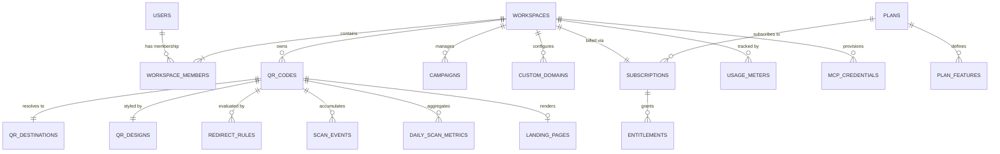

### 2.2 Identity, Authentication & RBAC ER

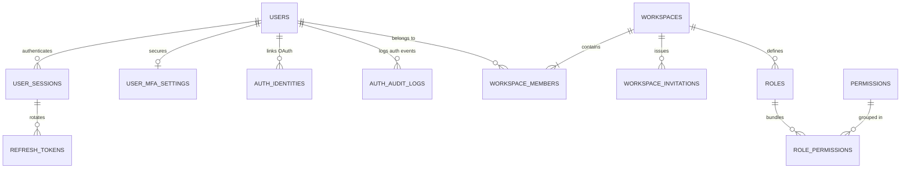

### 2.3 QR Subsystem & Dynamic Routing ER

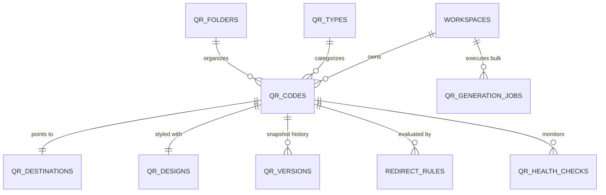

### 2.4 Micro-Landing Pages & Digital Content ER

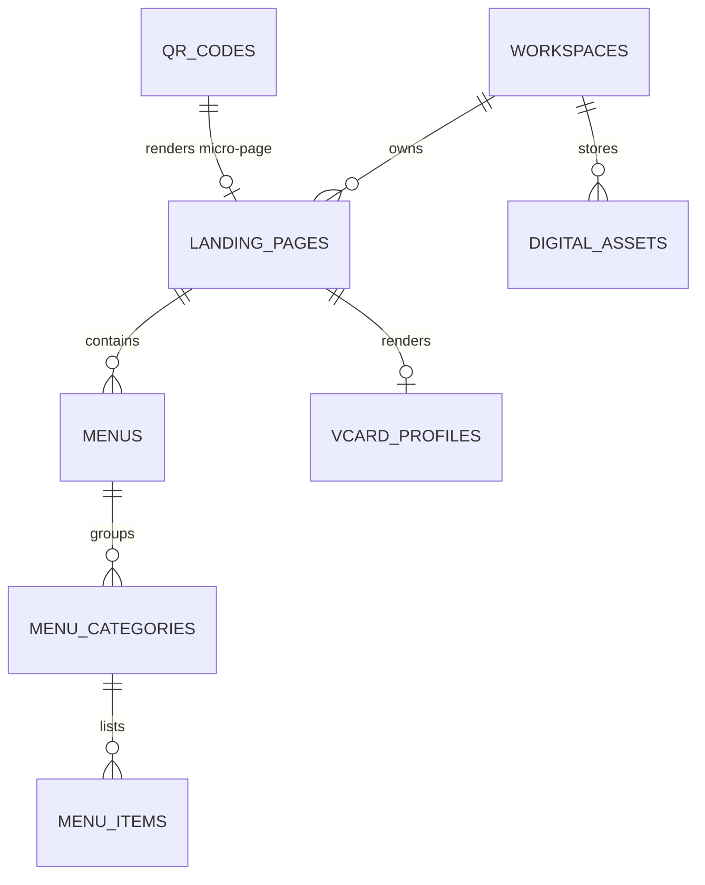

### 2.5 Marketing Campaigns & Attribution ER

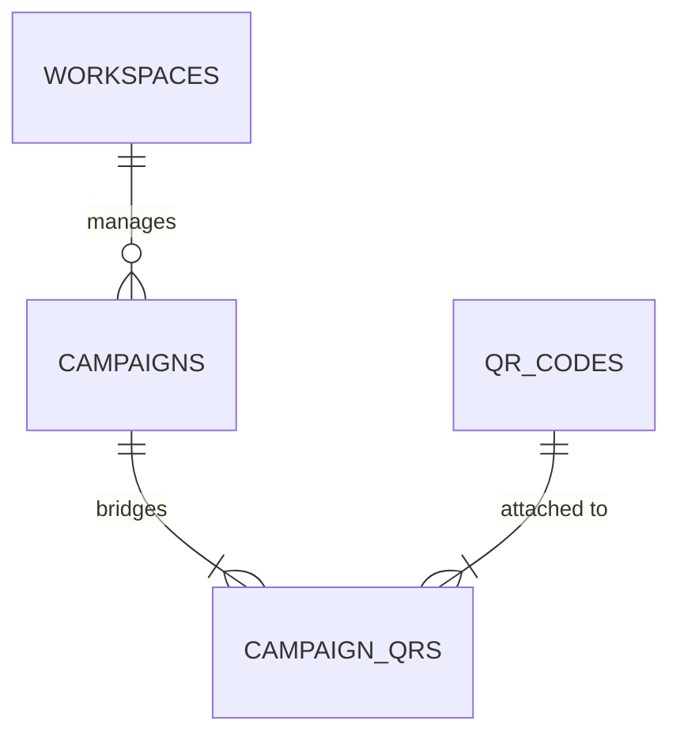

### 2.6 Scan Telemetry & Daily Metrics ER

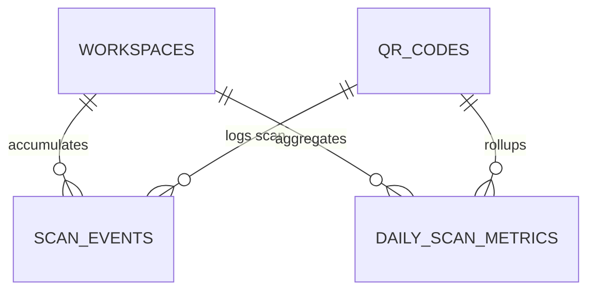

### 2.7 Subscriptions, Entitlements & Metering ER

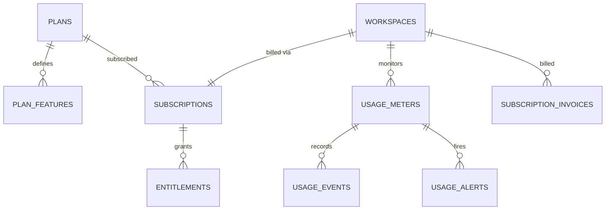

### 2.8 Developer Platform & Custom Domains ER

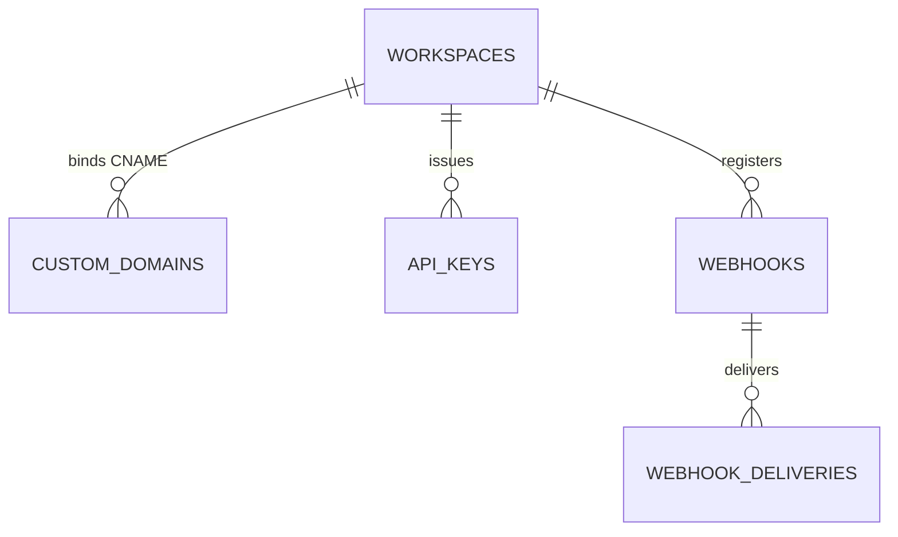

### 2.9 Model Context Protocol (MCP) & AI Integration ER

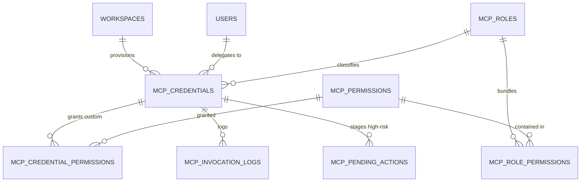

### 2.10 Security, Abuse & Audit Logging ER

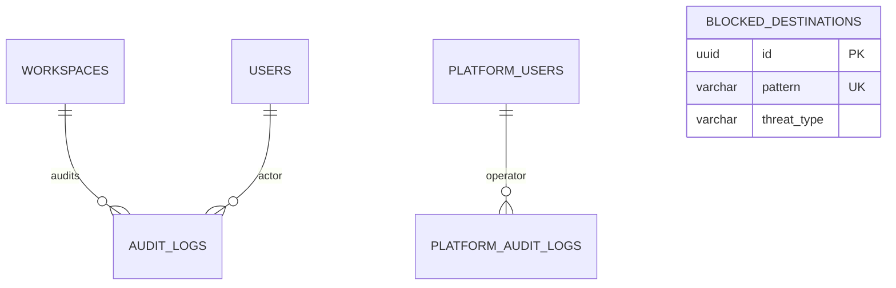

---

## 3. Complete Table Specifications & DDL Schemas (57 Tables)

---

### Group 1: Identity, Authentication & Sessions (6 Tables)

#### 1. `users`
- **Purpose:** Core user account entity containing profile metadata and credentials.
- **Tenant Scope:** Global (A user can belong to multiple workspaces).
- **Primary Key:** `id UUID` (UUIDv7).
- **Columns:**
  - `id` (UUID, NOT NULL, PK)
  - `email` (VARCHAR(255), NOT NULL, UNIQUE, Lowercase normalized)
  - `password_hash` (VARCHAR(255), NULL, Argon2id hash; NULL for OAuth-only users)
  - `full_name` (VARCHAR(100), NOT NULL)
  - `avatar_url` (TEXT, NULL)
  - `is_verified` (BOOLEAN, NOT NULL, DEFAULT FALSE)
  - `is_active` (BOOLEAN, NOT NULL, DEFAULT TRUE)
  - `password_changed_at` (TIMESTAMPTZ, NULL)
  - `created_at` (TIMESTAMPTZ, NOT NULL, DEFAULT NOW())
  - `updated_at` (TIMESTAMPTZ, NOT NULL, DEFAULT NOW())
  - `deleted_at` (TIMESTAMPTZ, NULL)
- **Constraints:** `UNIQUE (email) WHERE deleted_at IS NULL`
- **Foreign Keys:** None.
- **Indexes:** `idx_users_email_active ON users(email) WHERE deleted_at IS NULL`
- **Soft Delete Behavior:** Sets `deleted_at = NOW()`, email anonymized on GDPR purge.
- **Security Classification:** Confidential (PII).

#### 2. `user_sessions`
- **Purpose:** Tracks active user login sessions across devices.
- **Tenant Scope:** Scoped via `user_id`.
- **Primary Key:** `id UUID` (UUIDv7).
- **Columns:**
  - `id` (UUID, NOT NULL, PK)
  - `user_id` (UUID, NOT NULL, FK $\rightarrow$ `users(id)` ON DELETE CASCADE ON UPDATE CASCADE)
  - `user_agent` (TEXT, NULL)
  - `client_ip` (INET, NULL, Recorded for security audit)
  - `device_fingerprint` (VARCHAR(64), NULL)
  - `last_active_at` (TIMESTAMPTZ, NOT NULL, DEFAULT NOW())
  - `expires_at` (TIMESTAMPTZ, NOT NULL)
  - `created_at` (TIMESTAMPTZ, NOT NULL, DEFAULT NOW())
- **Constraints:** `CHECK (expires_at > created_at)`
- **Foreign Keys:** `user_id REFERENCES users(id) ON DELETE CASCADE ON UPDATE CASCADE`
- **Indexes:** `idx_user_sessions_user_expires ON user_sessions(user_id, expires_at)`
- **Retention:** Auto-purged upon logout or after 7 days inactivity.
- **Security Classification:** Confidential (Session metadata).

#### 3. `refresh_tokens`
- **Purpose:** Manages rotating refresh tokens with automatic replay/reuse detection.
- **Tenant Scope:** Scoped via `session_id`.
- **Primary Key:** `id UUID` (UUIDv7).
- **Columns:**
  - `id` (UUID, NOT NULL, PK)
  - `session_id` (UUID, NOT NULL, FK $\rightarrow$ `user_sessions(id)` ON DELETE CASCADE ON UPDATE CASCADE)
  - `token_hash` (VARCHAR(64), NOT NULL, UNIQUE, SHA-256 hash of refresh token)
  - `is_revoked` (BOOLEAN, NOT NULL, DEFAULT FALSE)
  - `replaced_by_token_id` (UUID, NULL, FK $\rightarrow$ `refresh_tokens(id)` ON DELETE SET NULL ON UPDATE CASCADE)
  - `expires_at` (TIMESTAMPTZ, NOT NULL)
  - `created_at` (TIMESTAMPTZ, NOT NULL, DEFAULT NOW())
- **Constraints:** `UNIQUE (token_hash)`
- **Foreign Keys:**
  - `session_id REFERENCES user_sessions(id) ON DELETE CASCADE ON UPDATE CASCADE`
  - `replaced_by_token_id REFERENCES refresh_tokens(id) ON DELETE SET NULL ON UPDATE CASCADE`
- **Indexes:** `idx_refresh_tokens_hash ON refresh_tokens(token_hash)`
- **Retention:** 7-day TTL; cascade deleted with parent session.
- **Security Classification:** Restricted (Authentication Secret Hash).

#### 4. `auth_identities`
- **Purpose:** Linked third-party OAuth 2.0 / OIDC provider identities (Google, GitHub, Azure AD).
- **Tenant Scope:** Scoped via `user_id`.
- **Primary Key:** `id UUID` (UUIDv7).
- **Columns:**
  - `id` (UUID, NOT NULL, PK)
  - `user_id` (UUID, NOT NULL, FK $\rightarrow$ `users(id)` ON DELETE CASCADE ON UPDATE CASCADE)
  - `provider` (VARCHAR(50), NOT NULL, `google`, `github`, `azure_ad`)
  - `provider_user_id` (VARCHAR(255), NOT NULL)
  - `created_at` (TIMESTAMPTZ, NOT NULL, DEFAULT NOW())
- **Constraints:** `UNIQUE (provider, provider_user_id)`
- **Foreign Keys:** `user_id REFERENCES users(id) ON DELETE CASCADE ON UPDATE CASCADE`
- **Indexes:** `idx_auth_identities_user ON auth_identities(user_id)`
- **Security Classification:** Confidential.

#### 5. `user_mfa_settings`
- **Purpose:** RFC 6238 Time-based One-Time Password (TOTP) configuration.
- **Tenant Scope:** Scoped via `user_id`.
- **Primary Key:** `id UUID` (UUIDv7).
- **Columns:**
  - `id` (UUID, NOT NULL, PK)
  - `user_id` (UUID, NOT NULL, UNIQUE, FK $\rightarrow$ `users(id)` ON DELETE CASCADE ON UPDATE CASCADE)
  - `totp_secret_encrypted` (TEXT, NOT NULL, AES-256-GCM encrypted secret)
  - `backup_codes_hashed` (TEXT[], NOT NULL, Array of 8 hashed single-use recovery codes)
  - `is_enabled` (BOOLEAN, NOT NULL, DEFAULT FALSE)
  - `enabled_at` (TIMESTAMPTZ, NULL)
- **Constraints:** `UNIQUE (user_id)`
- **Foreign Keys:** `user_id REFERENCES users(id) ON DELETE CASCADE ON UPDATE CASCADE`
- **Indexes:** `idx_user_mfa_user_id ON user_mfa_settings(user_id)`
- **Security Classification:** Restricted (MFA Secrets).

#### 6. `auth_audit_logs`
- **Purpose:** Chronological audit trail of authentication and identity security events.
- **Tenant Scope:** Scoped via `user_id` (nullable for failed logins).
- **Primary Key:** `id UUID` (UUIDv7).
- **Columns:**
  - `id` (UUID, NOT NULL, PK)
  - `user_id` (UUID, NULL, FK $\rightarrow$ `users(id)` ON DELETE SET NULL ON UPDATE CASCADE)
  - `event_type` (VARCHAR(60), NOT NULL, e.g., `LOGIN_SUCCESS`, `LOGIN_FAILED`, `MFA_CHALLENGE`)
  - `ip_address` (INET, NULL, Recorded for brute-force investigation)
  - `user_agent` (TEXT, NULL)
  - `metadata` (JSONB, NOT NULL, DEFAULT `'{}'`)
  - `created_at` (TIMESTAMPTZ, NOT NULL, DEFAULT NOW())
- **Foreign Keys:** `user_id REFERENCES users(id) ON DELETE SET NULL ON UPDATE CASCADE`
- **Indexes:** `idx_auth_audit_user_time ON auth_audit_logs(user_id, created_at DESC)`
- **Retention:** 90 days rolling retention.
- **Security Classification:** Confidential (Audit).

---

### Group 2: Tenancy, Workspaces & Customer RBAC (6 Tables)

#### 7. `workspaces`
- **Purpose:** Top-level multi-tenant organizational boundary for customer assets and teams.
- **Tenant Scope:** Root Multi-Tenant Container.
- **Primary Key:** `id UUID` (UUIDv7).
- **Columns:**
  - `id` (UUID, NOT NULL, PK)
  - `name` (VARCHAR(100), NOT NULL)
  - `slug` (VARCHAR(60), NOT NULL, Unique URL identifier)
  - `tier` (VARCHAR(30), NOT NULL, DEFAULT 'FREE')
  - `status` (VARCHAR(30), NOT NULL, DEFAULT 'ACTIVE', `ACTIVE`, `PAST_DUE`, `SUSPENDED`)
  - `white_label_logo` (TEXT, NULL)
  - `white_label_theme` (JSONB, NOT NULL, DEFAULT `'{}'`)
  - `created_at` (TIMESTAMPTZ, NOT NULL, DEFAULT NOW())
  - `updated_at` (TIMESTAMPTZ, NOT NULL, DEFAULT NOW())
  - `deleted_at` (TIMESTAMPTZ, NULL)
- **Constraints:** `UNIQUE (slug) WHERE deleted_at IS NULL`
- **Indexes:** `idx_workspaces_slug_active ON workspaces(slug) WHERE deleted_at IS NULL`
- **Soft Delete Behavior:** Sets `deleted_at = NOW()`.
- **Security Classification:** Confidential.

#### 8. `workspace_members`
- **Purpose:** Assigns users to workspaces with standard RBAC roles.
- **Tenant Scope:** Direct (`workspace_id`).
- **Primary Key:** `id UUID` (UUIDv7).
- **Columns:**
  - `id` (UUID, NOT NULL, PK)
  - `workspace_id` (UUID, NOT NULL, FK $\rightarrow$ `workspaces(id)` ON DELETE CASCADE ON UPDATE CASCADE)
  - `user_id` (UUID, NOT NULL, FK $\rightarrow$ `users(id)` ON DELETE CASCADE ON UPDATE CASCADE)
  - `role` (VARCHAR(30), NOT NULL, DEFAULT 'EDITOR', `OWNER`, `ADMIN`, `EDITOR`, `VIEWER`, `CLIENT_GUEST`)
  - `joined_at` (TIMESTAMPTZ, NOT NULL, DEFAULT NOW())
- **Constraints:** `UNIQUE (workspace_id, user_id)`
- **Foreign Keys:**
  - `workspace_id REFERENCES workspaces(id) ON DELETE CASCADE ON UPDATE CASCADE`
  - `user_id REFERENCES users(id) ON DELETE CASCADE ON UPDATE CASCADE`
- **Indexes:** `idx_workspace_members_user ON workspace_members(user_id)`
- **Security Classification:** Confidential.

#### 9. `workspace_invitations`
- **Purpose:** Pending email invitations to join a workspace.
- **Tenant Scope:** Direct (`workspace_id`).
- **Primary Key:** `id UUID` (UUIDv7).
- **Columns:**
  - `id` (UUID, NOT NULL, PK)
  - `workspace_id` (UUID, NOT NULL, FK $\rightarrow$ `workspaces(id)` ON DELETE CASCADE ON UPDATE CASCADE)
  - `email` (VARCHAR(255), NOT NULL)
  - `role` (VARCHAR(30), NOT NULL, DEFAULT 'VIEWER')
  - `token` (VARCHAR(64), NOT NULL, UNIQUE, Cryptographic token)
  - `expires_at` (TIMESTAMPTZ, NOT NULL)
  - `created_at` (TIMESTAMPTZ, NOT NULL, DEFAULT NOW())
- **Constraints:** `UNIQUE (token)`
- **Foreign Keys:** `workspace_id REFERENCES workspaces(id) ON DELETE CASCADE ON UPDATE CASCADE`
- **Indexes:** `idx_workspace_invitations_token ON workspace_invitations(token)`
- **Retention:** 7-day TTL.
- **Security Classification:** Confidential.

#### 10. `roles`
- **Purpose:** Custom workspace RBAC roles (Enterprise tier).
- **Tenant Scope:** Direct (`workspace_id`).
- **Primary Key:** `id UUID` (UUIDv7).
- **Columns:**
  - `id` (UUID, NOT NULL, PK)
  - `workspace_id` (UUID, NOT NULL, FK $\rightarrow$ `workspaces(id)` ON DELETE CASCADE ON UPDATE CASCADE)
  - `name` (VARCHAR(60), NOT NULL)
  - `is_system_default` (BOOLEAN, NOT NULL, DEFAULT FALSE)
- **Constraints:** `UNIQUE (workspace_id, name)`
- **Foreign Keys:** `workspace_id REFERENCES workspaces(id) ON DELETE CASCADE ON UPDATE CASCADE`
- **Indexes:** `idx_roles_workspace ON roles(workspace_id)`
- **Security Classification:** Internal.

#### 11. `permissions`
- **Purpose:** Master catalog of granular workspace permissions.
- **Tenant Scope:** Global.
- **Primary Key:** `id VARCHAR(60)`.
- **Columns:**
  - `id` (VARCHAR(60), NOT NULL, PK, e.g., `qr:create`, `manage:mcp_credentials`)
  - `category` (VARCHAR(40), NOT NULL, `QR`, `ANALYTICS`, `BILLING`, `DOMAINS`, `TEAM`, `MCP`)
  - `description` (TEXT, NOT NULL)
- **Indexes:** `idx_permissions_category ON permissions(category)`
- **Security Classification:** Public.

#### 12. `role_permissions`
- **Purpose:** Binds granular permissions to workspace roles.
- **Tenant Scope:** Indirect (via `role_id`).
- **Primary Key:** Composite `(role_id, permission_id)`.
- **Columns:**
  - `role_id` (UUID, NOT NULL, FK $\rightarrow$ `roles(id)` ON DELETE CASCADE ON UPDATE CASCADE)
  - `permission_id` (VARCHAR(60), NOT NULL, FK $\rightarrow$ `permissions(id)` ON DELETE CASCADE ON UPDATE CASCADE)
- **Foreign Keys:**
  - `role_id REFERENCES roles(id) ON DELETE CASCADE ON UPDATE CASCADE`
  - `permission_id REFERENCES permissions(id) ON DELETE CASCADE ON UPDATE CASCADE`
- **Security Classification:** Internal.

---

### Group 3: Platform Owner Administration & Operations (5 Tables)

#### 13. `platform_users`
- **Purpose:** Dedicated staff operator accounts isolated from customer workspaces.
- **Tenant Scope:** Global Platform Governance.
- **Primary Key:** `id UUID` (UUIDv7).
- **Columns:**
  - `id` (UUID, NOT NULL, PK)
  - `email` (VARCHAR(255), NOT NULL, UNIQUE)
  - `password_hash` (VARCHAR(255), NOT NULL, Argon2id hash)
  - `full_name` (VARCHAR(100), NOT NULL)
  - `mfa_enabled` (BOOLEAN, NOT NULL, DEFAULT TRUE, Mandatory MFA)
  - `totp_secret_encrypted` (TEXT, NOT NULL)
  - `is_active` (BOOLEAN, NOT NULL, DEFAULT TRUE)
  - `created_at` (TIMESTAMPTZ, NOT NULL, DEFAULT NOW())
- **Constraints:** `UNIQUE (email)`
- **Indexes:** `idx_platform_users_email ON platform_users(email)`
- **Security Classification:** Restricted (Platform Staff).

#### 14. `platform_roles`
- **Purpose:** Platform roles: `PLATFORM_OWNER`, `PLATFORM_ADMIN`, `PLATFORM_SUPPORT`, `PLATFORM_ANALYST`.
- **Tenant Scope:** Global Platform Governance.
- **Primary Key:** `id VARCHAR(40)`.
- **Columns:**
  - `id` (VARCHAR(40), NOT NULL, PK)
  - `description` (TEXT, NOT NULL)
- **Security Classification:** Internal.

#### 15. `platform_permissions`
- **Purpose:** Granular operator permissions (e.g., `platform:abuse:quarantine`, `platform:revenue:read`).
- **Tenant Scope:** Global Platform Governance.
- **Primary Key:** `id VARCHAR(60)`.
- **Columns:**
  - `id` (VARCHAR(60), NOT NULL, PK)
  - `description` (TEXT, NOT NULL)
- **Security Classification:** Internal.

#### 16. `platform_user_roles`
- **Purpose:** Assigns platform roles to platform users.
- **Tenant Scope:** Global Platform Governance.
- **Primary Key:** Composite `(platform_user_id, platform_role_id)`.
- **Columns:**
  - `platform_user_id` (UUID, NOT NULL, FK $\rightarrow$ `platform_users(id)` ON DELETE CASCADE ON UPDATE CASCADE)
  - `platform_role_id` (VARCHAR(40), NOT NULL, FK $\rightarrow$ `platform_roles(id)` ON DELETE CASCADE ON UPDATE CASCADE)
- **Foreign Keys:**
  - `platform_user_id REFERENCES platform_users(id) ON DELETE CASCADE ON UPDATE CASCADE`
  - `platform_role_id REFERENCES platform_roles(id) ON DELETE CASCADE ON UPDATE CASCADE`
- **Security Classification:** Restricted.

#### 17. `platform_audit_logs`
- **Purpose:** Immutable audit ledger recording all platform staff operator actions.
- **Tenant Scope:** Global Platform Governance.
- **Primary Key:** `id UUID` (UUIDv7).
- **Columns:**
  - `id` (UUID, NOT NULL, PK)
  - `platform_user_id` (UUID, NOT NULL, FK $\rightarrow$ `platform_users(id)` ON DELETE RESTRICT ON UPDATE CASCADE)
  - `action` (VARCHAR(80), NOT NULL, e.g., `QUARANTINE_QR`, `UPDATE_PLAN`)
  - `target_resource` (VARCHAR(50), NOT NULL)
  - `target_resource_id` (UUID, NULL)
  - `metadata` (JSONB, NOT NULL, DEFAULT `'{}'`)
  - `ip_address` (INET, NOT NULL, Operator IP)
  - `created_at` (TIMESTAMPTZ, NOT NULL, DEFAULT NOW())
- **Foreign Keys:** `platform_user_id REFERENCES platform_users(id) ON DELETE RESTRICT ON UPDATE CASCADE`
- **Indexes:** `idx_platform_audit_time ON platform_audit_logs(created_at DESC)`
- **Retention:** 7 years statutory compliance retention.
- **Security Classification:** Restricted (Audit).

---

### Group 4: QR Code Core Management & Design (7 Tables)

#### 18. `qr_types`
- **Purpose:** Master catalog of 16 supported QR types.
- **Tenant Scope:** Global.
- **Primary Key:** `id VARCHAR(40)`.
- **Columns:**
  - `id` (VARCHAR(40), NOT NULL, PK, `DYNAMIC_URL`, `STATIC_URL`, etc.)
  - `category` (VARCHAR(40), NOT NULL, `WEB`, `IDENTITY`, `HOSPITALITY`, `CONNECT`, `COMMERCE`, `MEDIA`, `ENTERPRISE`)
  - `is_dynamic` (BOOLEAN, NOT NULL)
  - `min_tier` (VARCHAR(30), NOT NULL, DEFAULT 'FREE')
- **Security Classification:** Public.

#### 19. `qr_codes`
- **Purpose:** Core entity tracking all generated QR codes, short codes, status, and metadata.
- **Tenant Scope:** Direct (`workspace_id`).
- **Primary Key:** `id UUID` (UUIDv7).
- **Columns:**
  - `id` (UUID, NOT NULL, PK)
  - `workspace_id` (UUID, NOT NULL, FK $\rightarrow$ `workspaces(id)` ON DELETE CASCADE ON UPDATE CASCADE)
  - `folder_id` (UUID, NULL, FK $\rightarrow$ `qr_folders(id)` ON DELETE SET NULL ON UPDATE CASCADE)
  - `qr_type_id` (VARCHAR(40), NOT NULL, FK $\rightarrow$ `qr_types(id)` ON DELETE RESTRICT ON UPDATE CASCADE)
  - `short_code` (VARCHAR(16), NOT NULL, Base62 6-character code)
  - `name` (VARCHAR(150), NOT NULL)
  - `is_dynamic` (BOOLEAN, NOT NULL, DEFAULT TRUE)
  - `status` (VARCHAR(30), NOT NULL, DEFAULT 'ACTIVE', `ACTIVE`, `PAUSED`, `EXPIRED`, `BLOCKED`)
  - `total_scans` (BIGINT, NOT NULL, DEFAULT 0)
  - `expires_at` (TIMESTAMPTZ, NULL)
  - `scannability_score` (INTEGER, NOT NULL, DEFAULT 100)
  - `created_by` (UUID, NULL, FK $\rightarrow$ `users(id)` ON DELETE SET NULL ON UPDATE CASCADE)
  - `created_at` (TIMESTAMPTZ, NOT NULL, DEFAULT NOW())
  - `updated_at` (TIMESTAMPTZ, NOT NULL, DEFAULT NOW())
  - `deleted_at` (TIMESTAMPTZ, NULL)
- **Constraints:** `UNIQUE (short_code) WHERE deleted_at IS NULL`
- **Foreign Keys:**
  - `workspace_id REFERENCES workspaces(id) ON DELETE CASCADE ON UPDATE CASCADE`
  - `folder_id REFERENCES qr_folders(id) ON DELETE SET NULL ON UPDATE CASCADE`
  - `qr_type_id REFERENCES qr_types(id) ON DELETE RESTRICT ON UPDATE CASCADE`
  - `created_by REFERENCES users(id) ON DELETE SET NULL ON UPDATE CASCADE`
- **Indexes:**
  - `idx_qr_codes_short_code_active ON qr_codes(short_code) WHERE deleted_at IS NULL`
  - `idx_qr_codes_workspace_status ON qr_codes(workspace_id, status, created_at DESC) WHERE deleted_at IS NULL`
- **Soft Delete Behavior:** Sets `deleted_at = NOW()`, evicts Redis cache.
- **Security Classification:** Confidential.

#### 20. `qr_destinations`
- **Purpose:** Resolved destination target and health metrics for dynamic QR codes.
- **Tenant Scope:** Indirect (1:1 with `qr_codes`).
- **Primary Key:** `id UUID` (UUIDv7).
- **Columns:**
  - `id` (UUID, NOT NULL, PK)
  - `qr_id` (UUID, NOT NULL, UNIQUE, FK $\rightarrow$ `qr_codes(id)` ON DELETE CASCADE ON UPDATE CASCADE)
  - `target_url` (TEXT, NOT NULL)
  - `utm_source` (VARCHAR(100), NULL)
  - `utm_medium` (VARCHAR(100), NULL)
  - `utm_campaign` (VARCHAR(100), NULL)
  - `health_status` (VARCHAR(30), NOT NULL, DEFAULT 'HEALTHY', `HEALTHY`, `WARNING`, `FAILING`)
  - `last_checked_at` (TIMESTAMPTZ, NULL)
  - `last_http_status` (INTEGER, NULL, DEFAULT 200)
- **Constraints:** `UNIQUE (qr_id)`
- **Foreign Keys:** `qr_id REFERENCES qr_codes(id) ON DELETE CASCADE ON UPDATE CASCADE`
- **Indexes:** `idx_qr_destinations_qr_id ON qr_destinations(qr_id)`
- **Security Classification:** Confidential.

#### 21. `qr_designs`
- **Purpose:** Visual styling configuration for QR matrix, patterns, eyes, colors, and logos.
- **Tenant Scope:** Indirect (1:1 with `qr_codes`).
- **Primary Key:** `id UUID` (UUIDv7).
- **Columns:**
  - `id` (UUID, NOT NULL, PK)
  - `qr_id` (UUID, NOT NULL, UNIQUE, FK $\rightarrow$ `qr_codes(id)` ON DELETE CASCADE ON UPDATE CASCADE)
  - `ecc_level` (VARCHAR(2), NOT NULL, DEFAULT 'M', `L`, `M`, `Q`, `H`)
  - `module_pattern` (VARCHAR(40), NOT NULL, DEFAULT 'square')
  - `eye_shape` (VARCHAR(40), NOT NULL, DEFAULT 'square')
  - `eye_pupil` (VARCHAR(40), NOT NULL, DEFAULT 'square')
  - `fg_color` (VARCHAR(20), NOT NULL, DEFAULT '#000000')
  - `bg_color` (VARCHAR(20), NOT NULL, DEFAULT '#FFFFFF')
  - `gradient_type` (VARCHAR(20), NULL, `linear`, `radial`, `none`)
  - `gradient_secondary` (VARCHAR(20), NULL)
  - `logo_url` (TEXT, NULL)
  - `logo_scale` (NUMERIC(3,2), NOT NULL, DEFAULT 0.20)
  - `frame_style` (VARCHAR(50), NULL)
  - `frame_text` (VARCHAR(60), NULL)
  - `styling_payload` (JSONB, NOT NULL, DEFAULT `'{}'`)
- **Constraints:** `UNIQUE (qr_id)`, `CHECK (logo_scale <= 0.22)`
- **Foreign Keys:** `qr_id REFERENCES qr_codes(id) ON DELETE CASCADE ON UPDATE CASCADE`
- **Security Classification:** Internal.

#### 22. `qr_versions`
- **Purpose:** Immutable snapshot history capturing every modification for auditing and rollbacks.
- **Tenant Scope:** Indirect (via `qr_id`).
- **Primary Key:** `id UUID` (UUIDv7).
- **Columns:**
  - `id` (UUID, NOT NULL, PK)
  - `qr_id` (UUID, NOT NULL, FK $\rightarrow$ `qr_codes(id)` ON DELETE CASCADE ON UPDATE CASCADE)
  - `version_number` (INTEGER, NOT NULL, DEFAULT 1)
  - `snapshot_payload` (JSONB, NOT NULL)
  - `created_by` (UUID, NULL, FK $\rightarrow$ `users(id)` ON DELETE SET NULL ON UPDATE CASCADE)
  - `created_at` (TIMESTAMPTZ, NOT NULL, DEFAULT NOW())
- **Foreign Keys:**
  - `qr_id REFERENCES qr_codes(id) ON DELETE CASCADE ON UPDATE CASCADE`
  - `created_by REFERENCES users(id) ON DELETE SET NULL ON UPDATE CASCADE`
- **Indexes:** `idx_qr_versions_qr_id ON qr_versions(qr_id, version_number DESC)`
- **Security Classification:** Confidential.

#### 23. `qr_folders`
- **Purpose:** Hierarchical folder organization for QR codes within workspaces.
- **Tenant Scope:** Direct (`workspace_id`).
- **Primary Key:** `id UUID` (UUIDv7).
- **Columns:**
  - `id` (UUID, NOT NULL, PK)
  - `workspace_id` (UUID, NOT NULL, FK $\rightarrow$ `workspaces(id)` ON DELETE CASCADE ON UPDATE CASCADE)
  - `parent_folder_id` (UUID, NULL, FK $\rightarrow$ `qr_folders(id)` ON DELETE CASCADE ON UPDATE CASCADE)
  - `name` (VARCHAR(80), NOT NULL)
  - `created_at` (TIMESTAMPTZ, NOT NULL, DEFAULT NOW())
- **Foreign Keys:**
  - `workspace_id REFERENCES workspaces(id) ON DELETE CASCADE ON UPDATE CASCADE`
  - `parent_folder_id REFERENCES qr_folders(id) ON DELETE CASCADE ON UPDATE CASCADE`
- **Indexes:** `idx_qr_folders_workspace ON qr_folders(workspace_id)`
- **Security Classification:** Internal.

#### 24. `qr_generation_jobs`
- **Purpose:** Tracks asynchronous CSV bulk generation batches.
- **Tenant Scope:** Direct (`workspace_id`).
- **Primary Key:** `id UUID` (UUIDv7).
- **Columns:**
  - `id` (UUID, NOT NULL, PK)
  - `workspace_id` (UUID, NOT NULL, FK $\rightarrow$ `workspaces(id)` ON DELETE CASCADE ON UPDATE CASCADE)
  - `total_records` (INTEGER, NOT NULL)
  - `processed_records` (INTEGER, NOT NULL, DEFAULT 0)
  - `status` (VARCHAR(30), NOT NULL, DEFAULT 'PENDING', `PENDING`, `PROCESSING`, `COMPLETED`, `FAILED`)
  - `download_zip_url` (TEXT, NULL)
  - `error_summary` (JSONB, NULL)
  - `created_at` (TIMESTAMPTZ, NOT NULL, DEFAULT NOW())
- **Foreign Keys:** `workspace_id REFERENCES workspaces(id) ON DELETE CASCADE ON UPDATE CASCADE`
- **Indexes:** `idx_qr_generation_jobs_ws ON qr_generation_jobs(workspace_id, status)`
- **Retention:** 30 days.
- **Security Classification:** Confidential.

---

### Group 5: Dynamic Routing & Health Defense (2 Tables)

#### 25. `redirect_rules`
- **Purpose:** Context-aware routing rules (Device OS, GeoIP, Schedule, A/B Testing).
- **Tenant Scope:** Indirect (via `qr_id`).
- **Primary Key:** `id UUID` (UUIDv7).
- **Columns:**
  - `id` (UUID, NOT NULL, PK)
  - `qr_id` (UUID, NOT NULL, FK $\rightarrow$ `qr_codes(id)` ON DELETE CASCADE ON UPDATE CASCADE)
  - `rule_type` (VARCHAR(30), NOT NULL, `DEVICE_OS`, `GEOLOCATION`, `TIME_SCHEDULE`, `AB_TEST`)
  - `priority` (INTEGER, NOT NULL, DEFAULT 0)
  - `condition_payload` (JSONB, NOT NULL)
  - `destination_url` (TEXT, NOT NULL)
  - `is_active` (BOOLEAN, NOT NULL, DEFAULT TRUE)
  - `created_at` (TIMESTAMPTZ, NOT NULL, DEFAULT NOW())
- **Foreign Keys:** `qr_id REFERENCES qr_codes(id) ON DELETE CASCADE ON UPDATE CASCADE`
- **Indexes:** `idx_redirect_rules_qr_active ON redirect_rules(qr_id, priority) WHERE is_active = TRUE`
- **Security Classification:** Confidential.

#### 26. `qr_health_checks`
- **Purpose:** Destination URL ping check responses from the automated dead-link crawler.
- **Tenant Scope:** Indirect (via `qr_id`).
- **Primary Key:** `id UUID` (UUIDv7).
- **Columns:**
  - `id` (UUID, NOT NULL, PK)
  - `qr_id` (UUID, NOT NULL, FK $\rightarrow$ `qr_codes(id)` ON DELETE CASCADE ON UPDATE CASCADE)
  - `http_status` (INTEGER, NOT NULL)
  - `response_time_ms` (INTEGER, NOT NULL)
  - `error_message` (TEXT, NULL)
  - `checked_at` (TIMESTAMPTZ, NOT NULL, DEFAULT NOW())
- **Foreign Keys:** `qr_id REFERENCES qr_codes(id) ON DELETE CASCADE ON UPDATE CASCADE`
- **Indexes:** `idx_qr_health_checks_qr ON qr_health_checks(qr_id, checked_at DESC)`
- **Retention:** 90 days rolling retention.
- **Security Classification:** Internal.

---

### Group 6: No-Code Micro-Landing Pages & Content (6 Tables)

#### 27. `landing_pages`
- **Purpose:** Mobile-responsive hosted micro-landing pages (Digital Menu, vCard, Product).
- **Tenant Scope:** Direct (`workspace_id`).
- **Primary Key:** `id UUID` (UUIDv7).
- **Columns:**
  - `id` (UUID, NOT NULL, PK)
  - `qr_id` (UUID, NOT NULL, UNIQUE, FK $\rightarrow$ `qr_codes(id)` ON DELETE CASCADE ON UPDATE CASCADE)
  - `workspace_id` (UUID, NOT NULL, FK $\rightarrow$ `workspaces(id)` ON DELETE CASCADE ON UPDATE CASCADE)
  - `page_type` (VARCHAR(40), NOT NULL, `MENU`, `VCARD_PLUS`, `PRODUCT`, `COUPON`, `EVENT`)
  - `title` (VARCHAR(150), NOT NULL)
  - `meta_description` (TEXT, NULL)
  - `theme_settings` (JSONB, NOT NULL, DEFAULT `'{}'`)
  - `is_published` (BOOLEAN, NOT NULL, DEFAULT TRUE)
  - `created_at` (TIMESTAMPTZ, NOT NULL, DEFAULT NOW())
  - `updated_at` (TIMESTAMPTZ, NOT NULL, DEFAULT NOW())
- **Constraints:** `UNIQUE (qr_id)`
- **Foreign Keys:**
  - `qr_id REFERENCES qr_codes(id) ON DELETE CASCADE ON UPDATE CASCADE`
  - `workspace_id REFERENCES workspaces(id) ON DELETE CASCADE ON UPDATE CASCADE`
- **Indexes:** `idx_landing_pages_workspace ON landing_pages(workspace_id)`
- **Security Classification:** Public Content.

#### 28. `menus`
- **Purpose:** Restaurant / bar menu attached to a landing page.
- **Tenant Scope:** Indirect (1:1 with `landing_pages`).
- **Primary Key:** `id UUID` (UUIDv7).
- **Columns:**
  - `id` (UUID, NOT NULL, PK)
  - `landing_page_id` (UUID, NOT NULL, UNIQUE, FK $\rightarrow$ `landing_pages(id)` ON DELETE CASCADE ON UPDATE CASCADE)
  - `currency` (VARCHAR(3), NOT NULL, DEFAULT 'USD')
  - `allow_allergens` (BOOLEAN, NOT NULL, DEFAULT TRUE)
- **Constraints:** `UNIQUE (landing_page_id)`
- **Foreign Keys:** `landing_page_id REFERENCES landing_pages(id) ON DELETE CASCADE ON UPDATE CASCADE`
- **Security Classification:** Public Content.

#### 29. `menu_categories`
- **Purpose:** Menu sections (Starters, Mains, Desserts, Cocktails).
- **Tenant Scope:** Indirect (via `menu_id`).
- **Primary Key:** `id UUID` (UUIDv7).
- **Columns:**
  - `id` (UUID, NOT NULL, PK)
  - `menu_id` (UUID, NOT NULL, FK $\rightarrow$ `menus(id)` ON DELETE CASCADE ON UPDATE CASCADE)
  - `name` (VARCHAR(100), NOT NULL)
  - `display_order` (INTEGER, NOT NULL, DEFAULT 0)
- **Foreign Keys:** `menu_id REFERENCES menus(id) ON DELETE CASCADE ON UPDATE CASCADE`
- **Indexes:** `idx_menu_categories_menu ON menu_categories(menu_id, display_order)`
- **Security Classification:** Public Content.

#### 30. `menu_items`
- **Purpose:** Individual dishes and beverages within a category.
- **Tenant Scope:** Indirect (via `category_id`).
- **Primary Key:** `id UUID` (UUIDv7).
- **Columns:**
  - `id` (UUID, NOT NULL, PK)
  - `category_id` (UUID, NOT NULL, FK $\rightarrow$ `menu_categories(id)` ON DELETE CASCADE ON UPDATE CASCADE)
  - `name` (VARCHAR(120), NOT NULL)
  - `description` (TEXT, NULL)
  - `price` (NUMERIC(12,2), NOT NULL)
  - `image_url` (TEXT, NULL)
  - `dietary_tags` (TEXT[], NOT NULL, DEFAULT `'{}'`)
  - `is_available` (BOOLEAN, NOT NULL, DEFAULT TRUE)
- **Foreign Keys:** `category_id REFERENCES menu_categories(id) ON DELETE CASCADE ON UPDATE CASCADE`
- **Indexes:** `idx_menu_items_category ON menu_items(category_id)`
- **Security Classification:** Public Content.

#### 31. `vcard_profiles`
- **Purpose:** Digital contact information for vCard Plus micro-landing pages.
- **Tenant Scope:** Indirect (1:1 with `landing_pages`).
- **Primary Key:** `id UUID` (UUIDv7).
- **Columns:**
  - `id` (UUID, NOT NULL, PK)
  - `landing_page_id` (UUID, NOT NULL, UNIQUE, FK $\rightarrow$ `landing_pages(id)` ON DELETE CASCADE ON UPDATE CASCADE)
  - `first_name` (VARCHAR(60), NOT NULL)
  - `last_name` (VARCHAR(60), NULL)
  - `organization` (VARCHAR(100), NULL)
  - `job_title` (VARCHAR(100), NULL)
  - `phone_mobile` (VARCHAR(30), NULL)
  - `phone_work` (VARCHAR(30), NULL)
  - `email` (VARCHAR(255), NULL)
  - `website_url` (TEXT, NULL)
  - `address_json` (JSONB, NOT NULL, DEFAULT `'{}'`)
  - `social_links` (JSONB, NOT NULL, DEFAULT `'{}'`)
- **Constraints:** `UNIQUE (landing_page_id)`
- **Foreign Keys:** `landing_page_id REFERENCES landing_pages(id) ON DELETE CASCADE ON UPDATE CASCADE`
- **Security Classification:** Public Content (User Provided).

#### 32. `digital_assets`
- **Purpose:** Uploaded files (PDF catalogs, menu photography, audio tracks).
- **Tenant Scope:** Direct (`workspace_id`).
- **Primary Key:** `id UUID` (UUIDv7).
- **Columns:**
  - `id` (UUID, NOT NULL, PK)
  - `workspace_id` (UUID, NOT NULL, FK $\rightarrow$ `workspaces(id)` ON DELETE CASCADE ON UPDATE CASCADE)
  - `file_name` (VARCHAR(255), NOT NULL)
  - `mime_type` (VARCHAR(100), NOT NULL)
  - `size_bytes` (BIGINT, NOT NULL)
  - `storage_path` (TEXT, NOT NULL, Cloudflare R2 object key)
  - `created_at` (TIMESTAMPTZ, NOT NULL, DEFAULT NOW())
- **Foreign Keys:** `workspace_id REFERENCES workspaces(id) ON DELETE CASCADE ON UPDATE CASCADE`
- **Indexes:** `idx_digital_assets_workspace ON digital_assets(workspace_id)`
- **Security Classification:** Confidential.

---

### Group 7: Campaigns & Attribution (2 Tables)

#### 33. `campaigns`
- **Purpose:** Marketing campaign groupings for multi-QR analytics attribution.
- **Tenant Scope:** Direct (`workspace_id`).
- **Primary Key:** `id UUID` (UUIDv7).
- **Columns:**
  - `id` (UUID, NOT NULL, PK)
  - `workspace_id` (UUID, NOT NULL, FK $\rightarrow$ `workspaces(id)` ON DELETE CASCADE ON UPDATE CASCADE)
  - `name` (VARCHAR(120), NOT NULL)
  - `description` (TEXT, NULL)
  - `utm_campaign` (VARCHAR(100), NULL)
  - `start_date` (DATE, NULL)
  - `end_date` (DATE, NULL)
  - `created_at` (TIMESTAMPTZ, NOT NULL, DEFAULT NOW())
- **Foreign Keys:** `workspace_id REFERENCES workspaces(id) ON DELETE CASCADE ON UPDATE CASCADE`
- **Indexes:** `idx_campaigns_workspace ON campaigns(workspace_id)`
- **Security Classification:** Internal.

#### 34. `campaign_qrs`
- **Purpose:** Many-to-many junction bridging QR codes into marketing campaigns.
- **Tenant Scope:** Indirect (via `campaign_id` and `qr_id`).
- **Primary Key:** Composite `(campaign_id, qr_id)`.
- **Columns:**
  - `campaign_id` (UUID, NOT NULL, FK $\rightarrow$ `campaigns(id)` ON DELETE CASCADE ON UPDATE CASCADE)
  - `qr_id` (UUID, NOT NULL, FK $\rightarrow$ `qr_codes(id)` ON DELETE CASCADE ON UPDATE CASCADE)
- **Foreign Keys:**
  - `campaign_id REFERENCES campaigns(id) ON DELETE CASCADE ON UPDATE CASCADE`
  - `qr_id REFERENCES qr_codes(id) ON DELETE CASCADE ON UPDATE CASCADE`
- **Security Classification:** Internal.

---

### Group 8: Scan Telemetry & Pre-Aggregated Rollups (2 Tables)

#### 35. `scan_events` (Partitioned by Month on `scanned_at`)
- **Purpose:** High-throughput raw scan telemetry log (Privacy-by-Design, **Zero Raw IP**).
- **Tenant Scope:** Direct (`workspace_id`).
- **Primary Key:** Composite `(id, scanned_at)`.
- **Columns:**
  - `id` (UUID, NOT NULL)
  - `workspace_id` (UUID, NOT NULL, FK $\rightarrow$ `workspaces(id)` ON DELETE CASCADE ON UPDATE CASCADE)
  - `qr_id` (UUID, NOT NULL, FK $\rightarrow$ `qr_codes(id)` ON DELETE CASCADE ON UPDATE CASCADE)
  - `visitor_hash` (VARCHAR(64), NOT NULL, HMAC-SHA256 with 24-hr rotating salt)
  - `country_code` (VARCHAR(2), NULL, ISO 3166-1 alpha-2)
  - `region` (VARCHAR(50), NULL)
  - `city` (VARCHAR(100), NULL)
  - `device_type` (VARCHAR(20), NOT NULL, DEFAULT 'mobile', `mobile`, `tablet`, `desktop`, `bot`)
  - `os` (VARCHAR(30), NULL, `iOS`, `Android`, `Windows`, `macOS`)
  - `browser` (VARCHAR(40), NULL)
  - `is_unique_daily` (BOOLEAN, NOT NULL, DEFAULT FALSE)
  - `scanned_at` (TIMESTAMPTZ, NOT NULL)
- **Partitioning:** `PARTITION BY RANGE (scanned_at)`
- **Foreign Keys:**
  - `workspace_id REFERENCES workspaces(id) ON DELETE CASCADE ON UPDATE CASCADE`
  - `qr_id REFERENCES qr_codes(id) ON DELETE CASCADE ON UPDATE CASCADE`
- **Indexes:** `idx_scan_events_qr_time ON scan_events(qr_id, scanned_at DESC)`
- **Retention:** 90 days (Starter), 365 days (Business), 2–5 yrs (Agency/Enterprise).
- **Security Classification:** Internal Telemetry (**Zero Raw IP**).

#### 36. `daily_scan_metrics`
- **Purpose:** Pre-aggregated daily rollup table powering instant sub-50ms dashboard charts.
- **Tenant Scope:** Direct (`workspace_id`).
- **Primary Key:** `id UUID` (UUIDv7).
- **Columns:**
  - `id` (UUID, NOT NULL, PK)
  - `workspace_id` (UUID, NOT NULL, FK $\rightarrow$ `workspaces(id)` ON DELETE CASCADE ON UPDATE CASCADE)
  - `qr_id` (UUID, NOT NULL, FK $\rightarrow$ `qr_codes(id)` ON DELETE CASCADE ON UPDATE CASCADE)
  - `metric_date` (DATE, NOT NULL)
  - `total_scans` (INTEGER, NOT NULL, DEFAULT 0)
  - `unique_scans` (INTEGER, NOT NULL, DEFAULT 0)
  - `geo_breakdown` (JSONB, NOT NULL, DEFAULT `'{}'`)
  - `device_breakdown` (JSONB, NOT NULL, DEFAULT `'{}'`)
  - `os_breakdown` (JSONB, NOT NULL, DEFAULT `'{}'`)
  - `hourly_distribution` (INTEGER[], NOT NULL, DEFAULT '{0,0,0,0,0,0,0,0,0,0,0,0,0,0,0,0,0,0,0,0,0,0,0,0}')
- **Constraints:** `UNIQUE (qr_id, metric_date)`
- **Foreign Keys:**
  - `workspace_id REFERENCES workspaces(id) ON DELETE CASCADE ON UPDATE CASCADE`
  - `qr_id REFERENCES qr_codes(id) ON DELETE CASCADE ON UPDATE CASCADE`
- **Indexes:** `idx_daily_metrics_qr_date ON daily_scan_metrics(qr_id, metric_date DESC)`
- **Retention:** Permanent for paid tiers.
- **Security Classification:** Internal Telemetry.

---

### Group 9: Subscriptions, Entitlements & Metering (8 Tables)

#### 37. `plans`
- **Purpose:** Master catalog of subscription tiers and pricing models.
- **Tenant Scope:** Global.
- **Primary Key:** `id VARCHAR(40)`.
- **Columns:**
  - `id` (VARCHAR(40), NOT NULL, PK, `FREE`, `STARTER_USD_MONTHLY`, etc.)
  - `tier` (VARCHAR(30), NOT NULL, `FREE`, `STARTER`, `BUSINESS`, `AGENCY`, `ENTERPRISE`)
  - `billing_interval` (VARCHAR(20), NOT NULL, `'month'`, `'year'`)
  - `currency` (VARCHAR(3), NOT NULL, `'USD'`, `'INR'`)
  - `price_amount` (NUMERIC(12,2), NOT NULL, NEVER float)
  - `stripe_price_id` (VARCHAR(100), NULL)
  - `razorpay_plan_id` (VARCHAR(100), NULL)
  - `is_active` (BOOLEAN, NOT NULL, DEFAULT TRUE)
- **Security Classification:** Public.

#### 38. `plan_features`
- **Purpose:** Configurable feature flags tied to subscription plans.
- **Tenant Scope:** Global (Plan-Scoped).
- **Primary Key:** `id UUID` (UUIDv7).
- **Columns:**
  - `id` (UUID, NOT NULL, PK)
  - `plan_id` (VARCHAR(40), NOT NULL, FK $\rightarrow$ `plans(id)` ON DELETE CASCADE ON UPDATE CASCADE)
  - `feature_key` (VARCHAR(60), NOT NULL, `SMART_ROUTING`, `CUSTOM_DOMAINS`, `MCP_ACCESS`, `WHITE_LABEL`)
  - `is_enabled` (BOOLEAN, NOT NULL, DEFAULT TRUE)
- **Constraints:** `UNIQUE (plan_id, feature_key)`
- **Foreign Keys:** `plan_id REFERENCES plans(id) ON DELETE CASCADE ON UPDATE CASCADE`
- **Security Classification:** Internal.

#### 39. `subscriptions`
- **Purpose:** Active customer billing subscriptions.
- **Tenant Scope:** Direct (1:1 with `workspaces`).
- **Primary Key:** `id UUID` (UUIDv7).
- **Columns:**
  - `id` (UUID, NOT NULL, PK)
  - `workspace_id` (UUID, NOT NULL, UNIQUE, FK $\rightarrow$ `workspaces(id)` ON DELETE RESTRICT ON UPDATE CASCADE)
  - `plan_id` (VARCHAR(40), NOT NULL, FK $\rightarrow$ `plans(id)` ON DELETE RESTRICT ON UPDATE CASCADE)
  - `gateway` (VARCHAR(20), NOT NULL, `'stripe'`, `'razorpay'`)
  - `gateway_customer_id` (VARCHAR(100), NULL)
  - `gateway_subscription_id` (VARCHAR(100), NULL, UNIQUE)
  - `status` (VARCHAR(30), NOT NULL, DEFAULT 'ACTIVE', `ACTIVE`, `PAST_DUE`, `CANCELLED`, `TRIALING`)
  - `current_period_start` (TIMESTAMPTZ, NOT NULL)
  - `current_period_end` (TIMESTAMPTZ, NOT NULL)
  - `cancel_at_period_end` (BOOLEAN, NOT NULL, DEFAULT FALSE)
- **Constraints:** `UNIQUE (workspace_id)`, `UNIQUE (gateway_subscription_id)`
- **Foreign Keys:**
  - `workspace_id REFERENCES workspaces(id) ON DELETE RESTRICT ON UPDATE CASCADE`
  - `plan_id REFERENCES plans(id) ON DELETE RESTRICT ON UPDATE CASCADE`
- **Security Classification:** Restricted (Financial Subscription).

#### 40. `entitlements`
- **Purpose:** Instantiated feature entitlements granted to active subscriptions.
- **Tenant Scope:** Indirect (via `subscription_id`).
- **Primary Key:** `id UUID` (UUIDv7).
- **Columns:**
  - `id` (UUID, NOT NULL, PK)
  - `subscription_id` (UUID, NOT NULL, FK $\rightarrow$ `subscriptions(id)` ON DELETE CASCADE ON UPDATE CASCADE)
  - `feature_key` (VARCHAR(60), NOT NULL)
  - `is_enabled` (BOOLEAN, NOT NULL, DEFAULT TRUE)
- **Constraints:** `UNIQUE (subscription_id, feature_key)`
- **Foreign Keys:** `subscription_id REFERENCES subscriptions(id) ON DELETE CASCADE ON UPDATE CASCADE`
- **Security Classification:** Internal.

#### 41. `usage_meters`
- **Purpose:** Real-time counters tracking quota consumption against subscription limits.
- **Tenant Scope:** Direct (`workspace_id`).
- **Primary Key:** `id UUID` (UUIDv7).
- **Columns:**
  - `id` (UUID, NOT NULL, PK)
  - `workspace_id` (UUID, NOT NULL, FK $\rightarrow$ `workspaces(id)` ON DELETE CASCADE ON UPDATE CASCADE)
  - `metric_key` (VARCHAR(60), NOT NULL, `ACTIVE_DYNAMIC_QRS`, `MONTHLY_SCANS`, `TEAM_SEATS`, `CUSTOM_DOMAINS`)
  - `current_value` (BIGINT, NOT NULL, DEFAULT 0)
  - `quota_limit` (BIGINT, NOT NULL)
  - `policy_on_exhaustion` (VARCHAR(30), NOT NULL, DEFAULT 'BLOCK', `BLOCK`, `SOFT_OVERAGE`, `READ_ONLY`)
  - `reset_interval` (VARCHAR(20), NOT NULL, DEFAULT 'MONTHLY', `'MONTHLY'`, `'PERMANENT'`)
  - `last_reset_at` (TIMESTAMPTZ, NOT NULL, DEFAULT NOW())
- **Constraints:** `UNIQUE (workspace_id, metric_key)`
- **Foreign Keys:** `workspace_id REFERENCES workspaces(id) ON DELETE CASCADE ON UPDATE CASCADE`
- **Security Classification:** Internal.

#### 42. `usage_events`
- **Purpose:** Ledger of significant quota consumption increments.
- **Tenant Scope:** Indirect (via `meter_id`).
- **Primary Key:** `id UUID` (UUIDv7).
- **Columns:**
  - `id` (UUID, NOT NULL, PK)
  - `meter_id` (UUID, NOT NULL, FK $\rightarrow$ `usage_meters(id)` ON DELETE CASCADE ON UPDATE CASCADE)
  - `delta` (BIGINT, NOT NULL)
  - `recorded_at` (TIMESTAMPTZ, NOT NULL, DEFAULT NOW())
- **Foreign Keys:** `meter_id REFERENCES usage_meters(id) ON DELETE CASCADE ON UPDATE CASCADE`
- **Indexes:** `idx_usage_events_meter ON usage_events(meter_id, recorded_at DESC)`
- **Retention:** 90 days.
- **Security Classification:** Internal.

#### 43. `usage_alerts`
- **Purpose:** Tracks automated threshold alerts dispatched to workspace administrators.
- **Tenant Scope:** Direct (`workspace_id`).
- **Primary Key:** `id UUID` (UUIDv7).
- **Columns:**
  - `id` (UUID, NOT NULL, PK)
  - `workspace_id` (UUID, NOT NULL, FK $\rightarrow$ `workspaces(id)` ON DELETE CASCADE ON UPDATE CASCADE)
  - `metric_key` (VARCHAR(60), NOT NULL)
  - `threshold_percent` (INTEGER, NOT NULL, 80, 90, 100)
  - `dispatched_at` (TIMESTAMPTZ, NOT NULL, DEFAULT NOW())
- **Foreign Keys:** `workspace_id REFERENCES workspaces(id) ON DELETE CASCADE ON UPDATE CASCADE`
- **Security Classification:** Internal.

#### 44. `subscription_invoices`
- **Purpose:** Authoritative financial ledger of historical invoices and payment receipts.
- **Tenant Scope:** Direct (`workspace_id`).
- **Primary Key:** `id UUID` (UUIDv7).
- **Columns:**
  - `id` (UUID, NOT NULL, PK)
  - `workspace_id` (UUID, NOT NULL, FK $\rightarrow$ `workspaces(id)` ON DELETE RESTRICT ON UPDATE CASCADE)
  - `invoice_number` (VARCHAR(50), NOT NULL, UNIQUE)
  - `amount_paid` (NUMERIC(12,2), NOT NULL, NEVER float)
  - `currency` (VARCHAR(3), NOT NULL)
  - `status` (VARCHAR(20), NOT NULL, DEFAULT 'PAID', `PAID`, `OPEN`, `FAILED`)
  - `pdf_receipt_url` (TEXT, NULL)
  - `created_at` (TIMESTAMPTZ, NOT NULL, DEFAULT NOW())
- **Constraints:** `UNIQUE (invoice_number)`
- **Foreign Keys:** `workspace_id REFERENCES workspaces(id) ON DELETE RESTRICT ON UPDATE CASCADE`
- **Indexes:** `idx_invoices_workspace ON subscription_invoices(workspace_id, created_at DESC)`
- **Retention:** 7 years statutory tax compliance.
- **Security Classification:** Restricted (Financial Records).

---

### Group 10: Developer Platform & Custom Domains (4 Tables)

#### 45. `custom_domains`
- **Purpose:** Custom branded CNAME hostnames (e.g., `qr.clientbrand.com`).
- **Tenant Scope:** Direct (`workspace_id`).
- **Primary Key:** `id UUID` (UUIDv7).
- **Columns:**
  - `id` (UUID, NOT NULL, PK)
  - `workspace_id` (UUID, NOT NULL, FK $\rightarrow$ `workspaces(id)` ON DELETE CASCADE ON UPDATE CASCADE)
  - `hostname` (VARCHAR(255), NOT NULL, UNIQUE)
  - `status` (VARCHAR(30), NOT NULL, DEFAULT 'PENDING', `PENDING`, `ACTIVE`, `FAILED`)
  - `ssl_status` (VARCHAR(30), NOT NULL, DEFAULT 'PENDING', `PENDING`, `ACTIVE`, `EXPIRING`)
  - `verified_at` (TIMESTAMPTZ, NULL)
  - `created_at` (TIMESTAMPTZ, NOT NULL, DEFAULT NOW())
- **Constraints:** `UNIQUE (hostname)`
- **Foreign Keys:** `workspace_id REFERENCES workspaces(id) ON DELETE CASCADE ON UPDATE CASCADE`
- **Indexes:** `idx_custom_domains_hostname ON custom_domains(hostname)`
- **Security Classification:** Confidential.

#### 46. `api_keys`
- **Purpose:** Programmatic REST API credentials (SHA-256 hashed, NOT JWTs).
- **Tenant Scope:** Direct (`workspace_id`).
- **Primary Key:** `id UUID` (UUIDv7).
- **Columns:**
  - `id` (UUID, NOT NULL, PK)
  - `workspace_id` (UUID, NOT NULL, FK $\rightarrow$ `workspaces(id)` ON DELETE CASCADE ON UPDATE CASCADE)
  - `name` (VARCHAR(80), NOT NULL)
  - `key_prefix` (VARCHAR(12), NOT NULL, e.g., `sk_live_9a2f`)
  - `key_hash` (VARCHAR(64), NOT NULL, UNIQUE, SHA-256 hash of API secret)
  - `scopes` (TEXT[], NOT NULL, DEFAULT `'{"read:qrs", "write:qrs"}'`)
  - `last_used_at` (TIMESTAMPTZ, NULL)
  - `created_at` (TIMESTAMPTZ, NOT NULL, DEFAULT NOW())
- **Constraints:** `UNIQUE (key_hash)`
- **Foreign Keys:** `workspace_id REFERENCES workspaces(id) ON DELETE CASCADE ON UPDATE CASCADE`
- **Indexes:** `idx_api_keys_hash ON api_keys(key_hash)`
- **Security Classification:** Restricted (Credential Hash).

#### 47. `webhooks`
- **Purpose:** Outbound webhook event subscriptions.
- **Tenant Scope:** Direct (`workspace_id`).
- **Primary Key:** `id UUID` (UUIDv7).
- **Columns:**
  - `id` (UUID, NOT NULL, PK)
  - `workspace_id` (UUID, NOT NULL, FK $\rightarrow$ `workspaces(id)` ON DELETE CASCADE ON UPDATE CASCADE)
  - `target_url` (TEXT, NOT NULL)
  - `secret_encrypted` (TEXT, NOT NULL, AES-256 encrypted signing secret)
  - `events` (TEXT[], NOT NULL, DEFAULT `'{"scan.milestone"}'`)
  - `is_active` (BOOLEAN, NOT NULL, DEFAULT TRUE)
- **Foreign Keys:** `workspace_id REFERENCES workspaces(id) ON DELETE CASCADE ON UPDATE CASCADE`
- **Indexes:** `idx_webhooks_workspace ON webhooks(workspace_id)`
- **Security Classification:** Confidential.

#### 48. `webhook_deliveries`
- **Purpose:** Log of outbound webhook dispatch attempts and HTTP response codes.
- **Tenant Scope:** Indirect (via `webhook_id`).
- **Primary Key:** `id UUID` (UUIDv7).
- **Columns:**
  - `id` (UUID, NOT NULL, PK)
  - `webhook_id` (UUID, NOT NULL, FK $\rightarrow$ `webhooks(id)` ON DELETE CASCADE ON UPDATE CASCADE)
  - `event_name` (VARCHAR(60), NOT NULL)
  - `http_status` (INTEGER, NULL)
  - `response_body` (TEXT, NULL)
  - `duration_ms` (INTEGER, NULL)
  - `attempted_at` (TIMESTAMPTZ, NOT NULL, DEFAULT NOW())
- **Foreign Keys:** `webhook_id REFERENCES webhooks(id) ON DELETE CASCADE ON UPDATE CASCADE`
- **Indexes:** `idx_webhook_deliveries_hook ON webhook_deliveries(webhook_id, attempted_at DESC)`
- **Retention:** 30 days.
- **Security Classification:** Internal.

---

### Group 11: Model Context Protocol (MCP) & AI Integration (7 Tables)

#### 49. `mcp_roles`
- **Purpose:** Standard and custom MCP role bundles: `MCP Viewer`, `MCP Editor`, `MCP Manager`, `MCP Administrator`.
- **Tenant Scope:** Global / Workspace Custom.
- **Primary Key:** `id UUID` (UUIDv7).
- **Columns:**
  - `id` (UUID, NOT NULL, PK)
  - `workspace_id` (UUID, NULL, FK $\rightarrow$ `workspaces(id)` ON DELETE CASCADE ON UPDATE CASCADE; NULL = System Default)
  - `name` (VARCHAR(60), NOT NULL)
  - `description` (TEXT, NULL)
  - `is_system_default` (BOOLEAN, NOT NULL, DEFAULT FALSE)
  - `created_at` (TIMESTAMPTZ, NOT NULL, DEFAULT NOW())
- **Constraints:** `UNIQUE (workspace_id, name)`
- **Foreign Keys:** `workspace_id REFERENCES workspaces(id) ON DELETE CASCADE ON UPDATE CASCADE`
- **Security Classification:** Internal.

#### 50. `mcp_permissions`
- **Purpose:** Master catalog of granular tool-level MCP permissions (e.g., `read:qrs`, `delete:qrs`, `manage:billing`).
- **Tenant Scope:** Global.
- **Primary Key:** `id VARCHAR(60)`.
- **Columns:**
  - `id` (VARCHAR(60), NOT NULL, PK)
  - `category` (VARCHAR(30), NOT NULL, `READ`, `WRITE`, `MANAGEMENT`)
  - `is_high_risk` (BOOLEAN, NOT NULL, DEFAULT FALSE, Requires human confirmation)
  - `description` (TEXT, NOT NULL)
- **Security Classification:** Public.

#### 51. `mcp_role_permissions`
- **Purpose:** Binds granular MCP permissions into standard or custom MCP roles.
- **Tenant Scope:** Indirect (via `role_id`).
- **Primary Key:** Composite `(role_id, permission_id)`.
- **Columns:**
  - `role_id` (UUID, NOT NULL, FK $\rightarrow$ `mcp_roles(id)` ON DELETE CASCADE ON UPDATE CASCADE)
  - `permission_id` (VARCHAR(60), NOT NULL, FK $\rightarrow$ `mcp_permissions(id)` ON DELETE CASCADE ON UPDATE CASCADE)
- **Foreign Keys:**
  - `role_id REFERENCES mcp_roles(id) ON DELETE CASCADE ON UPDATE CASCADE`
  - `permission_id REFERENCES mcp_permissions(id) ON DELETE CASCADE ON UPDATE CASCADE`
- **Security Classification:** Internal.

#### 52. `mcp_credentials`
- **Purpose:** Admin-managed cryptographic access tokens for AI agents (e.g., Jarvis) with lifecycle states.
- **Tenant Scope:** Direct (`workspace_id`).
- **Primary Key:** `id UUID` (UUIDv7).
- **Columns:**
  - `id` (UUID, NOT NULL, PK)
  - `workspace_id` (UUID, NOT NULL, FK $\rightarrow$ `workspaces(id)` ON DELETE CASCADE ON UPDATE CASCADE)
  - `user_id` (UUID, NOT NULL, FK $\rightarrow$ `users(id)` ON DELETE RESTRICT ON UPDATE CASCADE, Delegated identity)
  - `name` (VARCHAR(80), NOT NULL)
  - `token_prefix` (VARCHAR(14), NOT NULL, e.g., `mcp_sk_live_`)
  - `token_hash` (VARCHAR(64), NOT NULL, UNIQUE, SHA-256 hash of secret MCP token)
  - `role_id` (UUID, NOT NULL, FK $\rightarrow$ `mcp_roles(id)` ON DELETE RESTRICT ON UPDATE CASCADE)
  - `starts_at` (TIMESTAMPTZ, NOT NULL, DEFAULT NOW())
  - `expires_at` (TIMESTAMPTZ, NOT NULL)
  - `status` (VARCHAR(30), NOT NULL, DEFAULT 'ACTIVE', `SCHEDULED`, `ACTIVE`, `SUSPENDED`, `EXPIRED`, `REVOKED`)
  - `created_by_user_id` (UUID, NOT NULL, FK $\rightarrow$ `users(id)` ON DELETE RESTRICT ON UPDATE CASCADE)
  - `updated_by_user_id` (UUID, NULL, FK $\rightarrow$ `users(id)` ON DELETE SET NULL ON UPDATE CASCADE)
  - `revoked_by_user_id` (UUID, NULL, FK $\rightarrow$ `users(id)` ON DELETE SET NULL ON UPDATE CASCADE)
  - `revoked_at` (TIMESTAMPTZ, NULL)
  - `suspended_at` (TIMESTAMPTZ, NULL)
  - `last_used_at` (TIMESTAMPTZ, NULL)
  - `created_at` (TIMESTAMPTZ, NOT NULL, DEFAULT NOW())
  - `updated_at` (TIMESTAMPTZ, NOT NULL, DEFAULT NOW())
- **Constraints:** `UNIQUE (token_hash)`, `CHECK (expires_at > starts_at)`
- **Foreign Keys:**
  - `workspace_id REFERENCES workspaces(id) ON DELETE CASCADE ON UPDATE CASCADE`
  - `user_id REFERENCES users(id) ON DELETE RESTRICT ON UPDATE CASCADE`
  - `role_id REFERENCES mcp_roles(id) ON DELETE RESTRICT ON UPDATE CASCADE`
  - `created_by_user_id REFERENCES users(id) ON DELETE RESTRICT ON UPDATE CASCADE`
  - `updated_by_user_id REFERENCES users(id) ON DELETE SET NULL ON UPDATE CASCADE`
  - `revoked_by_user_id REFERENCES users(id) ON DELETE SET NULL ON UPDATE CASCADE`
- **Indexes:**
  - `idx_mcp_credentials_hash ON mcp_credentials(token_hash)`
  - `idx_mcp_credentials_workspace ON mcp_credentials(workspace_id, status)`
- **Security Classification:** Restricted (Credential Hash).

#### 53. `mcp_credential_permissions`
- **Purpose:** Specific permission overrides or additions granted directly to an MCP credential.
- **Tenant Scope:** Indirect (via `mcp_credential_id`).
- **Primary Key:** Composite `(mcp_credential_id, permission_id)`.
- **Columns:**
  - `mcp_credential_id` (UUID, NOT NULL, FK $\rightarrow$ `mcp_credentials(id)` ON DELETE CASCADE ON UPDATE CASCADE)
  - `permission_id` (VARCHAR(60), NOT NULL, FK $\rightarrow$ `mcp_permissions(id)` ON DELETE CASCADE ON UPDATE CASCADE)
  - `is_granted` (BOOLEAN, NOT NULL, DEFAULT TRUE)
- **Foreign Keys:**
  - `mcp_credential_id REFERENCES mcp_credentials(id) ON DELETE CASCADE ON UPDATE CASCADE`
  - `permission_id REFERENCES mcp_permissions(id) ON DELETE CASCADE ON UPDATE CASCADE`
- **Security Classification:** Internal.

#### 54. `mcp_invocation_logs`
- **Purpose:** Audit log recording every tool invocation executed by AI agents via MCP.
- **Tenant Scope:** Direct (`workspace_id`).
- **Primary Key:** `id UUID` (UUIDv7).
- **Columns:**
  - `id` (UUID, NOT NULL, PK)
  - `mcp_credential_id` (UUID, NOT NULL, FK $\rightarrow$ `mcp_credentials(id)` ON DELETE RESTRICT ON UPDATE CASCADE)
  - `user_id` (UUID, NOT NULL, FK $\rightarrow$ `users(id)` ON DELETE RESTRICT ON UPDATE CASCADE)
  - `workspace_id` (UUID, NOT NULL, FK $\rightarrow$ `workspaces(id)` ON DELETE CASCADE ON UPDATE CASCADE)
  - `tool_name` (VARCHAR(60), NOT NULL)
  - `tool_classification` (VARCHAR(20), NOT NULL, `READ`, `WRITE`, `HIGH_RISK`)
  - `request_id` (VARCHAR(64), NOT NULL)
  - `trace_id` (VARCHAR(64), NOT NULL)
  - `input_arguments` (JSONB, NOT NULL, Scrubbed of sensitive secrets)
  - `success` (BOOLEAN, NOT NULL, DEFAULT TRUE)
  - `error_code` (VARCHAR(50), NULL)
  - `execution_duration_ms` (INTEGER, NOT NULL)
  - `ip_address` (INET, NOT NULL, Origin IP of MCP client)
  - `created_at` (TIMESTAMPTZ, NOT NULL, DEFAULT NOW())
- **Foreign Keys:**
  - `mcp_credential_id REFERENCES mcp_credentials(id) ON DELETE RESTRICT ON UPDATE CASCADE`
  - `user_id REFERENCES users(id) ON DELETE RESTRICT ON UPDATE CASCADE`
  - `workspace_id REFERENCES workspaces(id) ON DELETE CASCADE ON UPDATE CASCADE`
- **Indexes:**
  - `idx_mcp_invocations_credential ON mcp_invocation_logs(mcp_credential_id, created_at DESC)`
  - `idx_mcp_invocations_request_id ON mcp_invocation_logs(request_id)`
- **Retention:** 180 days rolling retention.
- **Security Classification:** Confidential (Audit).

#### 55. `mcp_pending_actions`
- **Purpose:** Stages **HIGH-RISK** tool operations requiring human administrator confirmation before execution.
- **Tenant Scope:** Direct (`workspace_id`).
- **Primary Key:** `id UUID` (UUIDv7).
- **Columns:**
  - `id` (UUID, NOT NULL, PK)
  - `mcp_credential_id` (UUID, NOT NULL, FK $\rightarrow$ `mcp_credentials(id)` ON DELETE CASCADE ON UPDATE CASCADE)
  - `workspace_id` (UUID, NOT NULL, FK $\rightarrow$ `workspaces(id)` ON DELETE CASCADE ON UPDATE CASCADE)
  - `tool_name` (VARCHAR(60), NOT NULL)
  - `payload` (JSONB, NOT NULL)
  - `status` (VARCHAR(30), NOT NULL, DEFAULT 'PENDING', `PENDING`, `APPROVED`, `REJECTED`, `EXPIRED`)
  - `confirmed_by_user_id` (UUID, NULL, FK $\rightarrow$ `users(id)` ON DELETE SET NULL ON UPDATE CASCADE)
  - `confirmed_at` (TIMESTAMPTZ, NULL)
  - `expires_at` (TIMESTAMPTZ, NOT NULL, 24-hour expiration)
  - `created_at` (TIMESTAMPTZ, NOT NULL, DEFAULT NOW())
- **Foreign Keys:**
  - `mcp_credential_id REFERENCES mcp_credentials(id) ON DELETE CASCADE ON UPDATE CASCADE`
  - `workspace_id REFERENCES workspaces(id) ON DELETE CASCADE ON UPDATE CASCADE`
  - `confirmed_by_user_id REFERENCES users(id) ON DELETE SET NULL ON UPDATE CASCADE`
- **Indexes:** `idx_mcp_pending_actions_ws ON mcp_pending_actions(workspace_id, status)`
- **Security Classification:** Confidential.

---

### Group 12: Security, Abuse & Audit Logging (2 Tables)

#### 56. `audit_logs`
- **Purpose:** Authoritative immutable business and security audit ledger capturing all mutations.
- **Tenant Scope:** Direct (`workspace_id`).
- **Primary Key:** `id UUID` (UUIDv7).
- **Columns:**
  - `id` (UUID, NOT NULL, PK)
  - `workspace_id` (UUID, NOT NULL, FK $\rightarrow$ `workspaces(id)` ON DELETE RESTRICT ON UPDATE CASCADE)
  - `actor_user_id` (UUID, NULL, FK $\rightarrow$ `users(id)` ON DELETE SET NULL ON UPDATE CASCADE)
  - `actor_type` (VARCHAR(30), NOT NULL, `USER`, `API_KEY`, `MCP_AGENT`, `PLATFORM_OPERATOR`, `SYSTEM`)
  - `action` (VARCHAR(80), NOT NULL, e.g., `qr.created`, `mcp_credential.revoked`)
  - `event_type` (VARCHAR(60), NOT NULL)
  - `resource_type` (VARCHAR(40), NOT NULL, `qr_code`, `campaign`, `mcp_credential`, `subscription`)
  - `resource_id` (UUID, NULL)
  - `before_state` (JSONB, NULL)
  - `after_state` (JSONB, NULL)
  - `metadata` (JSONB, NOT NULL, DEFAULT `'{}'`)
  - `request_id` (VARCHAR(64), NULL)
  - `trace_id` (VARCHAR(64), NULL)
  - `ip_address` (INET, NULL, Recorded for security accountability)
  - `user_agent` (TEXT, NULL)
  - `created_at` (TIMESTAMPTZ, NOT NULL, DEFAULT NOW())
- **Foreign Keys:**
  - `workspace_id REFERENCES workspaces(id) ON DELETE RESTRICT ON UPDATE CASCADE`
  - `actor_user_id REFERENCES users(id) ON DELETE SET NULL ON UPDATE CASCADE`
- **Indexes:**
  - `idx_audit_logs_workspace_time ON audit_logs(workspace_id, created_at DESC)`
  - `idx_audit_logs_request_id ON audit_logs(request_id)`
  - `idx_audit_logs_resource ON audit_logs(resource_type, resource_id)`
- **Retention:** 1 year (Business), 5 years (Agency/Enterprise, SOC2 aligned).
- **Security Classification:** Confidential (Authoritative Business Audit).

#### 57. `blocked_destinations`
- **Purpose:** Global threat intelligence blacklist of malicious phishing URLs and scam domains.
- **Tenant Scope:** Global Platform Governance.
- **Primary Key:** `id UUID` (UUIDv7).
- **Columns:**
  - `id` (UUID, NOT NULL, PK)
  - `pattern` (VARCHAR(255), NOT NULL, UNIQUE)
  - `threat_type` (VARCHAR(50), NOT NULL, DEFAULT 'PHISHING', `PHISHING`, `MALWARE`, `SCAM`)
  - `detected_by` (VARCHAR(50), NOT NULL, DEFAULT 'SAFE_BROWSING')
  - `created_at` (TIMESTAMPTZ, NOT NULL, DEFAULT NOW())
- **Constraints:** `UNIQUE (pattern)`
- **Indexes:** `idx_blocked_destinations_pattern ON blocked_destinations(pattern)`
- **Security Classification:** Internal Security.

---

## 4. Complete Global Foreign Key Registry

Every foreign key relationship across the 57 tables is explicitly registered below with its target referential action and architectural justification:

| Child Table | Child Column | Parent Table | Parent Column | ON DELETE | ON UPDATE | Architectural Justification |
| :--- | :--- | :--- | :--- | :--- | :--- | :--- |
| `user_sessions` | `user_id` | `users` | `id` | `CASCADE` | `CASCADE` | Deleting a user must terminate active sessions immediately. |
| `refresh_tokens` | `session_id` | `user_sessions` | `id` | `CASCADE` | `CASCADE` | Deleting a session revokes all associated refresh tokens. |
| `refresh_tokens` | `replaced_by_token_id` | `refresh_tokens` | `id` | `SET NULL` | `CASCADE` | Token chain preservation during rotation. |
| `auth_identities` | `user_id` | `users` | `id` | `CASCADE` | `CASCADE` | User deletion purges associated third-party OAuth links. |
| `user_mfa_settings` | `user_id` | `users` | `id` | `CASCADE` | `CASCADE` | MFA secret belongs 1:1 to user account. |
| `auth_audit_logs` | `user_id` | `users` | `id` | `SET NULL` | `CASCADE` | Preserve historical auth audit log if user record is purged. |
| `workspace_members` | `workspace_id` | `workspaces` | `id` | `CASCADE` | `CASCADE` | Workspace purge deletes memberships. |
| `workspace_members` | `user_id` | `users` | `id` | `CASCADE` | `CASCADE` | User purge drops workspace memberships. |
| `workspace_invitations`| `workspace_id` | `workspaces` | `id` | `CASCADE` | `CASCADE` | Workspace deletion voids pending invites. |
| `roles` | `workspace_id` | `workspaces` | `id` | `CASCADE` | `CASCADE` | Custom roles belong directly to workspace. |
| `role_permissions` | `role_id` | `roles` | `id` | `CASCADE` | `CASCADE` | Role deletion cascades to permission join. |
| `role_permissions` | `permission_id` | `permissions` | `id` | `CASCADE` | `CASCADE` | Permission deletion cascades to role join. |
| `platform_user_roles` | `platform_user_id` | `platform_users` | `id` | `CASCADE` | `CASCADE` | Platform user deletion removes operator role. |
| `platform_user_roles` | `platform_role_id` | `platform_roles` | `id` | `CASCADE` | `CASCADE` | Platform role deletion removes bindings. |
| `platform_audit_logs` | `platform_user_id` | `platform_users` | `id` | `RESTRICT` | `CASCADE` | **RESTRICT:** Cannot delete operator with active audit records. |
| `qr_codes` | `workspace_id` | `workspaces` | `id` | `CASCADE` | `CASCADE` | Workspace deletion purges all contained QR codes. |
| `qr_codes` | `folder_id` | `qr_folders` | `id` | `SET NULL` | `CASCADE` | Deleting a folder un-files QR codes without deleting them. |
| `qr_codes` | `qr_type_id` | `qr_types` | `id` | `RESTRICT` | `CASCADE` | **RESTRICT:** Cannot delete QR type in active use. |
| `qr_codes` | `created_by` | `users` | `id` | `SET NULL` | `CASCADE` | User deletion retains QR code ownership in workspace. |
| `qr_destinations` | `qr_id` | `qr_codes` | `id` | `CASCADE` | `CASCADE` | QR deletion cascades to destination configuration. |
| `qr_designs` | `qr_id` | `qr_codes` | `id` | `CASCADE` | `CASCADE` | QR deletion cascades to styling configuration. |
| `qr_versions` | `qr_id` | `qr_codes` | `id` | `CASCADE` | `CASCADE` | QR deletion cascades to version snapshots. |
| `qr_versions` | `created_by` | `users` | `id` | `SET NULL` | `CASCADE` | Preserves snapshot author history. |
| `qr_folders` | `workspace_id` | `workspaces` | `id` | `CASCADE` | `CASCADE` | Workspace deletion drops folder trees. |
| `qr_folders` | `parent_folder_id` | `qr_folders` | `id` | `CASCADE` | `CASCADE` | Deleting a folder cascades to sub-folders. |
| `qr_generation_jobs`| `workspace_id` | `workspaces` | `id` | `CASCADE` | `CASCADE` | Workspace deletion drops bulk generation jobs. |
| `redirect_rules` | `qr_id` | `qr_codes` | `id` | `CASCADE` | `CASCADE` | QR deletion drops attached context routing rules. |
| `qr_health_checks` | `qr_id` | `qr_codes` | `id` | `CASCADE` | `CASCADE` | QR deletion drops ping history. |
| `landing_pages` | `qr_id` | `qr_codes` | `id` | `CASCADE` | `CASCADE` | QR deletion drops micro-landing page. |
| `landing_pages` | `workspace_id` | `workspaces` | `id` | `CASCADE` | `CASCADE` | Workspace deletion drops landing pages. |
| `menus` | `landing_page_id` | `landing_pages` | `id` | `CASCADE` | `CASCADE` | Landing page deletion drops menu. |
| `menu_categories` | `menu_id` | `menus` | `id` | `CASCADE` | `CASCADE` | Menu deletion drops categories. |
| `menu_items` | `category_id` | `menu_categories` | `id` | `CASCADE` | `CASCADE` | Category deletion drops items. |
| `vcard_profiles` | `landing_page_id` | `landing_pages` | `id` | `CASCADE` | `CASCADE` | Landing page deletion drops vCard profile. |
| `digital_assets` | `workspace_id` | `workspaces` | `id` | `CASCADE` | `CASCADE` | Workspace deletion drops asset metadata. |
| `campaigns` | `workspace_id` | `workspaces` | `id` | `CASCADE` | `CASCADE` | Workspace deletion drops campaigns. |
| `campaign_qrs` | `campaign_id` | `campaigns` | `id` | `CASCADE` | `CASCADE` | Campaign deletion drops QR link junction. |
| `campaign_qrs` | `qr_id` | `qr_codes` | `id` | `CASCADE` | `CASCADE` | QR deletion drops campaign link junction. |
| `scan_events` | `workspace_id` | `workspaces` | `id` | `CASCADE` | `CASCADE` | Workspace deletion drops telemetry events. |
| `scan_events` | `qr_id` | `qr_codes` | `id` | `CASCADE` | `CASCADE` | QR deletion drops telemetry events. |
| `daily_scan_metrics`| `workspace_id` | `workspaces` | `id` | `CASCADE` | `CASCADE` | Workspace deletion drops metrics. |
| `daily_scan_metrics`| `qr_id` | `qr_codes` | `id` | `CASCADE` | `CASCADE` | QR deletion drops metrics. |
| `plan_features` | `plan_id` | `plans` | `id` | `CASCADE` | `CASCADE` | Plan deletion cascades to features. |
| `subscriptions` | `workspace_id` | `workspaces` | `id` | `RESTRICT` | `CASCADE` | **RESTRICT:** Cannot delete workspace with active billing. |
| `subscriptions` | `plan_id` | `plans` | `id` | `RESTRICT` | `CASCADE` | **RESTRICT:** Cannot delete plan assigned to subscribers. |
| `entitlements` | `subscription_id` | `subscriptions` | `id` | `CASCADE` | `CASCADE` | Subscription deletion cascades to entitlements. |
| `usage_meters` | `workspace_id` | `workspaces` | `id` | `CASCADE` | `CASCADE` | Workspace deletion drops usage meters. |
| `usage_events` | `meter_id` | `usage_meters` | `id` | `CASCADE` | `CASCADE` | Meter deletion cascades to events. |
| `usage_alerts` | `workspace_id` | `workspaces` | `id` | `CASCADE` | `CASCADE` | Workspace deletion drops alerts. |
| `subscription_invoices`| `workspace_id` | `workspaces` | `id` | `RESTRICT` | `CASCADE` | **RESTRICT:** Cannot delete workspace with statutory invoices. |
| `custom_domains` | `workspace_id` | `workspaces` | `id` | `CASCADE` | `CASCADE` | Workspace deletion drops custom domains. |
| `api_keys` | `workspace_id` | `workspaces` | `id` | `CASCADE` | `CASCADE` | Workspace deletion revokes all API keys. |
| `webhooks` | `workspace_id` | `workspaces` | `id` | `CASCADE` | `CASCADE` | Workspace deletion drops webhooks. |
| `webhook_deliveries`| `webhook_id` | `webhooks` | `id` | `CASCADE` | `CASCADE` | Webhook deletion cascades to delivery logs. |
| `mcp_roles` | `workspace_id` | `workspaces` | `id` | `CASCADE` | `CASCADE` | Workspace deletion drops custom MCP roles. |
| `mcp_role_permissions`| `role_id` | `mcp_roles` | `id` | `CASCADE` | `CASCADE` | MCP role deletion cascades to permission joins. |
| `mcp_role_permissions`| `permission_id`| `mcp_permissions` | `id` | `CASCADE` | `CASCADE` | MCP permission deletion cascades to joins. |
| `mcp_credentials` | `workspace_id` | `workspaces` | `id` | `CASCADE` | `CASCADE` | Workspace deletion revokes MCP credentials. |
| `mcp_credentials` | `user_id` | `users` | `id` | `RESTRICT` | `CASCADE` | **RESTRICT:** Cannot delete user with active MCP credentials. |
| `mcp_credentials` | `role_id` | `mcp_roles` | `id` | `RESTRICT` | `CASCADE` | **RESTRICT:** Cannot delete MCP role assigned to active credentials. |
| `mcp_credentials` | `created_by_user_id`| `users` | `id` | `RESTRICT` | `CASCADE` | **RESTRICT:** Preserves creator audit chain. |
| `mcp_credentials` | `updated_by_user_id`| `users` | `id` | `SET NULL` | `CASCADE` | Preserves modifier history. |
| `mcp_credentials` | `revoked_by_user_id`| `users` | `id` | `SET NULL` | `CASCADE` | Preserves revoker history. |
| `mcp_credential_permissions`| `mcp_credential_id`| `mcp_credentials`| `id` | `CASCADE` | `CASCADE` | Credential deletion drops custom permission joins. |
| `mcp_credential_permissions`| `permission_id`| `mcp_permissions` | `id` | `CASCADE` | `CASCADE` | Permission deletion cascades to credential joins. |
| `mcp_invocation_logs`| `mcp_credential_id`| `mcp_credentials`| `id` | `RESTRICT` | `CASCADE` | **RESTRICT:** Preserves MCP execution audit trail. |
| `mcp_invocation_logs`| `user_id` | `users` | `id` | `RESTRICT` | `CASCADE` | **RESTRICT:** Preserves delegated user audit trail. |
| `mcp_invocation_logs`| `workspace_id` | `workspaces` | `id` | `CASCADE` | `CASCADE` | Workspace deletion purges invocation logs. |
| `mcp_pending_actions`| `mcp_credential_id`| `mcp_credentials`| `id` | `CASCADE` | `CASCADE` | Credential deletion purges pending actions. |
| `mcp_pending_actions`| `workspace_id` | `workspaces` | `id` | `CASCADE` | `CASCADE` | Workspace deletion drops pending actions. |
| `mcp_pending_actions`| `confirmed_by_user_id`| `users` | `id` | `SET NULL` | `CASCADE` | Preserves approver history. |
| `audit_logs` | `workspace_id` | `workspaces` | `id` | `RESTRICT` | `CASCADE` | **RESTRICT:** Preserves business and security audit history. |
| `audit_logs` | `actor_user_id` | `users` | `id` | `SET NULL` | `CASCADE` | Preserves audit record even if actor account is purged. |

---

## 5. Indexing Strategy & Query Optimization

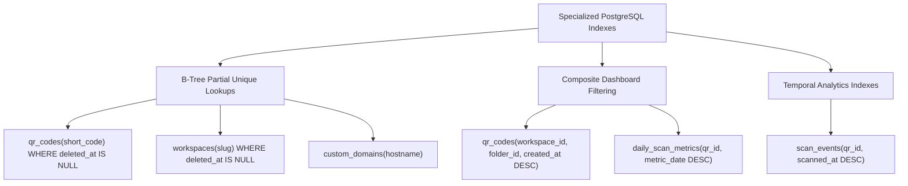

1. **Short Code Sub-Millisecond Lookup:**
   ```sql
   CREATE UNIQUE INDEX idx_qr_codes_short_code_active 
   ON qr_codes (short_code) 
   WHERE deleted_at IS NULL;
   ```
   *Impact:* Enables index-only heap scans returning routing metadata in $< 1\text{ms}$.
2. **Dashboard Filtering & Pagination:**
   ```sql
   CREATE INDEX idx_qr_codes_workspace_status 
   ON qr_codes (workspace_id, status, created_at DESC) 
   WHERE deleted_at IS NULL;
   ```
   *Impact:* Eliminates file-sort overhead during customer dashboard table rendering.
3. **Analytics Fast Aggregation:**
   ```sql
   CREATE INDEX idx_daily_metrics_qr_date 
   ON daily_scan_metrics (qr_id, metric_date DESC);
   ```
   *Impact:* 30-day dashboard queries scan exactly 30 contiguous index records.

---

## 6. High-Throughput Analytics & Partitioning Architecture

### 6.1 Declarative Range Partitioning for `scan_events`

`scan_events` is partitioned by month on `scanned_at` using generic monthly partitions:
```sql
-- Illustrative monthly child partition syntax
CREATE TABLE scan_events_YYYY_MM PARTITION OF scan_events
    FOR VALUES FROM ('YYYY-MM-01 00:00:00+00') TO ('YYYY-MM-01 00:00:00+00' + INTERVAL '1 month');
```
Partitions for upcoming months are auto-provisioned via a scheduled NestJS cron worker on the 20th of every month.

### 6.2 Pre-Aggregated Rollup Pipeline (`daily_scan_metrics`)

The background consumer worker processes batches of 500 events from `stream:scans:raw` and executes an atomic rollup upsert:

```sql
INSERT INTO daily_scan_metrics (
    workspace_id, qr_id, metric_date, total_scans, unique_scans, geo_breakdown, device_breakdown, os_breakdown
)
VALUES (
    :workspace_id, :qr_id, :metric_date, 1, :is_unique,
    jsonb_build_object(:country, 1),
    jsonb_build_object(:device, 1),
    jsonb_build_object(:os, 1)
)
ON CONFLICT (qr_id, metric_date) DO UPDATE SET
    total_scans = daily_scan_metrics.total_scans + EXCLUDED.total_scans,
    unique_scans = daily_scan_metrics.unique_scans + EXCLUDED.unique_scans,
    geo_breakdown = daily_scan_metrics.geo_breakdown || 
        jsonb_build_object(
            :country, 
            COALESCE((daily_scan_metrics.geo_breakdown->>:country)::int, 0) + 1
        ),
    device_breakdown = daily_scan_metrics.device_breakdown || 
        jsonb_build_object(
            :device, 
            COALESCE((daily_scan_metrics.device_breakdown->>:device)::int, 0) + 1
        ),
    os_breakdown = daily_scan_metrics.os_breakdown || 
        jsonb_build_object(
            :os, 
            COALESCE((daily_scan_metrics.os_breakdown->>:os)::int, 0) + 1
        );
```

### 6.3 ClickHouse Migration Threshold & Target DDL

> **Authoritative Policy:**  
> *"ClickHouse evaluation begins around 10M scans/month based on workload characteristics, while mandatory migration is targeted around 25M scans/month or earlier if PostgreSQL analytics performance/SLOs require it."*

```sql
CREATE TABLE skyra_analytics.scan_events (
    workspace_id UUID,
    qr_id UUID,
    visitor_hash FixedString(64),
    country LowCardinality(String),
    region String,
    city String,
    device_type LowCardinality(String),
    os LowCardinality(String),
    browser LowCardinality(String),
    scanned_at DateTime64(3, 'UTC')
) ENGINE = MergeTree()
PARTITION BY toYYYYMM(scanned_at)
ORDER BY (workspace_id, qr_id, scanned_at)
SETTINGS index_granularity = 8192;
```

---

## 7. Data Retention, Privacy & GDPR Deletion Protocols

```mermaid
flowchart TD
    Req[GDPR Right-to-be-Forgotten Request] --> API[Admin Initiates User Deletion]
    API --> MarkDel[Set users.deleted_at = NOW()]
    API --> Anonymize[Anonymize email: anonymized_user@deleted.skyra.link]
    API --> AuditLog[Record Deletion in audit_logs]
    
    subgraph AsyncPurge["Automated 30-Day Recovery Window"]
        Grace{30 Days Passed?} -- No --> Retain[Allow Accidental Recovery]
        Grace -- Yes --> HardPurge[Execute Hard Cascade Delete]
        HardPurge --> PurgeQRs[Purge QRs & Designs]
        HardPurge --> PurgeFiles[Purge S3/R2 Assets]
        HardPurge --> PurgeTelemetry[Drop Scan Event Partitions]
    end
```

### 7.1 Data Retention Schedule by Tier

| Data Category | Free Tier | Starter Tier | Business Tier | Agency / Enterprise |
| :--- | :--- | :--- | :--- | :--- |
| **Raw Scan Events (`scan_events`)** | 7 days | 90 days | 365 days | 2–5 Years |
| **Daily Metrics (`daily_scan_metrics`)**| 30 days | 1 Year | Permanent | Permanent |
| **Audit Logs (`audit_logs`)** | 30 days | 90 days | 1 Year | 5 Years (SOC2 Aligned) |
| **Platform Audit Logs** | 7 Years | 7 Years | 7 Years | 7 Years (Statutory Requirement) |
| **Billing & Invoices** | 7 Years | 7 Years | 7 Years | 7 Years (Statutory Tax Law) |

### 7.2 GDPR & DPDP Right-to-be-Forgotten Enforcement
1. **Immediate PII Anonymization:** `users.email` and `users.full_name` are overwritten with pseudonymous hashes.
2. **Session Revocation:** All active refresh tokens and Redis sessions are purged immediately.
3. **Hard Deletion:** After the 30-day grace period, a scheduled worker purges all workspace records and triggers S3/R2 asset deletion.

---

## 8. Revision & Version History

| Version | Date | Description | Author |
| :--- | :--- | :--- | :--- |
| **v1.0.0** | 2026-08-15 | Initial baseline Database schema release | Skyra Database Architecture |
| **v2.0.0** | 2026-08-25 | Expansion to 55 tables, partitioned scan logs, and MCP schema | Skyra Database Architecture |
| **v2.1.0** | 2026-09-01 | Architecture reconciliation and UUIDv7 indexing standard | Skyra Database Architecture |
| **v2.2.0** | 2026-09-02 | Final pre-implementation architecture consistency correction: Exactly 57 production tables, NUMERIC(12,2) financial precision standardization, codename policy, and PostgreSQL authority | Skyra Database Architecture Group |
