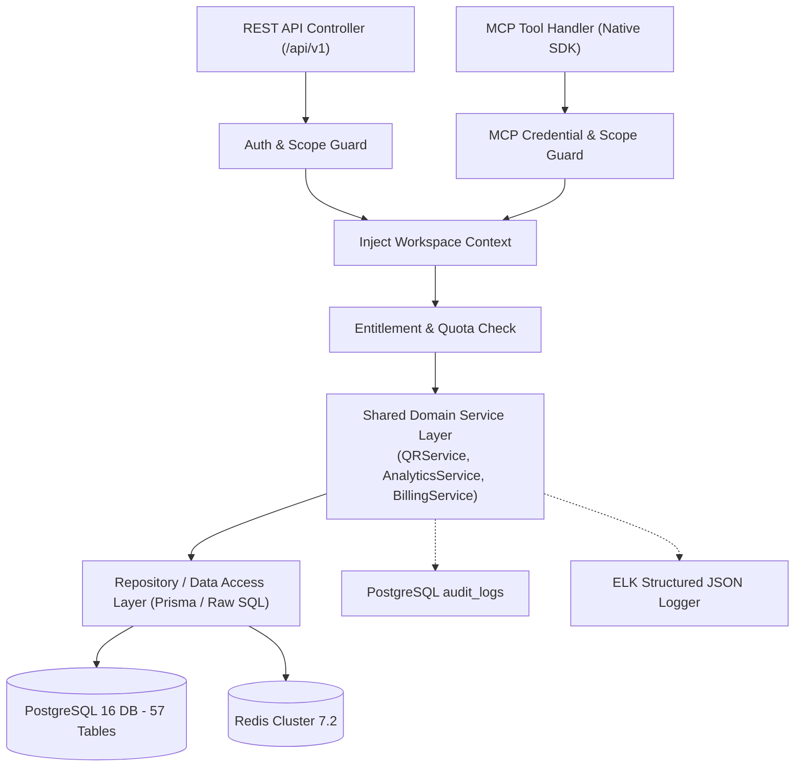
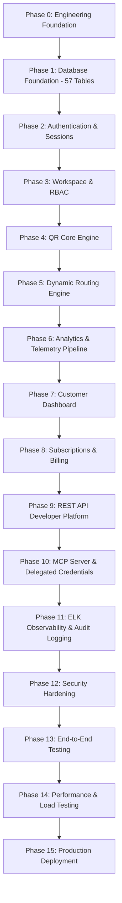

# SkyraQR — Development Implementation Plan

**Document Identifier:** SKYRA-DOC-DEV-001  
**Version:** 1.0.0  
**Status:** Approved for Implementation (Architecture Locked)  
**Owner:** Skyra Engineering & DevOps Group  
**Target Architecture Baseline:** Architecture v2.2.0 (BRD, System Architecture, Database Architecture)  

---

## Executive Summary

This document establishes the comprehensive, step-by-step engineering execution roadmap for building the **SkyraQR** platform from initial repository scaffolding to hyper-scale production deployment. 

The implementation roadmap follows an authoritative, dependency-driven progression designed to prevent circular dependencies, premature optimization, and security vulnerabilities:
$$\text{Database Foundation} \longrightarrow \text{Auth \& Sessions} \longrightarrow \text{Workspace RBAC} \longrightarrow \text{Shared Domain Services} \longrightarrow \text{QR Engine} \longrightarrow \text{Customer Dashboard} \longrightarrow \text{Billing} \longrightarrow \text{REST API} \longrightarrow \text{MCP Server} \longrightarrow \text{ELK Observability} \longrightarrow \text{Hardening \& Production}$$

Every phase specifies concrete deliverables, cross-functional tasks (backend, frontend, database, API, security, testing, infrastructure), and unambiguous **Definitions of Done (DoD)** to ensure engineering alignment across teams.

---

## Table of Contents

- [1. Development Principles, Codename Policy & Code Architecture](#1-development-principles-codename-policy--code-architecture)
  - [1.1 Product Codename & Branding Policy](#11-product-codename--branding-policy)
  - [1.2 The Shared Domain Services Pattern](#12-the-shared-domain-services-pattern)
  - [1.3 Canonical Request Execution Paths (REST Flow vs. MCP Flow)](#13-canonical-request-execution-paths-rest-flow-vs-mcp-flow)
  - [1.4 Next.js ↔ NestJS Boundary & Security Rules](#14-nextjs--nestjs-boundary--security-rules)
  - [1.5 Request Context & Distributed Tracing](#15-request-context--distributed-tracing)
- [2. Phased Development Dependency Graph](#2-phased-development-dependency-graph)
- [3. Phase 0 — Engineering Foundation & Tooling Scaffolding](#phase-0--engineering-foundation--tooling-scaffolding)
- [4. Phase 1 — Database Foundation & Migrations (57 Tables)](#phase-1--database-foundation--migrations-57-tables)
- [5. Phase 2 — Authentication, Sessions & MFA](#phase-2--authentication-sessions--mfa)
- [6. Phase 3 — Workspace Tenancy & Customer RBAC](#phase-3--workspace-tenancy--customer-rbac)
- [7. Phase 4 — QR Core Generation & Design Studio Engine](#phase-4--qr-core-generation--design-studio-engine)
- [8. Phase 5 — Dynamic Routing & Edge Redirection Engine](#phase-5--dynamic-routing--edge-redirection-engine)
- [9. Phase 6 — Analytics, Telemetry & Rollup Pipeline](#phase-6--analytics-telemetry--rollup-pipeline)
- [10. Phase 7 — Customer Dashboard & Micro-Landing Pages](#phase-7--customer-dashboard--micro-landing-pages)
- [11. Phase 8 — Subscription, Dual Billing & Entitlement Engine](#phase-8--subscription-dual-billing--entitlement-engine)
- [12. Phase 9 — REST API Developer Platform & Webhooks](#phase-9--rest-api-developer-platform--webhooks)
- [13. Phase 10 — Model Context Protocol (MCP) Server & Delegated Credentials](#phase-10--model-context-protocol-mcp-server--delegated-credentials)
- [14. Phase 11 — ELK Observability, Audit Logging & Distributed Tracing](#phase-11--elk-observability-audit-logging--distributed-tracing)
- [15. Phase 12 — Security Hardening & Vulnerability Mitigation](#phase-12--security-hardening--vulnerability-mitigation)
- [16. Phase 13 — Automated Testing & Quality Assurance](#phase-13--automated-testing--quality-assurance)
- [17. Phase 14 — Performance, Benchmark & Load Testing](#phase-14--performance-benchmark--load-testing)
- [18. Phase 15 — Production Deployment, HA & Cutover](#phase-15--production-deployment-ha--cutover)
- [19. Revision & Version History](#19-revision--version-history)

---

## 1. Development Principles, Codename Policy & Code Architecture

### 1.1 Product Codename & Branding Policy
- **Internal Project Codename:** **SkyraQR**
- **Parent Company:** **Skyra Tech**
- **Future Commercial Product Name:** **TBD** (to be determined prior to commercial launch; zero architectural lock-in).

### 1.2 The Shared Domain Services Pattern
Controllers and protocol adapters (whether REST API controllers or MCP tool handlers) **never execute direct database queries**. All operations must route through strongly-typed domain services:

### 1.3 Canonical Request Execution Paths (REST Flow vs. MCP Flow)

1. **Canonical REST Flow:**
   $$\text{Browser / Client} \longrightarrow \text{Next.js UI} \longrightarrow \text{NestJS Controller} \longrightarrow \text{Auth Guard} \longrightarrow \text{Authorization} \longrightarrow \text{Entitlement Check} \longrightarrow \text{Shared Domain Service} \longrightarrow \text{Repository} \longrightarrow \text{PostgreSQL / Redis}$$

2. **Canonical MCP Flow:**
   $$\text{MCP Client / AI Agent} \longrightarrow \text{MCP Server} \longrightarrow \text{MCP Credential Authentication} \longrightarrow \text{MCP Permission Check} \longrightarrow \text{Workspace Scope} \longrightarrow \text{Entitlement Check} \longrightarrow \text{Shared Domain Service} \longrightarrow \text{Repository} \longrightarrow \text{PostgreSQL / Redis}$$

Both execution paths **MUST converge on the same Shared Domain Service layer**. Business logic, quota consumption, and validation rules are executed once and shared universally.

### 1.4 Next.js ↔ NestJS Boundary & Security Rules
- **Role Distinction:** Next.js is strictly a presentation and routing frontend. NestJS is the authoritative business backend.
- **Data Access Prohibition:** Next.js (client-side or server-side) must **NEVER** connect directly to PostgreSQL, Redis, Elasticsearch, internal queues, or billing provider secrets.
- **Server Actions Policy:** If Next.js Server Actions are used, they must act only as presentation/API adapters and delegate the actual business mutation to the NestJS API.
- **Secret Protection:** Never expose DB credentials, Redis credentials, payment provider secret keys, MCP token hashes, JWT signing private keys, or internal service credentials to the browser. All secrets must remain server-side only in the NestJS environment.

### 1.5 Request Context & Distributed Tracing
Every inbound request (REST or MCP) must generate or propagate a `request_id` (UUIDv7) and `trace_id` (W3C standard). The context carries:
- `request_id`
- `trace_id`
- `workspace_id`
- `actor_id` (User ID, API Key ID, or MCP Credential ID)
- `actor_type` (`USER`, `API_KEY`, `MCP_AGENT`, `PLATFORM_OPERATOR`)
- `permissions` (Set of granted permission strings)

---

## 2. Phased Development Dependency Graph

---

## Phase 0 — Engineering Foundation & Tooling Scaffolding

### Objective
Establish the monorepo architecture, developer tooling, linting, formatting, containerization standards, and CI/CD pipelines.

- **Prerequisites:** GitHub organization setup, Docker runtime, Node.js 20 LTS, pnpm package manager.
- **Dependencies:** None.
- **Frontend Architecture:**
  - Initialize Next.js 14+ application using App Router.
  - Setup TypeScript in strict mode.
  - Install and configure Tailwind CSS and shadcn/ui component library.
  - Setup TanStack Query v5 and Lucide React icons.
- **Backend Architecture:**
  - Scaffold NestJS 10+ core backend application with Fastify adapter.
  - Configure dependency injection, global exception filters, and Zod validation pipes.
- **Shared Tooling:**
  - Initialize Turborepo / pnpm workspace monorepo.
  - Setup TypeScript strict mode (`tsconfig.json`) across all packages.
  - Configure ESLint, Prettier, and Husky pre-commit hooks.
- **Database Tasks:**
  - Setup local PostgreSQL 16 Docker container with UUID extension.
  - Setup local Redis 7.2 Docker container.
- **Infrastructure Tasks:**
  - Create `docker-compose.yml` for local development (Postgres, Redis, Mailpit mock SMTP).
  - Configure GitHub Actions CI workflow for type checking, linting, and test execution.
- **Deliverables:** Operational monorepo, clean build commands (`pnpm build`, `pnpm dev`), green CI pipeline.
- **Definition of Done (DoD):**
  1. Next.js frontend starts successfully (`pnpm dev:web`).
  2. NestJS backend starts successfully (`pnpm dev:api`).
  3. Frontend can communicate with backend via authenticated client.
  4. PostgreSQL 16 starts and accepts connections.
  5. Redis 7.2 starts and accepts connections.
  6. Local development environment works end-to-end.
  7. GitHub Actions CI pipeline passes with zero warnings.
  8. **No frontend direct database access exists.**

---

## Phase 1 — Database Foundation & Migrations (57 Tables)

### Objective
Translate all 57 database tables defined by Database Architecture v2.2.0 into production Prisma schemas and raw SQL migrations.

- **Prerequisites:** Phase 0 complete.
- **Dependencies:** Phase 0.
- **Database Tasks:**
  - Define Prisma schema containing **all 57 production tables** across all 12 functional groups:
    - Group 1: Identity, Auth & Sessions (6 tables)
    - Group 2: Tenancy, Workspaces & Customer RBAC (6 tables)
    - Group 3: Platform Owner Administration (5 tables)
    - Group 4: QR Core Management & Design (7 tables)
    - Group 5: Dynamic Routing & Health Defense (2 tables)
    - Group 6: No-Code Micro-Landing Pages & Content (6 tables)
    - Group 7: Campaigns & Attribution (2 tables)
    - Group 8: Scan Telemetry & Pre-Aggregated Rollups (2 tables)
    - Group 9: Subscriptions, Entitlements & Metering (8 tables)
    - Group 10: Developer Platform & Custom Domains (4 tables)
    - Group 11: Model Context Protocol (MCP) & AI Integration (7 tables)
    - Group 12: Security, Abuse & Audit Logging (2 tables)
  - Enforce PostgreSQL datatype policies:
    - **Financial precision:** Standardize all prices, subscription amounts, invoice totals, and monetary balances on **`NUMERIC(12,2)`** (**strictly NEVER FLOAT or REAL**).
    - `TIMESTAMPTZ` for all timestamps.
    - `INET` strictly and exclusively for security/audit tables (`user_sessions`, `auth_audit_logs`, `platform_audit_logs`, `audit_logs`).
    - Standard `UUID` for all primary and foreign keys.
  - Implement custom raw SQL migration for application-level UUIDv7 generation.
  - Generate initial baseline migration (`001_initial_schema.sql`).
  - Implement declarative monthly range partitioning DDL for `scan_events` (`scan_events_YYYY_MM`).
  - Create seed script for the 16 standard QR types, permissions catalog, and default subscription plans.
- **Testing Tasks:**
  - Verify migration rollback (`prisma migrate reset`) executes cleanly with zero orphaned foreign keys.
  - Verify seed data persists all 16 QR types and 27 granular workspace permissions.
- **Deliverables:** Tested migration scripts, Prisma client generation, seed data script.
- **Definition of Done (DoD):** Automated tests verify all 57 tables exist with correct constraints, indexes, and primary/foreign key relationships.

---

## Phase 2 — Authentication, Sessions & MFA

### Objective
Implement the zero-trust identity layer: Argon2id password hashing, short-lived JWTs in memory, rotating refresh tokens in `HttpOnly` cookies, session revocation in Redis, and RFC 6238 TOTP MFA.

- **Prerequisites:** Phase 1 complete.
- **Dependencies:** Phase 1.
- **Backend Tasks:**
  - Implement `AuthService` with Argon2id password hashing ($m=65536, t=3, p=4$).
  - Implement asymmetric JWT minting (15-min TTL) and verification guards.
  - Implement rotating refresh tokens (7-day TTL) stored in `__Host-skyra_rt` cookies.
  - Implement automatic token reuse detection in Redis with session family revocation.
  - Implement RFC 6238 TOTP enrollment, verification, and recovery code generation (`user_mfa_settings`).
  - Implement password reset token workflow with automatic Redis session invalidation.
- **Frontend Tasks:**
  - Build responsive login, registration, email verification, and password reset views in Next.js.
  - Implement in-memory JWT token store and Axios/Fetch interceptor for seamless cookie refresh.
  - Build TOTP MFA setup wizard with QR secret display and recovery code backup confirmation.
- **Security Tasks:**
  - Enforce rate-limiting on auth endpoints (5 req / 15 min via Token Bucket).
  - Audit logging of all auth events into `auth_audit_logs`.
- **Deliverables:** Secure authentication micro-module, session management API, UI auth flows.
- **Definition of Done (DoD):** Token rotation verifies that presenting an old refresh token instantly invalidates all active sessions for that user across all devices.

---

## Phase 3 — Workspace Tenancy & Customer RBAC

### Objective
Implement multi-tenant workspace isolation, team member invitations, and standard RBAC roles (`OWNER`, `ADMIN`, `EDITOR`, `VIEWER`, `CLIENT_GUEST`).

- **Prerequisites:** Phase 2 complete.
- **Dependencies:** Phase 2.
- **Backend Tasks:**
  - Implement `WorkspaceService` managing workspace creation, slug validation, and membership.
  - Implement NestJS `WorkspaceInterceptor` to extract and inject active `workspace_id` into all service queries.
  - Implement `RBACGuard` evaluating user role permissions against the master permissions catalog.
  - Implement member invitation email dispatch with cryptographic verification tokens (7-day TTL).
- **Frontend Tasks:**
  - Build workspace switcher in the dashboard navigation bar.
  - Build **Workspace Administration** $\rightarrow$ **Team Members** management console.
  - Implement role assignment dropdown and pending invitation list.
- **Security Tasks:**
  - Verify tenant isolation: Ensure an authenticated user cannot view, edit, or delete resources belonging to another workspace.
- **Deliverables:** Multi-tenant workspace management API, RBAC guards, team management UI.
- **Definition of Done (DoD):** Automated tests prove cross-tenant access attempts return `HTTP 403 Forbidden` or `HTTP 404 Not Found`.

---

## Phase 4 — QR Core Generation & Design Studio Engine

### Objective
Implement dynamic and static barcode generation across all 16 QR types, real-time visual styling customizer, scannability score algorithm, and vector exports (SVG, PDF, EPS).

- **Prerequisites:** Phase 3 complete.
- **Dependencies:** Phase 3.
- **Backend Tasks:**
  - Implement `QRService` handling Base62 short-code collision-resistant generation.
  - Implement visual customization engine: 12 module patterns, corner eyes, linear/radial gradients, and center logos.
  - Implement Scannability Scoring Engine: Evaluates WCAG contrast ratio and clamps logo area to $\le 22\%$.
  - Implement vector export service streaming SVG, PDF (CMYK print-ready), EPS, and PNG (up to 4096px).
  - Implement asynchronous CSV bulk generation worker using BullMQ queue (`qr_generation_jobs`).
- **Frontend Tasks:**
  - Build the interactive **QR Creation Studio** with live HTML5 Canvas / SVG rendering preview.
  - Implement type selector for all 16 QR types with requirement validation forms.
  - Build visual design customization accordion: patterns, colors, frames, and logos.
- **Testing Tasks:**
  - Verify scannability: Ensure generated barcodes scan successfully on native iOS and Android camera viewfinders.
- **Deliverables:** QR generation engine, visual design studio UI, vector download endpoints.
- **Definition of Done (DoD):** All 16 QR types generate valid, scannable barcodes with lossless vector export capability.

---

## Phase 5 — Dynamic Routing & Edge Redirection Engine

### Objective
Build the decoupled edge redirection service with sub-30ms target latency, L1/L2 caching, device OS routing, dayparting, deterministic A/B testing, and Google Safe Browsing integration.

- **Prerequisites:** Phase 4 complete.
- **Dependencies:** Phase 4.
- **Backend Tasks:**
  - Implement stateless Fastify edge redirect worker service.
  - Implement L1 in-memory LRU cache + L2 Redis cluster cache lookup (`GET qr:{code}`).
  - Implement context-aware rule evaluation: User-Agent OS detection, MaxMind GeoIP country detection, and scheduled local dayparting.
  - Implement deterministic A/B traffic split engine using salted hash modulo math:
    $$\text{bucket} = \text{hash}(\text{visitor\_key} \parallel \text{qr\_id}) \pmod{100}$$
  - Implement automated dead-link crawler inspecting destination URLs every 12 hours (`qr_health_checks`).
  - Integrate Google Safe Browsing API v4 for pre-screen URL reputation checks.
- **Infrastructure Tasks:**
  - Deploy redirect worker behind Cloudflare Enterprise CDN with TLS 1.3 edge termination.
- **Deliverables:** Edge redirect service, smart routing rules engine, dead-link monitoring crawler.
- **Definition of Done (DoD):** Benchmark tests confirm edge redirect processing executes in $< 20\text{ms}$ (target p99 $< 30\text{ms}$ under defined benchmark conditions).

---

## Phase 6 — Analytics, Telemetry & Rollup Pipeline

### Objective
Implement the privacy-first scan telemetry pipeline: durable Redis Streams ingestion (`XADD`), consumer group worker fleet, and atomic rollup updates (`daily_scan_metrics`).

- **Prerequisites:** Phase 5 complete.
- **Dependencies:** Phase 5.
- **Backend Tasks:**
  - Implement daily 256-bit cryptographic salt rotation in Redis for privacy-preserving HMAC-SHA256 IP hashing.
  - Implement durable telemetry push to `stream:scans:raw` during redirect resolution.
  - Build `analytics-worker` consumer group fleet reading batches of 500 events using `XREADGROUP` and acknowledging via `XACK`.
  - Implement atomic batch `INSERT` into partitioned `scan_events` and atomic `UPSERT` into `daily_scan_metrics`.
  - Implement scheduled partition maintenance cron auto-creating `scan_events_YYYY_MM` on the 20th of every month.
- **API Tasks:**
  - Implement `/api/v1/analytics/overview` and `/api/v1/analytics/qrs/:id` returning aggregated metrics in $< 50\text{ms}$.
  - Implement CSV scan telemetry streaming export.
- **Deliverables:** Telemetry ingestion pipeline, consumer worker fleet, analytics aggregation API.
- **Definition of Done (DoD):** Pipeline sustains 10,000 scans/second without blocking edge redirection, with zero scan event loss during consumer worker restarts.

---

## Phase 7 — Customer Dashboard & Micro-Landing Pages

### Objective
Complete the customer-facing web dashboard and no-code responsive micro-landing pages (Digital Menu, vCard Plus, Product Showcase, Event RSVP).

- **Prerequisites:** Phases 4 and 6 complete.
- **Dependencies:** Phases 4, 6.
- **Frontend Tasks:**
  - Build **Customer Dashboard** overview: metric summary cards, recent QRs, and visual scan heatmaps.
  - Build QR management table: pagination, status toggle (`ACTIVE`/`PAUSED`), tag filters, and folder grouping.
  - Build Digital Menu Builder: categories, allergen tags, currency switchers, and item photos.
  - Build vCard Plus Builder: contact fields, social links, and native 1-tap `.vcf` download generator.
  - Build Product and Coupon showcase templates.
- **Performance Tasks:**
  - Optimize micro-landing pages to achieve Lighthouse Mobile score $\ge 90$ with FCP $< 1.2\text{s}$.
- **Deliverables:** Complete responsive customer dashboard and 5 responsive micro-landing page templates.
- **Definition of Done (DoD):** Restaurant menu micro-page loads smoothly on simulated 3G cellular network with interactive allergen filtering.

---

## Phase 8 — Subscription, Dual Billing & Entitlement Engine

### Objective
Implement database-driven subscription management with dual payment gateways (Stripe USD/EUR + Razorpay INR/UPI) and the authoritative entitlement enforcement policy (`BLOCK`, `SOFT_OVERAGE`, `READ_ONLY`).

- **Prerequisites:** Phase 3 complete.
- **Dependencies:** Phase 3.
- **Backend Tasks:**
  - Implement `BillingService` integrating Stripe Billing API and Razorpay Subscriptions API.
  - Enforce financial monetary amounts using **`NUMERIC(12,2)`** for prices, invoices, and overage charges.
  - Implement webhook handlers for recurring billing, renewals, failed payments, and dunning cycles.
  - Implement database-driven Entitlement Engine querying `plans`, `plan_features`, and `usage_meters`.
  - Implement automated quota alert dispatch at 80%, 90%, and 100% consumption thresholds.
  - Enforce authoritative policy on 100% exhaustion: `BLOCK` for QRs/seats (returns `HTTP 429`), `SOFT_OVERAGE` for scans, and `READ_ONLY` for downgrades.
- **Frontend Tasks:**
  - Build subscription tier selection and checkout modal (supporting Stripe Checkout & Razorpay Modal).
  - Build **Workspace Administration** $\rightarrow$ **Billing & Invoices** view with PDF receipt download links.
  - Implement in-app quota warning banners at 80% and 90% usage.
- **Deliverables:** Dual billing integration, entitlement engine, invoice management UI.
- **Definition of Done (DoD):** Automated webhook test confirms upgrading from Starter to Business instantly increments quota meters and unlocks smart routing without user logout.

---

## Phase 9 — REST API Developer Platform & Webhooks

### Objective
Deliver the complete public developer platform versioned at `/api/v1`, scoped API keys, interactive documentation, and outbound HMAC-SHA256 signed webhooks.

- **Prerequisites:** Phases 4, 6, and 8 complete.
- **Dependencies:** Phases 4, 6, 8.
- **Backend Tasks:**
  - Implement all 48 documented REST API endpoints across all 14 resource groups.
  - Implement Scoped API Key authentication (`sk_live_...`, SHA-256 hashed in `api_keys`, transmitted via Bearer header).
  - Implement outbound webhook engine with HMAC-SHA256 signatures (`X-Skyra-Signature`) and exponential backoff retry.
  - Setup OpenAPI 3.0 auto-generation at `/api/v1/openapi.json` and interactive Swagger/Scalar documentation at `/api/v1/docs`.
- **Frontend Tasks:**
  - Build **Workspace Administration** $\rightarrow$ **Developer Settings**: API key generation modal (displays key once) and webhook registration form.
- **Deliverables:** REST API v1, interactive developer documentation, outbound webhook delivery engine.
- **Definition of Done (DoD):** 100% of documented API endpoints pass automated OpenAPI schema validation tests with rate limiting enforced.

---

## Phase 10 — Model Context Protocol (MCP) Server & Delegated Credentials

### Objective
Implement the native SkyraQR MCP Server for the Jarvis AI Agent, featuring primary Admin-Managed MCP Credentials, delegated administration boundaries, independent role permissions, and high-risk human confirmations.

- **Prerequisites:** Phases 4, 6, 8, and 9 complete.
- **Dependencies:** Phases 4, 6, 8, 9.
- **Backend Tasks:**
  - Implement native MCP server using the officially supported transport mechanisms of the selected production MCP SDK/version (with secure authenticated HTTPS communication).
  - Implement Admin-Managed MCP Credential authentication: Verifies `mcp_sk_live_...` against `token_hash` in `mcp_credentials`.
  - Implement Delegated Authority Validation: Enforce that users cannot issue credentials with permissions exceeding their own effective workspace authority:
    $$\text{Effective MCP Permission} = \text{Workspace Permission} \land \text{MCP Credential Permission} \land \text{Subscription Entitlement}$$
  - Implement the 4 standard MCP roles (`MCP Viewer`, `MCP Editor`, `MCP Manager`, `MCP Administrator`) and granular permission bundle checks.
  - Implement credential lifecycle state machine: `SCHEDULED`, `ACTIVE`, `SUSPENDED`, `EXPIRED`, `REVOKED`.
  - Implement MCP tool inventory: READ tools (autonomous), WRITE tools (standard), and HIGH-RISK tools (`delete_qr`, `change_billing`) staging into `mcp_pending_actions`.
  - Wire all MCP tools directly into shared Domain Services (**strictly zero direct database queries by MCP**).
- **Frontend Tasks:**
  - Build **Workspace Administration** $\rightarrow$ **MCP Access Management** console.
  - Build MCP credential creation wizard: user selection, role bundle, custom permissions, date ranges, and one-time token display modal.
  - Build credential lifecycle action controls: Suspend, Reactivate, Rotate, Revoke.
  - Build pending high-risk action confirmation modal with real-time approval triggers.
  - Build live MCP invocation audit table.
- **Deliverables:** SkyraQR MCP Server, delegated MCP access console, human confirmation workflow.
- **Definition of Done (DoD):** Jarvis AI Agent connects via MCP, queries scan analytics, attempts a high-risk deletion, pauses for human confirmation, and completes execution upon admin approval.

---

## Phase 11 — ELK Observability, Audit Logging & Distributed Tracing

### Objective
Implement the dual-tier observability architecture: Authoritative, immutable PostgreSQL audit logging (`audit_logs`) and centralized structured JSON logging into the ELK stack with distributed request tracing.

- **Prerequisites:** Phases 2, 3, 9, and 10 complete.
- **Dependencies:** Phases 2, 3, 9, 10.
- **Backend Tasks:**
  - Implement `AuditService` writing immutable business mutations to `audit_logs` using the standardized audit event catalog.
  - Implement Pino structured JSON logger formatting logs to the canonical ELK schema across all services.
  - Implement automated secret redaction interceptor scrubbing passwords, tokens, API keys, and authorization headers.
  - Implement distributed tracing middleware injecting and propagating `request_id` and `trace_id`.
  - Implement `mcp_invocation_logs` recording tool names, execution duration, and caller identity.
- **Infrastructure Tasks:**
  - Deploy Logstash pipeline collector, Elasticsearch 8 cluster with Index Lifecycle Management (ILM 30-day retention), and Kibana.
  - Build pre-configured Kibana dashboards: API latency, error rates, redirect throughput, and MCP agent tool usage.
- **Deliverables:** PostgreSQL audit service, canonical ELK logging stream, Kibana dashboards.
- **Definition of Done (DoD):** Any mutation initiated in the dashboard or via MCP can be traced end-to-end from Kibana down to the exact row in `audit_logs` using a single `request_id`.

---

## Phase 12 — Security Hardening & Vulnerability Mitigation

### Objective
Harden the entire platform against OWASP Top 10 vulnerabilities, enforce strict SSRF validation on destination URLs, implement CORS/CSP headers, and establish disaster recovery runbooks.

- **Prerequisites:** All prior implementation phases complete.
- **Dependencies:** Phases 1–11.
- **Security Tasks:**
  - Implement SSRF defense: Reject private RFC 1918 IP addresses (`10.0.0.0/8`, `172.16.0.0/12`, `192.168.0.0/16`) and cloud metadata endpoints (`169.254.169.254`).
  - Configure strict Content Security Policy (CSP), HSTS, and X-Content-Type-Options headers.
  - Implement CORS allowlist restricting dashboard APIs strictly to trusted application origins.
  - Conduct automated static application security testing (SAST) using Snyk and SonarQube.
- **Infrastructure Tasks:**
  - Configure Cloudflare WAF managed rules, rate-limiting rules, and DDoS protection.
  - Setup automated daily cross-region PostgreSQL backups to Cloudflare R2 with WAL archiving ($\text{RPO} < 1\text{ hr}, \text{RTO} < 4\text{ hrs}$).
- **Deliverables:** Hardened perimeter, SSRF validator, automated backup scripts, disaster recovery runbook.
- **Definition of Done (DoD):** Automated vulnerability scanning reports zero critical or high severity vulnerabilities.

---

## Phase 13 — Automated Testing & Quality Assurance

### Objective
Execute comprehensive multi-level automated testing across unit, integration, RBAC matrix, and end-to-end user journeys.

- **Prerequisites:** Phase 12 complete.
- **Dependencies:** Phase 12.
- **Testing Tasks:**
  - **Unit Tests:** Achieve $\ge 85\%$ code coverage on domain services, scannability scoring, and entitlement checks.
  - **Integration Tests:** Test full database transactions, Redis Stream enqueue/dequeue, and token rotation families.
  - **RBAC Matrix Tests:** Verify that every user role (`OWNER` to `CLIENT_GUEST`) and MCP role (`Viewer` to `Administrator`) conforms strictly to permission boundaries.
  - **E2E Cypress / Playwright Tests:** Automate Journey 1 (Registration to QR creation), Journey 2 (Custom domain verification), and Journey 3 (Delegated MCP issuance).
- **Deliverables:** Automated test suites integrated into GitHub Actions CI pipeline.
- **Definition of Done (DoD):** Full CI pipeline runs in $< 10\text{ minutes}$ with 100% passing test status.

---

## Phase 14 — Performance, Benchmark & Load Testing

### Objective
Validate platform scalability under peak load conditions using k6 and Locust benchmark suites.

- **Prerequisites:** Phase 13 complete.
- **Dependencies:** Phase 13.
- **Testing Tasks:**
  - **Edge Redirect Load Test:** Benchmark edge redirect worker to sustain 10,000 requests/second with p99 edge processing latency $< 30\text{ms}$.
  - **Telemetry Ingestion Test:** Verify Redis Streams and consumer workers ingest 10,000 events/second without backpressure accumulation.
  - **Dashboard Query Benchmark:** Verify 30-day analytics aggregation endpoints return in $< 50\text{ms}$.
  - **Database Connection Pool Test:** Stress test PgBouncer under 1,000 concurrent client connections.
- **Deliverables:** Benchmark performance report, k6 test scripts, optimization tuning parameters.
- **Definition of Done (DoD):** All performance metrics meet or exceed the targets established in NFRs (`BR-NFR-001` through `BR-NFR-004`).

---

## Phase 15 — Production Deployment, HA & Cutover

### Objective
Deploy SkyraQR into multi-region production infrastructure, execute production readiness review, and conduct go-live cutover.

- **Prerequisites:** Phase 14 complete.
- **Dependencies:** Phase 14.
- **Infrastructure Tasks:**
  - Provision production Kubernetes (EKS/GKE) or ECS cluster via Terraform.
  - Deploy multi-AZ PostgreSQL 16 managed database with automated standby replica.
  - Deploy Redis Cluster 7.2 with in-memory replication and AOF persistence.
  - Configure Cloudflare Enterprise DNS, Anycast routing, and custom domain SSL for SaaS.
- **Operational Tasks:**
  - Conduct Production Readiness Review (PRR) and execute failover test.
  - Setup PagerDuty alert routing for redirect latency spikes, queue lag, and error rates.
  - Perform live smoke test across customer dashboard, REST API, and Jarvis MCP client.
- **Deliverables:** Live production SaaS deployment, monitoring alerts, verified disaster recovery runbooks.
- **Definition of Done (DoD):** Production systems operational with 99.95% availability SLA monitoring active; all customer sign-up, QR scanning, and MCP agent workflows fully functional.

---

## 19. Revision & Version History

| Version | Date | Description | Author |
| :--- | :--- | :--- | :--- |
| **v1.0.0** | 2026-09-02 | Final pre-implementation architecture consistency correction: Codename policy, Next.js ↔ NestJS boundary & security rules, Phase 0 DoD with explicit frontend/backend tasks, exactly 57 database tables, NUMERIC(12,2) precision, and native MCP transport wording | Skyra Engineering & DevOps Group |
